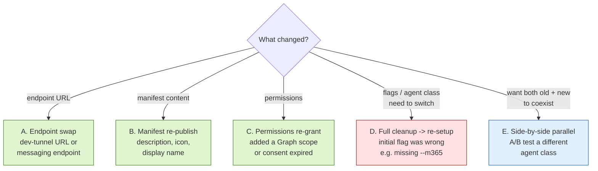
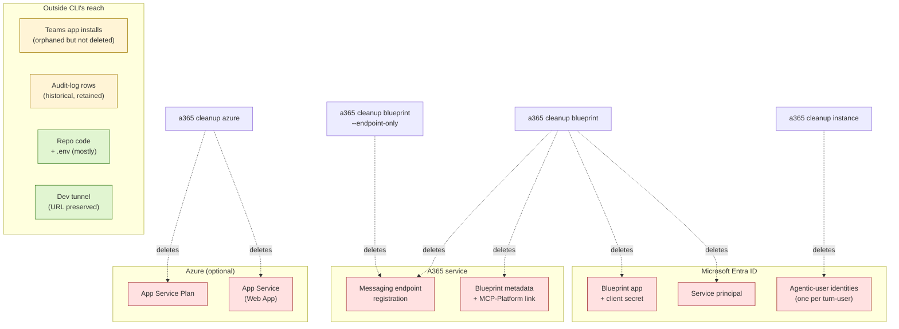
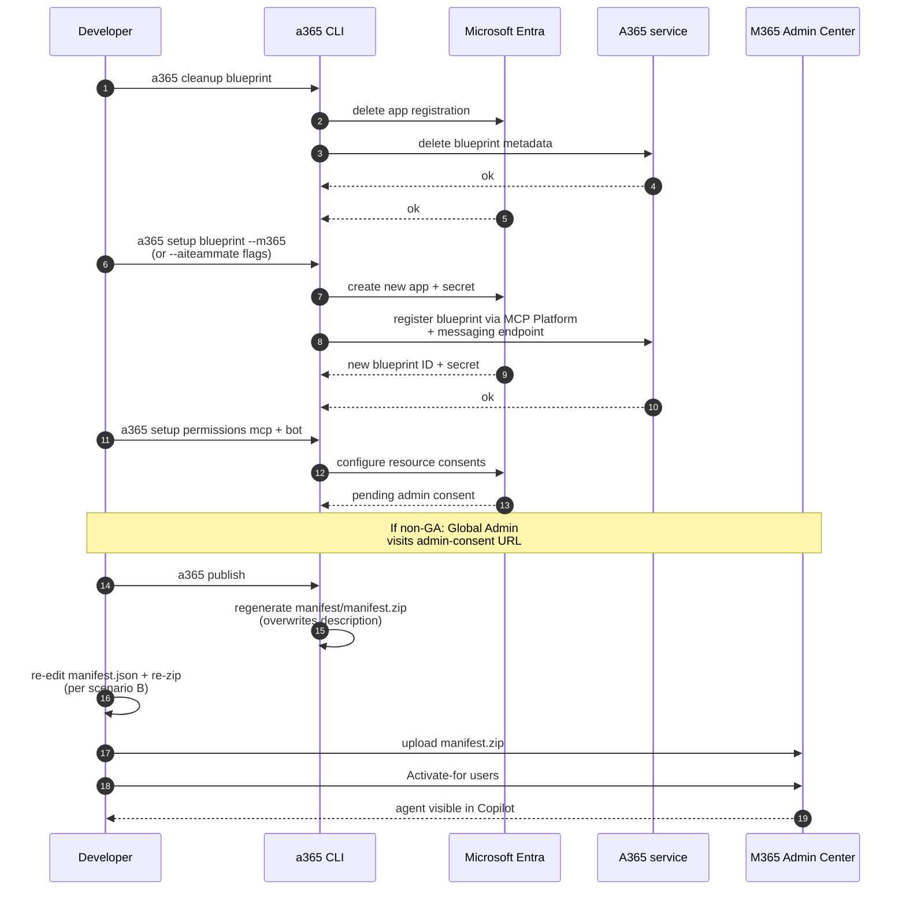

# Re-registering an Agent 365 agent

> Pick the smallest scenario that matches what you actually need to change.
> "Cleanup → re-setup" is the nuclear option; most cases don't need it.

`SETUP.md` is for first-time registration. **This file is for an agent that's already registered** and you need to change something. Microsoft's official CLI reference covers the individual commands — see [Agent 365 CLI Reference](https://learn.microsoft.com/en-us/microsoft-agent-365/developer/reference/cli/) — but doesn't give you an end-to-end workflow keyed to *what changed*. That's what this file is for.

## Pick your scenario



Quick-glance summary of the same flowchart:

| What changed | Scenario | Destructive? |
|---|---|---|
| Dev tunnel URL / messaging endpoint | [A. Endpoint swap](#a-endpoint-swap-non-destructive) | No |
| Manifest description, icon, display name | [B. Manifest re-publish](#b-manifest-re-publish-non-destructive) | No |
| Permissions / consent grants | [C. Permissions re-grant](#c-permissions-re-grant-non-destructive) | No |
| Initial flag was wrong (e.g. missing `--m365`) | [D. Full cleanup → re-setup](#d-full-cleanup--re-setup-destructive) | **Yes** |
| Want a parallel test registration | [E. Side-by-side parallel](#e-side-by-side-parallel-registration-non-destructive) | No |

---

## A. Endpoint swap (non-destructive)

**Use case.** Your dev-tunnel URL changed (laptop reset, region migration, new tunnel name). You want the existing blueprint to point at a new `https://…/api/messages` URL. Nothing else changes — same blueprint ID, same agentic-user identities, same Teams installs.

**Pre-flight.**

```bash
# Confirm the current endpoint
jq -r '.messagingEndpoint' a365.config.json
# Confirm the blueprint exists in your local generated config
jq -r '.agentBlueprintId' a365.generated.config.json
```

**Commands.**

```bash
a365 setup blueprint \
  --m365 \
  --update-endpoint "https://<your-tunnel-name>-3978.<region>.devtunnels.ms/api/messages"
```

> ⚠️ **`--m365` is required.** Without it the command silently no-ops with the message *"Skipping messaging endpoint update — this command only applies to M365 agents."* See [`LESSONS_LEARNED.md` §5.1](LESSONS_LEARNED.md#51-update-endpoint-requires-m365).

**Verification.** Send one Teams turn. The agent log should show `POST /api/messages HTTP/1.1 202`. If you get 502s, the Bot Framework still has the old URL cached — see [`LESSONS_LEARNED.md` §8](LESSONS_LEARNED.md#8-bot-framework-502-retry-storm-during-onboarding) for the self-heal timing.

**What's preserved / changed.** Blueprint ID, agentic-user IDs, Teams app installs, audit-log row continuity — all preserved. Only the `messagingEndpoint` field on the blueprint flips.

---

## B. Manifest re-publish (non-destructive)

**Use case.** You edited the agent display name, description, icon, or accent colour and need the change to surface in the M365 Admin Center.

**Pre-flight.**

```bash
# Snapshot the current manifest so you can re-apply your customisations after publish
cp manifest/manifest.json manifest/manifest.json.bak
```

**Commands.**

```bash
a365 publish
```

`a365 publish` regenerates `manifest/manifest.zip` from the CLI's templates. **It overwrites your custom description with a generic placeholder** — see [`LESSONS_LEARNED.md` §5.2](LESSONS_LEARNED.md#52-a365-publish-no-longer-auto-uploads-to-teams). Re-edit the description (and any other custom fields) and re-zip:

```bash
# Re-edit description
$EDITOR manifest/manifest.json

# Re-zip with the edited manifest
cd manifest && zip -r manifest.zip manifest.json color.png outline.png agenticUserTemplateManifest.json && cd ..
```

**Upload step.** Upload `manifest/manifest.zip` at <https://admin.microsoft.com> → Agents → All agents → Upload custom agent. The CLI used to auto-upload; it doesn't any more (1.1.174+).

**Verification.** Refresh the M365 Admin Center → Agents inventory. The new description/icon should appear within ~1 minute. Existing Teams installs auto-upgrade to the new manifest version.

---

## C. Permissions re-grant (non-destructive)

**Use case.** You added a new Graph scope to the agent, consent expired, or you re-installed a permission via Graph PowerShell and need the CLI's record of consent to match.

**Commands.**

```bash
a365 setup permissions mcp     # MCP-tool resource consents (Mail.ReadWrite, Chat.ReadWrite, etc.)
a365 setup permissions bot     # Bot-framework messaging consents
```

**Admin-consent step.** If you don't hold the **Global Administrator** role, the CLI prints next-step guidance: a Global Admin must visit the printed admin-consent URL and approve. The CLI cannot proxy that step. See `LESSONS_LEARNED.md` §13 if the resulting grant has the leading-space scope bug.

**Verification.** Trigger a Teams turn. If you previously saw `AADSTS65001 — user or administrator has not consented`, that error stops. The full consent table is queryable via:

```bash
a365 query-entra
```

---

## D. Full cleanup → re-setup (destructive)

**Use case.** Your initial registration was wrong in a way only re-doing it can fix — e.g., missing `--m365`, wrong agent class (`--aiteammate true` vs `false`), bad tenant. There's no incremental edit path; the blueprint has to be deleted and re-created.

### What dies

- **The current blueprint Entra app** (`f4762823-…` for our reference setup) and its service principal.
- **All agentic-user identity associations** keyed to that blueprint (`fc3ad290-…` etc.). Each user gets a *new* agentic-user the first time they engage with the new blueprint.
- **Teams app installs** keyed to the old blueprint ID. Existing chats break or silently re-instance.
- **Audit-log row continuity.** Past rows still exist under the old blueprint ID; future rows land under the new one. Your dashboards need to span both.

### What survives

- Repo code + observability fixes — those run per-turn at runtime, agnostic to which blueprint dispatched them.
- Dev-tunnel URL — keep it. The new blueprint will be wired to the same URL during step 2.
- `.env` values **except** `connections__service_connection__settings__clientSecret` — the CLI rotates the secret on `setup blueprint`, so that one needs to be updated.

### Object graph — what each cleanup subcommand actually destroys



The grey boxes are *outside* what the CLI controls — Teams installs and audit rows persist regardless of cleanup; your repo and tunnel just keep working.

### Pre-flight snapshot

```bash
cp a365.generated.config.json a365.generated.config.json.bak-$(date +%Y%m%d)
jq '{blueprintId: .agentBlueprintId, instanceId: .agentInstanceId, botMsaAppId: .botMsaAppId}' \
  a365.generated.config.json
# Copy this output somewhere — you'll need the IDs to query historical audit rows.
```

### Sequence



### Step-by-step

```bash
# 0. Snapshot (do this!)
cp a365.generated.config.json a365.generated.config.json.bak-$(date +%Y%m%d)

# 1. Destroy the existing blueprint
a365 cleanup blueprint -y                 # -y skips the confirmation prompt; remove if you want it
a365 cleanup instance -y                  # remove agentic-user identities too if doing a full reset

# 2. Re-create
a365 setup blueprint --m365               # use whatever flags you actually want this time

# 3. Re-grant permissions
a365 setup permissions mcp
a365 setup permissions bot

# 4. Re-publish manifest (then re-edit + re-zip per scenario B)
a365 publish

# 5. Upload manifest.zip via M365 Admin Center → Agents → Upload custom agent

# 6. Re-Activate for your test users (M365 Admin Center → your agent → Activated for)
```

### Verification (after each step)

| After step | Check | Expected |
|---|---|---|
| 1 | `a365 query-entra` | Old blueprint not found |
| 2 | `jq -r '.agentBlueprintId' a365.generated.config.json` | A new GUID, different from your snapshot |
| 3 | `a365 query-entra` | All required scopes show `consentGranted: true` |
| 4 | `ls -la manifest/manifest.zip` | Recent timestamp; non-zero size |
| 5 | M365 Admin Center → Agents | New row appears (may need refresh) |
| 6 | Teams turn | Draft Dodger replies; `POST /api/messages` returns `202` |

### Rollback if something fails mid-sequence

If `a365 setup blueprint` fails after `a365 cleanup blueprint` succeeded, you're stuck without an active blueprint. The CLI doesn't have an undo — but the Entra side keeps a 30-day soft-deleted app. Restore via:

```bash
# Find the soft-deleted app
az ad app list --filter "displayName eq 'Draft Dodger Identity'" --include-deleted-applications

# Restore (pulls it out of soft-delete)
az ad app restore --id <appId>
```

Then re-run `a365 setup blueprint` and let it pick up the restored app.

---

## E. Side-by-side parallel registration (non-destructive)

**Use case.** You want to test whether a different agent class (e.g., `a365 publish --aiteammate false --use-blueprint`) produces a different MAC inventory Platform classification — *without* touching your live registration. Both blueprints coexist in the tenant.

**Commands.**

```bash
# Register a brand-new blueprint with a distinguishing name.
# -n bypasses the project's a365.config.json so you don't disturb the live config.
a365 setup blueprint -n "Draft Dodger Test" --m365

# (For the alternative class):
# a365 publish -n "Draft Dodger Test" --aiteammate false --use-blueprint
```

**How to compare.** Both rows appear in M365 Admin Center → Agents. Note their respective `Platform` values (which is precisely what's empty for our `[AI teammate]` class today — see [`LESSONS_LEARNED.md` §23](LESSONS_LEARNED.md#23-mac-inventory-platform-column--server-stamped-no-client-lever)). For audit-log comparison: `scripts/query-audit.sh` filters by agentic-user GUID, so each blueprint's audit rows are clearly separated.

**Cleanup of the test registration when you're done.**

```bash
a365 cleanup blueprint -n "Draft Dodger Test" -y
```

---

## Quick-glance command reference

| Command | Effect | Destructive? |
|---|---|---|
| `a365 cleanup blueprint --endpoint-only` | Removes endpoint registration only | No |
| `a365 cleanup blueprint` | Removes Entra app + service principal + endpoint + blueprint metadata | **Yes** |
| `a365 cleanup instance` | Removes agentic-user identities | **Yes** |
| `a365 cleanup azure` | Removes App Service + Plan | **Yes** (but optional in our setup — we use a dev tunnel, not App Service) |
| `a365 setup blueprint --update-endpoint <url> --m365` | Rebinds endpoint without touching the rest | No |
| `a365 setup blueprint --m365` | Creates new blueprint (must follow a cleanup) | New IDs |
| `a365 setup blueprint -n "<name>"` | Standalone registration, no project config needed | New IDs |
| `a365 setup all --m365` | Setup blueprint + permissions in one shot | New IDs |
| `a365 publish` | Generates `manifest/manifest.zip` (overwrites your description) | No (but read §5.2 below) |

---

## Troubleshooting → existing lessons

| Symptom | Lesson |
|---|---|
| `Skipping messaging endpoint update — this command only applies to M365 agents` | [§5.1 — `--update-endpoint` requires `--m365`](LESSONS_LEARNED.md#51-update-endpoint-requires-m365) |
| Agent description shows generic placeholder text in M365 admin center | [§5.2 — `a365 publish` no longer auto-uploads](LESSONS_LEARNED.md#52-a365-publish-no-longer-auto-uploads-to-teams) |
| `[CLIENT_APP_VALIDATION_FAILED] Client app is missing required API permissions` | [§6 — required Graph permissions for the custom client app](LESSONS_LEARNED.md#6-required-microsoft-graph-permissions-for-the-custom-client-app) |
| Lots of 502s on `POST /api/messages` right after re-registration | [§8 — Bot Framework 502 retry storm during onboarding](LESSONS_LEARNED.md#8-bot-framework-502-retry-storm-during-onboarding) |
| `AADSTS65001 — user or administrator has not consented` | [§13 — leading-space scope bug; PATCH the grant via Graph](LESSONS_LEARNED.md#13-aadsts65001-on-agent365observabilityotelwrite-despite-a-grant-existing) |
| `HTTP 400 EndpointInvalid: Tenant id  is invalid` from the live agent | [§17 — `agent_id` must be the agentic-user identity, not the blueprint id](LESSONS_LEARNED.md#17-agentdetailsagent_id-must-be-the-agentic-user-identity-not-the-blueprint-id) |
| MAC inventory's "Platform" column stays empty after re-registration | [§23 — server-stamped enum, no client-side lever](LESSONS_LEARNED.md#23-mac-inventory-platform-column--server-stamped-no-client-lever) |

---

## See also

- [Agent 365 CLI Reference](https://learn.microsoft.com/en-us/microsoft-agent-365/developer/reference/cli/) — official command reference
- [Agent 365 development lifecycle](https://learn.microsoft.com/en-us/microsoft-agent-365/developer/a365-dev-lifecycle) — official overview
- [`SETUP.md`](SETUP.md) — fresh-tenant runbook (read this *first* if you've never registered before)
- [`LESSONS_LEARNED.md`](LESSONS_LEARNED.md) — error-driven knowledge base. §5 (publish quirks), §17 (agent identity model), §22 (observability gaps), §23 (Platform column).
