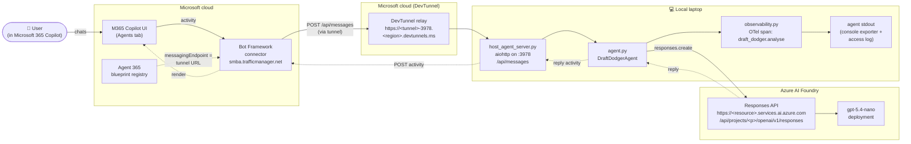
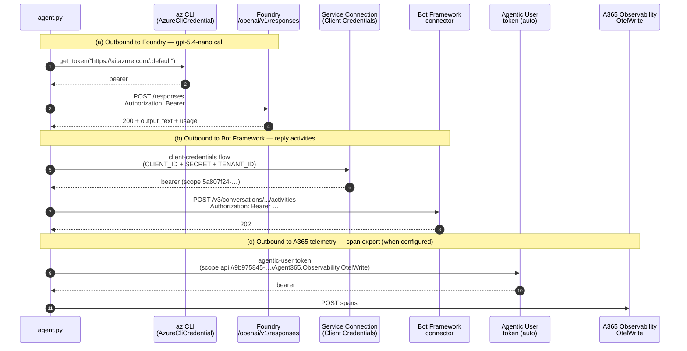
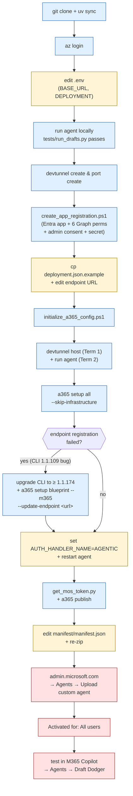

# Draft Dodger — Agent 365 Quickstart Template

> A reusable Microsoft Agent 365 quickstart. Demonstrates how to register a **locally-running** Python agent with **Microsoft 365 Copilot** via a persistent **DevTunnel** — no Azure Container Apps, no production deployment, just your laptop. Ships with **Draft Dodger** (an email tone advisor) as the example agent so you can see the full path from clone to working-in-Copilot end-to-end.

**What you get from this repo:**

- A working A365 agent (Draft Dodger) you can fork as a starting point.
- A documented blueprint-registration flow (Entra app + Graph permissions + a365 CLI + manifest publish + admin upload + activation).
- A DevTunnel-based local-runtime pattern so the agent stays on your laptop while M365 Copilot reaches it.
- Microsoft Agent 365 observability wired with OpenTelemetry semantic conventions, falling back to console output for local demos.
- A project-local Claude Code skill that automates the entire bootstrap.
- A complete `LESSONS_LEARNED.md` covering every SDK quirk, CLI version mismatch, auth audience pitfall, and Bot Framework onboarding storm we hit so you don't have to rediscover them.

> 🚀 **Forked this repo, or moved it to a new machine?** Open Claude Code in the project root and run **`/draft-dodger-setup`** — the bundled project-local skill walks through prereq checks, app registration, dev tunnel, blueprint, publish, admin upload, and Copilot activation. Everything is interactive and asks for your tenant info as needed.
>
> Prefer to do it manually? Follow [`SETUP.md`](SETUP.md) instead — same flow, you drive the commands.

## Documentation map

| File | Purpose |
|---|---|
| **`README.md` (this file)** | Project overview, architecture, demo-day ops |
| [`SETUP.md`](SETUP.md) | Fresh-tenant runbook from clone to working in Copilot |
| [`LESSONS_LEARNED.md`](LESSONS_LEARNED.md) | Every error we hit + the fix. Read this first when something breaks |
| [`.claude/skills/draft-dodger-setup/SKILL.md`](.claude/skills/draft-dodger-setup/SKILL.md) | Project-local Claude skill — interactive bootstrap. Invoke with `/draft-dodger-setup`. |
| [`plans/phase-1-scaffold.md`](plans/phase-1-scaffold.md) | Phase 1 design notes (initial scaffold) |
| [`plans/phase-2-registration-and-observability.md`](plans/phase-2-registration-and-observability.md) | Phase 2 design notes (registration + tracing) |

---

## What this repo demonstrates

Three things, in priority order:

1. **A365 blueprint registration for a locally-hosted agent.** The flow: register an Entra app with the right Microsoft Graph permissions, create a persistent DevTunnel, point an A365 blueprint's messaging endpoint at the tunnel URL, publish the manifest, upload it via the M365 admin center, activate, and use the agent from M365 Copilot — all while the agent runtime lives on your laptop.
2. **A working pattern against Azure AI Foundry's Responses API.** With the right SDK choice, auth audience, and request shape against the `/openai/v1/responses` Foundry projects path — including the workarounds for the bugs in `agent_framework`'s built-in clients.
3. **Microsoft Agent 365 observability with OpenTelemetry.** Each turn emits a single span with `gen_ai.*` semantic attributes (model, token counts, response size); the SDK auto-falls-back to a console exporter so spans show up in your terminal even without a backend.

Forking this repo gives you the full setup pattern with a working example you can iteratively replace with your own agent persona.

## The example agent (Draft Dodger)

The agent shipped with this repo analyses **draft emails before they're sent** and returns:

- **Three scores (1–10):** Passive Aggression, Emotional Temperature, Formality Match.
- **Flagged phrases**, each with a one-line "why this is risky" + a per-phrase rewrite.
- **A verdict:**
  - **SEND** — fine as-is, agent stays out of your way.
  - **TONE DOWN** — salvageable; agent shows rewrites.
  - **DELETE AND WALK AWAY** — career-risk territory; agent recommends a cooling-off period.
- **A confidence percentage.**
- Optionally, a full clean rewrite of the email.

Tone of the agent itself: direct, dry, on the user's side. Never moralizes, never lectures. The full system prompt lives in [`agent.py:AGENT_PROMPT`](agent.py); swap it out to make a different agent (note the prompt is structurally tied to email-tone analysis — replacing it produces a different agent).

---

## Architecture — system context



**No MCP tools.** The agent is reactive only — it analyses what the user sends. No mailbox/calendar/knowledge integrations.

**No notifications.** The agent doesn't auto-trigger on inbound mail. Chat-only.

---

## Auth model

Three distinct token flows, each for a different audience. Knowing which token goes where is half the battle:



Picked at runtime in `agent.py`:

- If `AZURE_OPENAI_API_KEY` is set, the agent uses it as a literal API key for the Foundry call (skip flow (a)'s token exchange).
- Otherwise the agent uses `AzureCliCredential` and an async callable as the OpenAI client's `api_key`. Run `az login` before starting the agent.
- Flow (b) and (c) are handled by `host_agent_server.py` + the Microsoft Agents SDK; configured via `.env` (`CLIENT_ID`, `CLIENT_SECRET`, `TENANT_ID`, `AUTH_HANDLER_NAME=AGENTIC`, agentic auth handler env).

For why this is the *only* working approach against Foundry's `/v1/` path, see [`LESSONS_LEARNED.md` §1, §3](LESSONS_LEARNED.md#1-foundry-responses-api-endpoint-quirks).

---

## Anatomy of one turn

What happens when a user types a draft into Copilot and hits send:

```mermaid
sequenceDiagram
    autonumber
    participant U as User<br/>(M365 Copilot)
    participant BF as Bot Framework
    participant DT as DevTunnel
    participant H as host_agent_server.py
    participant A as DraftDodgerAgent
    participant F as Foundry<br/>Responses API
    participant T as OTel Tracer<br/>(console exporter)

    U->>BF: send draft email
    BF->>DT: POST https://&lt;tunnel&gt;/api/messages<br/>JWT signed activity
    DT->>H: POST /api/messages
    H->>H: validate JWT (AGENTIC handler)
    H->>A: process_user_message(draft, auth, ctx)
    A->>T: start_as_current_span("draft_dodger.analyse")
    A->>F: AsyncOpenAI.responses.create(<br/>  model=gpt-5.4-nano,<br/>  instructions=AGENT_PROMPT,<br/>  input=draft)
    F-->>A: response.output_text + usage tokens
    A->>T: span.set_attribute(gen_ai.usage.*)
    A-->>H: verdict text
    H-->>DT: 202 Accepted (immediate)
    H->>BF: typing indicator
    H->>BF: POST reply activity (final)
    BF->>U: render verdict in Copilot UI
    T-->>T: (background) flush span to stdout / OTLP
```

Each successful turn produces:

- One `INFO:aiohttp.access:... "POST /api/messages HTTP/1.1" 202 ...` line in the agent log.
- One `draft_dodger.analyse` span with `gen_ai.request.model`, `gen_ai.usage.input_tokens`, `gen_ai.usage.output_tokens`, `gen_ai.response.output.length` attributes — pretty-printed by the console exporter.

That makes the agent log **the** demo prop: see the [Demo-day operations](#demo-day-operations) section.

---

## Setup at a glance

The full Phase 1 → Phase 2 → activation flow as a flowchart. Detailed runbook lives in [`SETUP.md`](SETUP.md).



Boxes by color:
- **Blue**: CLI / shell command.
- **Yellow**: manual file edit.
- **Red**: web UI step (admin center, Copilot).

---

## Why we bypass `agent_framework.ChatAgent`

The Foundry projects endpoint (`/openai/v1/responses`) is an OpenAI-compatible Responses API path, not classic Azure OpenAI. The `agent_framework` SDK (build `1.0.0b260130`) currently has two issues against this endpoint:

1. `AzureOpenAIResponsesClient` hardcodes the `?api-version=preview` query parameter. The `/v1/` Foundry path rejects this with `"api-version query parameter is not allowed when using /v1 path"`.
2. `OpenAIResponsesClient` (the generic one) sends a malformed second item in the `input` array — empty `type` field — which the endpoint rejects with `"Invalid value: ''. Supported values are: 'message', 'reasoning', ..."`.

Workaround: call `openai.AsyncOpenAI.responses.create(...)` directly. We lose `ChatAgent`'s middleware/tool plumbing, but we picked no MCP servers anyway, so nothing of value is lost. The `AgentInterface` contract (`process_user_message`, `cleanup`, `initialize`) is unchanged, so `host_agent_server.py` doesn't notice.

If/when the framework fixes either issue, swap back to the framework client by reverting commit `f2028c9` and updating the URL+api_version handling.

For full root-cause + reproductions, see [`LESSONS_LEARNED.md` §2](LESSONS_LEARNED.md#2-agent_framework-sdk-bugs-we-hit-build-100b260130).

---

## Quick start (local only — no A365)

```bash
# 1. Install deps
uv sync

# 2. Configure
cp .env.example .env
#   then edit .env — at minimum set AZURE_OPENAI_BASE_URL and AZURE_OPENAI_DEPLOYMENT

# 3. Auth
az login

# 4. Run the agent
uv run python start_with_generic_host.py

# 5. Health check (in another terminal)
curl http://localhost:3978/api/health

# 6. Send 5 sample drafts through the live Foundry endpoint
uv run python tests/run_drafts.py
```

For unit tests:
```bash
uv run pytest tests/ -v
```

For the full A365 + Copilot setup (DevTunnel, app registration, blueprint, publish, admin upload), see [`SETUP.md`](SETUP.md).

---

## Where to find the agent (after publishing)

⚠️ **The agent does NOT appear in the Teams app catalog.** It's registered as an "AI teammate" / agent identity, which lives in the Microsoft 365 Copilot agents registry. Find it at:

- **https://m365.cloud.microsoft → Copilot → Agents → Draft Dodger**
- Or: Microsoft Teams → **Copilot** in the left rail → **Agents** tab
- Or: standalone Microsoft 365 Copilot app → Agents

If a test user can't find it, check **Microsoft 365 admin center → Agents → your agent → "Activated for"** — set it to All users or include the user's group. Default may be empty.

---

## Running it locally (after first-time setup)

Once you've completed the bootstrap (either via `/draft-dodger-setup` or the manual `SETUP.md` flow), the agent is registered with A365 against your DevTunnel URL and the manifest is uploaded in the M365 admin center. Day-to-day, you only need two long-running processes:

```bash
# Terminal 1 — DevTunnel host (must be running for M365 Copilot to reach the agent)
devtunnel host <your-tunnel-name>

# Terminal 2 — Agent runtime (aiohttp on :3978)
uv run python start_with_generic_host.py

# (optional) Terminal 3 — sanity check
curl http://localhost:3978/api/health
curl https://<your-tunnel>-3978.<region>.devtunnels.ms/api/health
# both should return 200 + agent_initialized: true
```

Then open M365 Copilot → Agents → your agent and chat. The first message after a cold start can take 1–2 minutes (Bot Framework onboarding); subsequent turns are seconds.

**Stop everything:** Ctrl-C in both terminals. The DevTunnel + blueprint registration persist — you don't need to redo any A365 setup, just restart the two processes next time you want to demo.

For restart recipes (kill + start one-liners), live-traffic tail commands, and the `caffeinate -dimsu` anti-sleep trick, see [§ Demo-day operations](#demo-day-operations).

---

## Demo-day operations

The agent's stdout is the demo's best evidence. Every M365 Copilot turn produces one access log line + one trace span with token counts visible in real time. Tail it in a side terminal during a live demo.

### Restart the agent (preserves the tunnel)

```bash
pkill -f start_with_generic_host
uv run python start_with_generic_host.py
```

A365 doesn't notice — the tunnel URL is bound to the tunnel ID, not the local agent.

### Restart the dev tunnel host (URL persists)

```bash
pkill -f "devtunnel host"
devtunnel host <your-tunnel-name>
```

Tunnel URL is unchanged. A365 doesn't need any reconfiguration.

### Watch live inbound traffic during a demo

```bash
# Find the agent log file (e.g. wherever you started the agent)
tail -f <agent-log-file> \
  | grep --line-buffered -E "POST /api/messages|draft_dodger\.analyse|gen_ai\.(request|usage|response)"
```

Each successful Copilot turn shows up as:

```
INFO:aiohttp.access:127.0.0.1 [...] "POST /api/messages HTTP/1.1" 202 ...
{
    "name": "draft_dodger.analyse",
    "attributes": {
        "gen_ai.request.model": "gpt-5.4-nano",
        "gen_ai.usage.input_tokens": 639,
        "gen_ai.usage.output_tokens": 315,
        ...
```

For pretty-printed spans or an Aspire Dashboard UI view of every turn, see [`SETUP.md` §13](SETUP.md#watch-live-inbound-traffic-during-a-demo).

### Prevent the laptop from sleeping mid-demo (macOS)

```bash
caffeinate -dimsu
```

The dev tunnel host is the brittle bit; run this in a side terminal during demos so the host doesn't die from a laptop suspend.

---

## Environment variables

| Variable | Required | Default | Notes |
|---|---|---|---|
| `AZURE_OPENAI_BASE_URL` | yes | — | Must end in `/openai/v1/`. Foundry projects URL. |
| `AZURE_OPENAI_DEPLOYMENT` | yes | — | Deployment name in the Foundry project (e.g. `gpt-5.4-nano`). |
| `AZURE_OPENAI_API_KEY` | no | empty | If set, used directly. Otherwise we fall back to `az` CLI bearer token. |
| `AZURE_OPENAI_API_VERSION` | no | `preview` | Currently unused (raw `AsyncOpenAI` ignores this — kept for compatibility). |
| `PORT` | no | `3978` | aiohttp server bind port. |
| `LOG_LEVEL` | no | `INFO` | loguru level. |
| `AUTH_HANDLER_NAME` | no | empty | Empty = anonymous local mode. Set to `AGENTIC` after A365 setup. |
| `CLIENT_ID` / `CLIENT_SECRET` / `TENANT_ID` | for A365 | — | Filled in after `a365 setup all`. Required for JWT validation of inbound activities + outbound replies. |
| `CONNECTIONS__SERVICE_CONNECTION__SETTINGS__*` | for A365 | — | Service connection (Client Credentials) for Bot Framework calls. |
| `AGENTAPPLICATION__USERAUTHORIZATION__HANDLERS__AGENTIC__*` | for A365 | — | Agentic auth handler config (auto-stamped by `a365 setup`). |
| `AGENT_ID` | for A365 | — | Blueprint ID (auto-stamped by `a365 setup`). |
| `OTEL_EXPORTER_OTLP_ENDPOINT` | no | empty | OTLP receiver (Aspire Dashboard, Jaeger, otelcol). |
| `APPLICATIONINSIGHTS_CONNECTION_STRING` | no | empty | Azure Monitor / App Insights. |

`.env` is gitignored. `.env.example` shows the full set of expected keys.

---

## Project layout

```
A365_Draft_Dodger/
├── README.md                          # This file
├── SETUP.md                           # Fresh-tenant runbook
├── LESSONS_LEARNED.md                 # Hard-won knowledge
├── LICENSE                            # MIT
├── .claude/
│   └── skills/draft-dodger-setup/
│       └── SKILL.md                   # Project-local Claude skill — invoke /draft-dodger-setup
├── agent.py                           # DraftDodgerAgent — system prompt + Responses API call + manual OTel span
├── observability.py                   # init_observability() — A365 SDK + OpenAIInstrumentor
├── start_with_generic_host.py         # Entry point — passes DraftDodgerAgent into the host
├── host_agent_server.py               # Generic aiohttp host (CloudAdapter + Authorization)
├── agent_interface.py                 # Abstract base class
├── local_authentication_options.py    # Bearer-token / client-credentials helper
├── token_cache.py                     # In-memory cache for agentic auth tokens
├── agent.json                         # A365 agent metadata (name, port, devTunnelId)
├── ToolingManifest.json               # MCP server manifest — empty []
├── pyproject.toml                     # uv project + Python deps
├── requirements.txt                   # Frozen deps for Docker
├── Dockerfile                         # Container image
├── .env.example                       # Template for .env
├── .dockerignore / .gitignore
├── tests/
│   ├── test_main.py                   # pytest unit tests (token_cache, agent_interface)
│   └── run_drafts.py                  # Live integration runner — 5 demo drafts
├── plans/                             # Implementation plans (per phase)
│   ├── phase-1-scaffold.md
│   └── phase-2-registration-and-observability.md
├── manifest/                          # Generated by `a365 publish` — gitignored except for the icons
│   ├── manifest.json                  # gitignored — contains tenant-specific blueprint ID
│   ├── agenticUserTemplateManifest.json # gitignored
│   ├── manifest.zip                   # gitignored — what you upload to admin.microsoft.com
│   ├── color.png                      # tracked (icon, no personal data)
│   └── outline.png                    # tracked
└── deployment script/                 # A365 + Teams deployment artefacts (source-of-truth)
    ├── create_app_registration.ps1    # Entra app + Graph permissions + admin consent + secret
    ├── initialize_a365_config.ps1     # Generates a365.config.json
    ├── deploy.ps1                     # ACA deployment (skipped if running via DevTunnel)
    ├── get_mos_token.py               # Fetches the MOS auth token for a365 publish
    ├── deployment.json.example        # Template for project-root deployment.json (DevTunnel mode)
    ├── demo-tenant.config.json.example
    ├── manifest/                      # Source-of-truth manifest templates (NOT what publish uses!)
    │   ├── manifest.json / agenticUserTemplateManifest.json
    │   └── color.png / outline.png
    └── appPackage/
        └── manifest.json              # Teams app package manifest (v1.17)
```

---

## Phase 2 — A365 registration via DevTunnel

The agent runs locally on `:3978`, exposed via a persistent Microsoft DevTunnel. A365 has the tunnel URL registered as the agent's messaging endpoint instead of an Azure Container App URL.

Per fork, you'll end up with:
- **Tunnel:** `<your-tunnel>` → `https://<your-tunnel>-3978.<region>.devtunnels.ms` (anonymous, 30-day rolling expiration)
- **Blueprint:** `<YOUR_BLUEPRINT_ID>` (registered, endpoint pointing at the tunnel)
- **Custom client app:** `<YOUR_CLIENT_APP_ID>` (with all 6 Graph permissions + admin consent)
- **Manifest:** `manifest/manifest.zip` uploaded via https://admin.microsoft.com → Agents (gitignored — generated per fork)

To reproduce on a fresh tenant from scratch, follow [`SETUP.md`](SETUP.md) — or just run **`/draft-dodger-setup`** in Claude Code (the project-local skill bundled in `.claude/skills/`).

---

## Observability

Wired up in `observability.py` and called from `agent.py` at import time. Each call to `process_user_message` emits a single OpenTelemetry span named `draft_dodger.analyse` with `gen_ai.*` semantic attributes:

| Attribute | Value |
|---|---|
| `service.name` | `draft-dodger` |
| `service.namespace` | `a365.demo` |
| `gen_ai.system` | `azure_openai` |
| `gen_ai.operation.name` | `responses` |
| `gen_ai.request.model` | the deployment name (e.g. `gpt-5.4-nano`) |
| `gen_ai.request.input.length` | character count of the user draft |
| `gen_ai.usage.input_tokens` | from the Responses API response |
| `gen_ai.usage.output_tokens` | from the Responses API response |
| `gen_ai.response.output.length` | character count of the agent reply |

### Where the spans go

By default (no OTLP endpoint, no App Insights connection string) the Microsoft Agent 365 SDK falls back to a **console exporter** — spans are pretty-printed to stdout. Useful for local dev and demos.

To export elsewhere, set one of:

```bash
# Local OTLP collector (Aspire Dashboard, Jaeger, otelcol, etc.)
OTEL_EXPORTER_OTLP_ENDPOINT=http://localhost:4317

# Cloud (Azure Monitor / App Insights)
APPLICATIONINSIGHTS_CONNECTION_STRING=InstrumentationKey=...;IngestionEndpoint=...
```

### Note on `OpenAIInstrumentor`

`opentelemetry-instrumentation-openai-v2` is installed and enabled, but as of `2.4b0` it only wraps `openai.resources.chat.completions` — not the Responses API. Once it adds Responses-API support, our manual span in `process_user_message` becomes redundant and can be deleted. Until then, the manual span is what produces traces. Background in [`LESSONS_LEARNED.md` §11](LESSONS_LEARNED.md#11-openai-otel-auto-instrumentation-gap-responses-api).

### Aspire Dashboard (local)

If you want a UI for traces, run an Aspire Dashboard with Docker:

```bash
docker run --rm -it -p 18888:18888 -p 4317:18889 \
  mcr.microsoft.com/dotnet/aspire-dashboard:latest
```

Then add `OTEL_EXPORTER_OTLP_ENDPOINT=http://localhost:4317` to `.env` and open http://localhost:18888.

---

## Troubleshooting

When something breaks during setup or operation, **read [`LESSONS_LEARNED.md`](LESSONS_LEARNED.md) first** — it has the full error-message → root-cause → fix table. The most common ones:

| Symptom | Cause | Fix |
|---|---|---|
| `Missing credentials. Please pass an api_key, workload_identity, ...` | Foundry endpoint accepts `base_url` but the `openai` SDK requires *something* in `api_key`. | Already handled — `agent.py` passes an async callable that returns the bearer token. ([§3](LESSONS_LEARNED.md#3-openai-python-sdk-2340-credential-gotcha)) |
| `401 Unauthorized — audience is incorrect (https://ai.azure.com)` | Token requested for the wrong scope (e.g. `cognitiveservices.azure.com`). | Already handled — scope is `https://ai.azure.com/.default`. ([§1.1](LESSONS_LEARNED.md#11-wrong-audience--401-unauthorized)) |
| `400 — api-version query parameter is not allowed when using /v1 path` | Using `AzureOpenAIResponsesClient` which appends `?api-version=...`. | Already handled — we use raw `AsyncOpenAI` with `base_url`. ([§1.3](LESSONS_LEARNED.md#13-the-v1-path-rejects-api-version)) |
| `400 — Invalid value: ''. Supported values are: 'message', 'reasoning', ...` | Using `OpenAIResponsesClient` from the framework — bug in input formatting. | Already handled — bypassed via direct `AsyncOpenAI.responses.create`. ([§2.1](LESSONS_LEARNED.md#21-openairesponsesclient-sends-malformed-input1)) |
| `AzureCliCredential.get_token failed` | `az` CLI not signed in or signed into the wrong tenant. | `az login --tenant <tenantId>`; verify with `az account show`. |
| Teams says "couldn't reach the bot" but agent logs are clean | DevTunnel host process isn't running. | Restart `devtunnel host <your-tunnel-name>`. URL stays the same. ([§10](LESSONS_LEARNED.md#10-devtunnel-persistence-model)) |
| `a365 setup all` fails with `"CallbackUri is required"` | a365 CLI 1.1.109 has a request serialization bug. | `dotnet tool update -g Microsoft.Agents.A365.DevTools.Cli`, then `a365 setup blueprint --m365 --update-endpoint <url>`. ([§4](LESSONS_LEARNED.md#4-a365-cli-11109-endpoint-registration-bug)) |
| `a365 setup blueprint --update-endpoint` prints "Skipping…" and does nothing | New CLI requires opt-in flag. | Add `--m365`. ([§5.1](LESSONS_LEARNED.md#51-update-endpoint-requires-m365)) |
| `a365 publish` overwrote my custom description in the manifest | New CLI uses its own template at `manifest/manifest.json`, ignoring `deployment script/manifest/`. | Edit `manifest/manifest.json` and re-zip. ([§5.2](LESSONS_LEARNED.md#52-a365-publish-no-longer-auto-uploads-to-teams)) |
| `[CLIENT_APP_VALIDATION_FAILED] Client app is missing required API permissions` | Custom client app missing one or more of the 6 Graph permissions A365 needs. | Re-run `pwsh -File "deployment script/create_app_registration.ps1" -Force`. ([§6](LESSONS_LEARNED.md#6-required-microsoft-graph-permissions-for-the-custom-client-app)) |
| Lots of 500s on `POST /api/messages` right after install in Copilot | Bot Framework onboarding 502 storm — outbound replies fail with 502 Bad Gateway during initial agent-identity provisioning. | Wait it out. Self-heals in ~2 min. Subsequent turns are fast. ([§8](LESSONS_LEARNED.md#8-bot-framework-502-retry-storm-during-onboarding)) |
| Agent doesn't appear in Teams app catalog | It's published as an "AI teammate" / agent identity, not a personal-scope Teams bot. | Look in **Microsoft 365 Copilot → Agents**. Also check "Activated for" in the M365 admin center. ([§7](LESSONS_LEARNED.md#7-where-the-agent-shows-up-in-the-users-ui)) |
| `ERROR: demo-tenant.config.json not found` | The actual file lives at the project root, not under `deployment script/` (only the `.example` lives there). | The app reg script writes it to the right place; if you fork it, make sure it writes to the project root. ([§9.1](LESSONS_LEARNED.md#91-demo-tenantconfigjson-lives-at-the-project-root-not-under-deployment-script)) |

---

## What's intentionally not here

- **Azure Container Apps deployment** — deferred. The `deploy.ps1` script is staged but unused. If the demo grows beyond a laptop, run it.
- **MCP tools** (Mail/Calendar/Knowledge/Me) — declined during the interview. Adding them would require re-introducing `ChatAgent` (which means hitting the framework's Responses API bug again) or wiring tool-calling manually into `responses.create`.
- **Notifications** — declined. Agent is reactive only.
- **Multi-turn conversation memory** — each turn is independent. The Responses API supports thread state via `previous_response_id` if needed later.
- **Rate limiting / cost guards** — none. Each draft costs one Responses API call.

---

## Versioning & dependencies

- Python 3.12 (see `.python-version`).
- `uv` for env management. `uv.lock` is committed.
- a365 CLI **≥ 1.1.174** required (older has the endpoint registration bug).
- Pinned: `agent-framework-core==1.0.0b260130` (kept in deps even though we don't use ChatAgent — `host_agent_server.py` and other framework infrastructure still uses it).
- Model: `gpt-5.4-nano` on Foundry. Reasoning model — uses Responses API, not Chat Completions. Do not swap to Chat Completions models without also swapping the SDK call shape.

---

## Commits

- `7761d65` — scaffold project, framework files, deployment scripts, manifest templates, tests.
- `f2028c9` — wire `agent.py` to the Foundry Responses API for gpt-5.4-nano.
- `609293e` — add live draft runner with 5 spectrum cases.
- `0952580` — comprehensive README covering arch, Foundry quirks, A365 phase 2, observability.
- `7a9d9b4` — move plans into project under `plans/`.
- `e669e74` — wire observability — A365 SDK + manual span around Responses call.
- `7c19936` — phase 2A scaffolding — app registration script + dev tunnel deployment.json.
- `49b01ec` — write `demo-tenant.config.json` to project root, not under `deployment script/`.
- `8d407ae` — app reg script adds all 6 Graph permissions a365 CLI requires.
- `2bca765` — phase 2A — blueprint registered, manifest zipped for upload.
- `e6b7a35` — README + SETUP + LESSONS_LEARNED with Mermaid diagrams.
- `ba6e493` — prepare repo for public release + add project-local skill.

---

## License

MIT — see [`LICENSE`](LICENSE).
