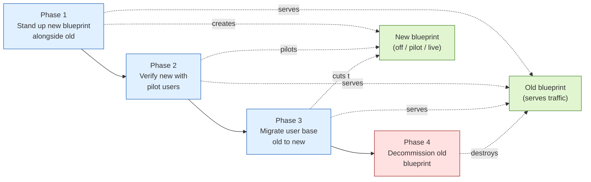
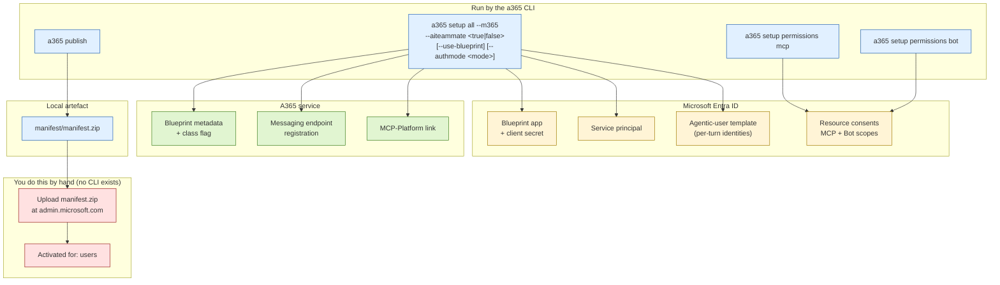
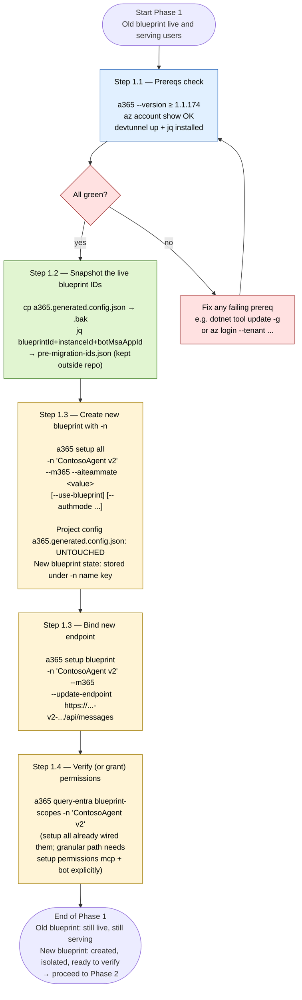

# Re-registering an Agent 365 agent — switching agent class (`--aiteammate`)

> **TL;DR.** Your A365 agent was registered with the wrong `--aiteammate` flag (`true` when you wanted `false`, or vice versa). The flag is baked into the blueprint at creation time and **A365 has no portal-side migration path**. The safe pattern is **not** "destroy the live blueprint and pray the new one works" — it's **stand up the new blueprint alongside the old, verify it end-to-end with a pilot group, migrate users, and only then decommission the old**. The old keeps serving traffic through phases 1–3; nothing destructive happens until phase 4. This file explains *why* a class swap can't be done in-place, walks the four phases step by step with prerequisites + commands + expected output + validation for each, and argues why a documented CLI workflow beats a generic skill for this kind of work.

Audience: architect-level overview in §1–§4, engineer-level runbook in §5–§14.

---

## 1. Why re-registration is required

Agent class in Agent 365 is determined by flags passed during the one-shot setup command, which lives on `a365 setup all` (not `a365 setup blueprint` — those flags don't exist on the blueprint subcommand). The full matrix of classes is in §6 Step 1.3; the short version:

```bash
# AI Teammate (M365), e.g. Draft Dodger today:
a365 setup all -n "<name>" --m365 --aiteammate true

# Blueprint-only with OBO (M365), the CLI default for non-AI-Teammate agents:
a365 setup all -n "<name>" --m365

# Blueprint-based non-DW agent (M365):
a365 setup all -n "<name>" --m365 --aiteammate false --use-blueprint
```

The class is **set once, at blueprint creation**. The flag combination decides whether you get an Entra agent-identity user (AI Teammate) or just a service principal (blueprint-only), and whether OBO / S2S / both permission modes are wired up.

**Three reasons there's no incremental "edit" path:**

1. The flag is consumed *once*, at blueprint creation, and persisted in immutable A365 blueprint metadata. There is no `a365 setup blueprint --change-class` and no equivalent in the [Agent 365 CLI Reference](https://learn.microsoft.com/en-us/microsoft-agent-365/developer/reference/cli/).
2. The M365 Admin Center → Agents pane is read-mostly for the Platform/class fields — they're server-stamped (see [`LESSONS_LEARNED.md` §23](LESSONS_LEARNED.md#23-mac-inventory-platform-column--server-stamped-no-client-lever)).
3. The Entra application + service principal that back the blueprint also carry class-specific properties; rewiring them in place isn't supported.

**Conclusion:** a class swap requires a fresh blueprint. The good news is that A365 has no problem with **two blueprints coexisting** in the same tenant — which is what makes the safer cutover pattern in §2 possible.

---

## 2. The safer cutover pattern (parallel-then-decommission)

The classic "destroy the live blueprint, then recreate" sequence has a fundamental flaw: if `a365 setup blueprint` fails after `a365 cleanup blueprint` succeeded, you have no working agent and you're staring at an Entra soft-delete recovery. Customer users see an outage during the failure window plus the BF onboarding 502 storm on the way back up.

The safer pattern flips the order: **create the new blueprint first, verify it everywhere, migrate users, then decommission the old**. Nothing destructive happens until the new is proven.



**What's preserved through phases 1–3:**
- Old blueprint, old Entra app, old service principal, old Teams installs, old audit-log continuity — all untouched. The old agent keeps serving users.
- Repo code + observability — agnostic to which blueprint dispatched the call.

**What's preserved through phase 4 (decommission):**
- Repo code + observability.
- Dev-tunnel URL (you'll move the production tunnel to the new agent service before deleting old, or run them in parallel until then).
- Historical audit-log rows under the old blueprint ID — they don't get deleted, they're just no longer being written to.

**What dies in phase 4 (and only then):**
- Old blueprint Entra app + client secret.
- Old service principal.
- Old agentic-user identities.
- *Active* Teams installs of the old agent — by phase 4, users should already be on the new one; old installs are now harmless residuals.

---

## 3. What the registration process actually does

A complete A365 agent registration is the composition of four things, in order:



Three properties of this flow that matter for the migration:

- **The CLI cannot do the last two steps.** Manifest upload and Activated-for-users are admin-center-only. Plan Global Admin presence for phase 2.
- **`a365 publish` overwrites your custom manifest description** with the CLI's generic template. Re-edit `manifest/manifest.json` and re-zip after every `publish` — see [`LESSONS_LEARNED.md` §5.2](LESSONS_LEARNED.md#52-a365-publish-no-longer-auto-uploads-to-teams).
- **The `--m365` flag is non-optional**, even for commands where the docs make it look optional. Without it the CLI silently no-ops with a misleading "skipping" message — see [`LESSONS_LEARNED.md` §5.1](LESSONS_LEARNED.md#51-update-endpoint-requires-m365).

---

## 4. CLI directly vs. a Claude skill — which should you use?

This is two questions, not one. **Generic skills** (a hypothetical "A365 setup skill" that claims to register any A365 agent) are very different from **project-specific skills** (e.g., `/draft-dodger-setup` in this repo, hand-tuned against this exact codebase and tenant pattern). They deserve different answers.

### Default: prefer the CLI directly

For production registration work — including the migration this document describes — **the CLI is the right tool**. The reasoning isn't anti-skill, it's pro-contract-with-Microsoft:

- **The CLI is what Microsoft maintains.** Every flag, every subcommand, every error message comes from the [Agent 365 CLI Reference](https://learn.microsoft.com/en-us/microsoft-agent-365/developer/reference/cli/). When a new CLI version ships, *that* is the source of truth. A skill is at best a wrapper that may or may not have been updated.
- **Deterministic output.** `a365 setup all -n "<name>" --m365 --aiteammate false` produces the same effect every time it succeeds, and a parseable error every time it fails. An LLM-driven skill can interpret the same situation two different ways across two runs.
- **Auditable.** Shell history is a normal part of a customer's audit trail. A chat transcript with a skill is not — and "the skill did it" is harder to defend in a post-incident review than "this exact command, with this exact output, at this exact time".
- **Scriptable.** Once you have the working sequence, you wrap it in a Makefile / CI step / IaC pipeline. Skills don't compose with the rest of your toolchain.
- **No hidden state changes.** Skills can edit config files, retry commands, swap flags silently. The CLI doesn't move unless you tell it to.

### When a skill helps anyway

Skills earn their keep when they encode **institutional memory** the bare CLI does not — known quirks, timing windows, ordered manual steps, error-to-fix routing. The A365 CLI has several of these (the `--m365` requirement, the manifest description overwrite, the Bot Framework 502 onboarding storm), and remembering them all every time is real cognitive load.

But that value only materialises when the skill is **tested against your specific situation**:

| Skill type | Recommendation |
|---|---|
| **Generic A365 setup skill** (e.g. a marketplace skill that claims to work on any tenant) | **Avoid for production work.** A generic skill cannot know your tenant's licensing, your manifest customisations, your Entra topology. It will work in the happy path and fail in interesting ways outside it — and the LLM has to guess how to handle the failures. |
| **Project-specific skill** (e.g. `.claude/skills/draft-dodger-setup` in this repo) | **OK to use** for the project it ships with. It's hand-validated against this exact codebase, this manifest shape, the documented LESSONS_LEARNED quirks. |
| **Customer-owned skill** built from your own `LESSONS_LEARNED.md` | **Best of both worlds** if you have the engineering bandwidth — encodes your tenant's quirks, stays in your audit boundary, can be versioned alongside the agent code. |

### Practical recommendation for the migration

Whichever you pick, **every step in §6–§13 below maps to a single `a365` command or admin-center action**. If you use a skill, ask it to print the commands it's about to run before executing them, so the audit trail captures what actually happened. If a skill insists on running commands it won't show you, that's a reason to drop back to the CLI for this work.

---

## 5. Worked example we'll thread through the runbook

To make each step concrete, the rest of this document follows a single example migration. Substitute your own values where they appear.

| Field | Example value |
|---|---|
| Tenant | `contoso.onmicrosoft.com` |
| Existing (old) agent display name | `ContosoAgent` |
| Existing agent's class | `--aiteammate true` |
| Existing dev tunnel | `contoso-agent-3978.uks.devtunnels.ms` |
| New blueprint name (CLI `-n` value) | `ContosoAgent v2` |
| New agent display name (in manifest) | `ContosoAgent (v2)` |
| New dev tunnel for the new agent service | `contoso-agent-v2-3978.uks.devtunnels.ms` |
| Target class | `--aiteammate false --use-blueprint` |
| Pilot user group | `pilot-agents@contoso.onmicrosoft.com` (5 users) |
| Operator's tenant role | Global Administrator |

The worked-example callouts use this notation:

> **ContosoAgent example.** *(specific value or expected output for this scenario)*

---

## 6. Phase 1 — Stand up the new blueprint alongside the old

**Goal of this phase.** Create the new blueprint in the tenant, with the correct `--aiteammate` flag, **without touching the live agent at all**. By the end of phase 1, both blueprints exist; the old one is still serving all traffic.



> **What's preserved through phase 1.** The live blueprint (Entra app, service principal, messaging endpoint, agentic-user identities, Teams installs, audit-log continuity) is bit-identical at the end of phase 1 to what it was at the start. The only filesystem change to the live registration is the read-only snapshot you took in Step 1.2 (a copy + a `pre-migration-ids.json` scratch file). Nothing in Step 1.3 or 1.4 touches `a365.generated.config.json`.

### Step 1.1 — Prereqs check

**Why this step.** A surprising number of failures in this flow trace back to an outdated CLI or a missing tool. Catching them now costs 60 seconds; catching them after `a365 setup blueprint` is mid-flight is much worse.

**State going in.** Nothing about your existing setup has changed — old agent is live, serving users.

**Prerequisites.**
- macOS / Linux / WSL shell.
- You're logged into the right Azure tenant (`az login --tenant contoso.onmicrosoft.com`).
- You have Global Administrator role (or a Global Admin standing by to grant consent in phase 2).

**Action.**
```bash
a365 --version           # need ≥ 1.1.174
az account show          # confirm the right tenant + subscription
devtunnel --version      # any recent version
dotnet --version         # need 8+
jq --version             # used for snapshotting IDs
```

**Expected output.**
```
1.1.176+f58fdbcd84
{
  "environmentName": "AzureCloud",
  "tenantId": "<your-tenant-guid>",
  "user": { ... }
}
1.0.1525+abcdef
8.0.401
jq-1.7.1
```

> **ContosoAgent example.** `az account show` returns `"tenantId": "11111111-2222-3333-4444-555555555555"`, matching the Contoso tenant. `a365 --version` returns `1.1.176+f58fdbcd84`.

**Validation.**
- `a365 --version` is `≥ 1.1.174`. If not: `dotnet tool update -g Microsoft.Agents.A365.DevTools.Cli` — see [`LESSONS_LEARNED.md` §4](LESSONS_LEARNED.md#4-a365-cli-11109-endpoint-registration-bug).
- `az account show` shows the correct tenant ID. If not: `az login --tenant <correct-tenant-id>`.

### Step 1.2 — Snapshot the existing blueprint IDs

**Why this step.** Once the new blueprint is registered, you still need to be able to query historical audit-log rows that landed under the *old* blueprint ID. The IDs are also useful for rollback. Capture them now, before anything changes.

**State going in.** Old blueprint is live; its IDs live in the project's `a365.generated.config.json`.

**Prerequisites.**
- You're sitting in the repo root (where `a365.generated.config.json` lives).

**Action.**
```bash
cp a365.generated.config.json a365.generated.config.json.bak-$(date +%Y%m%d)
jq '{
  oldBlueprintId: .agentBlueprintId,
  oldInstanceId: .agentInstanceId,
  oldBotMsaAppId: .botMsaAppId
}' a365.generated.config.json > pre-migration-ids.json
cat pre-migration-ids.json
```

**Expected output.**
```json
{
  "oldBlueprintId": "f4762823-1234-5678-9abc-def012345678",
  "oldInstanceId": "fc3ad290-aaaa-bbbb-cccc-ddddeeee0000",
  "oldBotMsaAppId": "9c8f1234-1111-2222-3333-444455556666"
}
```

> **ContosoAgent example.** The file you write out captures the three GUIDs that identify the old ContosoAgent blueprint, its agentic-user template, and the bot MSA app. You'll cross-reference these in phase 4 to confirm you're decommissioning the right thing.

**Validation.**
- `pre-migration-ids.json` exists, contains three non-null GUIDs.
- Save it somewhere **outside** the repo (e.g. your password manager / secure note). Once phase 4 runs, these GUIDs are the only handle you have on historical audit rows.

### Step 1.3 — Create the new blueprint with `-n` (isolated config)

**Why this step — and why `-n`.** This is the heart of the parallel-then-decommission pattern. Two things to internalise:

*What the CLI normally does (without `-n`):* The `a365` CLI is project-scoped. When you run any setup command in a directory, it reads inputs from `a365.config.json` (the project's source-of-truth config) and writes outputs to `a365.generated.config.json` (the project's record of what's currently registered — blueprintId, secret, endpoint URL, etc.). There's room for exactly **one** blueprint per project directory. If you ran `a365 setup all` without `-n` right now, the CLI would **overwrite** `a365.generated.config.json` with the new blueprint's IDs — and the moment that overwrite happens, your handle on the live blueprint is gone. You'd be unable to point at the live one for cleanup later because the project config no longer knows it exists.

*What `-n "<name>"` changes:* The `-n` flag tells the CLI "this isn't a project-config operation — it's a free-floating named registration". With `-n`, the CLI:
1. Doesn't read `a365.config.json`. It derives the agent display name from the `-n` value and the tenant from `az account show`. So the live config file is never opened.
2. Doesn't write to `a365.generated.config.json`. The new blueprint's IDs (blueprintId, instanceId, botMsaAppId, clientSecret) are stored against the `-n` name string in a separate name-keyed store the CLI manages. Per `a365 cleanup --help`: "Loads resource IDs from generated config in the current directory first, then falls back to the global generated config if available." That "global generated config" is the name-keyed store.

*What "isolated" means in practice:* You can have ten different blueprints registered in the same tenant, each with a unique `-n` value, none of them touching `a365.config.json` or `a365.generated.config.json`. The project's main config remains the canonical pointer to the **live** blueprint; every `-n`-keyed registration lives in its own slot in the global store.

*How you address the new blueprint later:* Every subsequent CLI command that needs to operate on the new blueprint — `setup blueprint --update-endpoint`, `setup permissions`, `query-entra`, `publish`, `cleanup blueprint`, etc. — takes the same `-n "<same name>"` value. That's the only handle the CLI has on this blueprint until you destroy it (or the project config) in phase 4. If you misspell `-n` on a follow-up command, the CLI either fails to find the blueprint or operates on the wrong one.

*Why this matters for safety:* Without `-n`, you'd be doing destroy-first by accident — running `setup all` would clobber the project config and leave you with one blueprint (the new one) and no way to reach the old. The whole "old keeps serving traffic through phases 1–3" promise depends on `-n` keeping the two registrations in separate namespaces.

**State going in.** Old blueprint live; `a365.generated.config.json` still points at the old IDs.

**Prerequisites.**
- Step 1.1 passed.
- You know the target class — see the matrix below.
- Your dev tunnel for the new agent service is created and exposing port `3978` (a different tunnel from the production one — see step 2.1 for why).

**Pick the target class.**

Agent class is set by the flag combination passed to `a365 setup all`. The flags are validated against CLI 1.1.176; run `a365 setup all --help` and `a365 publish --help` on your machine if you're on a different version.

| Class | Flags | What you get | When to pick it |
|---|---|---|---|
| **AI Teammate (M365)** | `--m365 --aiteammate true` | Blueprint **plus** an Entra agent-identity user. Surfaces in M365 Copilot **Agents** tab. Admin consent required for permissions. This is what `ContosoAgent` currently is. | Default for agents that should appear as standalone team members in M365 Copilot; need a user-like identity for OBO flows. |
| **AI Teammate (non-M365)** | `--aiteammate true` (no `--m365`) | Same as above but the messaging endpoint is not registered via MCP Platform — you configure the bot endpoint via Teams Developer Portal instead. | Teams-channel-only agent; you don't want it visible in M365 Copilot Agents tab. |
| **Blueprint-only with OBO (M365)** *— CLI default* | `--m365` (no `--aiteammate`, no `--authmode`; equivalent to `--aiteammate false --authmode obo`) | Blueprint + auto-created service principal; **no** Entra user. Delegated permissions (on-behalf-of); no admin consent required for OBO scopes. | Most server-to-server agents that act on behalf of the calling user. |
| **Blueprint-only with S2S (M365)** | `--m365 --authmode s2s` | Blueprint + SP. App permissions on the agent identity, not delegated. Admin consent required. | Agents that run scheduled jobs or other non-user-initiated work. |
| **Blueprint-only with both grants** | `--m365 --authmode both` | Both delegated (OBO) and app (S2S) permissions configured. | Agents that need both modes (rare — pick deliberately). |
| **Blueprint-based non-DW agent** | `--m365 --aiteammate false --use-blueprint` | Variant of blueprint-only; signals the agent is not a digital-worker (DW) agent. Registered via the `a365 setup all` flow. | A specific Microsoft-internal pattern — confirm with the A365 team before picking this. |

> If `a365 setup all --help` on your machine shows different flags or different defaults, **trust the CLI over this table**. The matrix above is a snapshot from `1.1.176`.

For the `ContosoAgent` example we're migrating from **AI Teammate (M365)** → **Blueprint-based non-DW agent**.

**Action.**

The class-aware setup lives on `a365 setup all` (not `a365 setup blueprint` — the class flags don't exist there). With `-n`, you skip the config file entirely:

```bash
# One-shot: blueprint + permissions in the chosen class.
a365 setup all \
  -n "ContosoAgent v2" \
  --m365 \
  --aiteammate false \
  --use-blueprint

# Then set the messaging endpoint for the new blueprint:
a365 setup blueprint \
  -n "ContosoAgent v2" \
  --m365 \
  --update-endpoint "https://contoso-agent-v2-3978.uks.devtunnels.ms/api/messages"
```

`a365 setup all` runs blueprint creation + `setup permissions mcp` + `setup permissions bot` in sequence. The endpoint then has to be set via `setup blueprint --update-endpoint` because the `-n` mode has no config file with a `messagingEndpoint` field.

**Expected output (truncated, both commands run cleanly).**
```
[setup all] Step 1/3: Creating blueprint "ContosoAgent v2 Identity"... done.
[setup all] Step 2/3: Configuring MCP permissions... done.
[setup all] Step 3/3: Configuring Bot Framework permissions... done.

Blueprint registered:
  blueprintId    : 7a8b9c0d-eeee-ffff-1111-222233334444
  instanceId     : 1122334455-aaaa-bbbb-cccc-ddddeeeeffff
  botMsaAppId    : abcdef12-3456-7890-1234-567890abcdef
  clientSecret   : (rotated, written to .a365/ContosoAgent v2/generated.config.json)

[setup blueprint --update-endpoint]
  New endpoint: https://contoso-agent-v2-3978.uks.devtunnels.ms/api/messages
  Done.
```

> **ContosoAgent example.** Three new GUIDs appear. None of them match the GUIDs in `pre-migration-ids.json`. The live `a365.generated.config.json` for the original `ContosoAgent` is **not** touched — verify with `jq -r '.agentBlueprintId' a365.generated.config.json`, which should still print the old `oldBlueprintId`.

**Validation.**
- New `blueprintId`, `instanceId`, `botMsaAppId` are printed and they're new GUIDs (distinct from `pre-migration-ids.json`).
- `jq -r '.agentBlueprintId' a365.generated.config.json` still equals the old `oldBlueprintId` — i.e., the live config is untouched.
- The CLI prints a non-empty client secret (or writes it to the name-keyed config). Save this — you'll plug it into the second agent service's `.env` in step 2.1.
- The second command (`--update-endpoint`) prints the new URL without errors.

### Step 1.4 — Grant permissions for the new blueprint

**Why this step.** A blueprint is just metadata until you grant the Entra app the Microsoft Graph + Bot Framework scopes it needs. Permissions are per-app, so the new blueprint's app needs its own grants — the old blueprint's grants don't transfer.

**State going in.** New blueprint exists. If you used `a365 setup all` in step 1.3, permissions have already been wired up — this step is now a *verification* step. If you ran `a365 setup blueprint` granularly instead of `setup all`, the new app has no consented scopes yet and you'll need to run the permissions subcommands explicitly.

**Prerequisites.**
- Step 1.3 succeeded.
- A Global Administrator is available (the consent step cannot be CLI-proxied for non-GA operators).

**Action (if you used `setup all` — verification only).**
```bash
a365 query-entra blueprint-scopes -n "ContosoAgent v2"
a365 query-entra instance-scopes -n "ContosoAgent v2"
```

**Action (granular path — only if you used `setup blueprint` instead of `setup all` in step 1.3).**
```bash
a365 setup permissions mcp -n "ContosoAgent v2"
a365 setup permissions bot -n "ContosoAgent v2"
# Optional, depending on what the agent needs to call:
# a365 setup permissions custom -n "ContosoAgent v2"
# a365 setup permissions copilotstudio -n "ContosoAgent v2"
```

**Expected output (granular path).**
```
[setup permissions mcp] Granting Mail.ReadWrite, Chat.ReadWrite, ChannelMessage.Read.All... done.
[setup permissions mcp] All 8 required scopes show consentGranted=true.

[setup permissions bot] Granting Bot Framework messaging scopes... done.
[setup permissions bot] All 3 required scopes show consentGranted=true.
```

> **ContosoAgent example.** If the operator running these commands is not a Global Admin, the output instead ends with `Pending admin consent — please have a Global Administrator visit: https://login.microsoftonline.com/<tenant>/adminconsent?client_id=abcdef12-3456-...`. The CLI cannot proxy this; the consent click is unavoidable.

**Validation.**
- `a365 query-entra blueprint-scopes -n "ContosoAgent v2"` shows every required scope with `"consentGranted": true`.
- If anything is `false` and you later see `AADSTS65001` in phase 2, check [`LESSONS_LEARNED.md` §13](LESSONS_LEARNED.md#13-aadsts65001-on-agent365observabilityotelwrite-despite-a-grant-existing) for the leading-space-scope edge case.

---

## 7. Phase 2 — Verify the new blueprint end-to-end with a pilot

**Goal of this phase.** Run real Teams turns through the new blueprint with a small pilot user group. By the end of phase 2 you have evidence that the new class produces the expected behaviour (Platform column, admin-centre row, audit-log shape) AND the new agent service handles traffic correctly. The old agent is still serving everyone else.

### Step 2.1 — Spin up a second agent service against the new blueprint

**Why this step.** The Python agent service (e.g. `start_with_generic_host.py`) is bound to **one** `CLIENT_ID` / `CLIENT_SECRET` pair from its `.env`. To serve the new blueprint, you need a second process — different working directory or different `.env`, different port, different tunnel — running alongside the production service.

**State going in.** Old agent service is running on production tunnel `contoso-agent-3978`. New blueprint exists in A365 but has no agent process behind it yet.

**Prerequisites.**
- Step 1.4 passed.
- The new dev tunnel `contoso-agent-v2-3978` is up and forwarding to a local port (say `3979`).
- You have the new blueprint's clientId / clientSecret from step 1.3.

**Action.**
```bash
# Clone the repo into a second working directory so the .env files don't collide:
cp -R A365_Draft_Dodger A365_Draft_Dodger_v2
cd A365_Draft_Dodger_v2

# Edit .env to point at the new blueprint:
sed -i.bak \
  -e 's|^CLIENT_ID=.*|CLIENT_ID=abcdef12-3456-7890-1234-567890abcdef|' \
  -e 's|^CLIENT_SECRET=.*|CLIENT_SECRET=<new-blueprint-secret>|' \
  -e 's|^PORT=.*|PORT=3979|' \
  .env

# Run the second instance:
uv run python start_with_generic_host.py
```

**Expected output.**
```
2026-05-11 14:23:17 | INFO     | Loaded config from .env
2026-05-11 14:23:17 | INFO     | Agent service starting on port 3979
2026-05-11 14:23:18 | INFO     | DraftDodgerAgent initialised
2026-05-11 14:23:18 | INFO     | Bot Framework adapter ready (clientId=abcdef12-3456-...)
```

> **ContosoAgent example.** A second Python process is running locally on port `3979`, fronted by `contoso-agent-v2-3978.uks.devtunnels.ms`. The original process keeps running on `3978` / production tunnel. Both are healthy; neither knows about the other.

**Validation.**
```bash
curl https://contoso-agent-v2-3978.uks.devtunnels.ms/api/health
# {"status": "ok", "agent_type": "ContosoAgent", "agent_initialized": true}
```

### Step 2.2 — Generate, customise, and upload the new manifest

**Why this step.** A blueprint isn't user-facing until a Teams app manifest references it. The manifest's `botId` field is what binds the user-installable agent to a specific blueprint's bot MSA appId. The new blueprint needs its own manifest with a different `manifestId` and a distinguishing display name (so it doesn't collide with the live agent in M365 Admin Center).

**State going in.** New blueprint live; agent service running; no manifest uploaded yet, so users still only see the old agent.

**Prerequisites.**
- Step 2.1 passed; new agent service is responding to `/api/health`.
- `a365 publish` runs cleanly in the new working directory.

**Action.**
```bash
# In the v2 working directory:
a365 publish -n "ContosoAgent v2"

# Edit the regenerated manifest with a distinguishing display name:
$EDITOR manifest/manifest.json
# Change "name.short" to "ContosoAgent (v2)" and update "id" to a new GUID.

# Re-zip:
cd manifest
zip -r manifest.zip manifest.json color.png outline.png agenticUserTemplateManifest.json
cd ..
```

**Expected output.**
```
[publish] Generating manifest from blueprint metadata... done.
[publish] Wrote manifest/manifest.json
[publish] Wrote manifest/manifest.zip (4 files, 38 KB)

WARNING: The "description.full" field has been overwritten with the CLI's
generic placeholder text. Re-edit it before uploading to admin.microsoft.com.
```

> **ContosoAgent example.** The new `manifest.json` shows `"botId": "abcdef12-3456-7890-1234-567890abcdef"` (= the new blueprint's bot MSA appId, different from the old one). After re-editing display name and description, the `manifest.zip` is ~38 KB.

Then upload via admin.microsoft.com:
1. <https://admin.microsoft.com> → Agents → All agents.
2. Click **Upload custom agent** → pick `manifest/manifest.zip` from the v2 working directory.
3. The admin centre adds a *new row* — your existing `ContosoAgent` row is unaffected.

**Validation.**
- M365 Admin Center → Agents shows two rows: `ContosoAgent` (old) and `ContosoAgent (v2)` (new).
- The Platform column for `ContosoAgent (v2)` shows the value you expected for the new class (this is the headline thing you're verifying — see [`LESSONS_LEARNED.md` §23](LESSONS_LEARNED.md#23-mac-inventory-platform-column--server-stamped-no-client-lever) for what to expect).

### Step 2.3 — Activate the new agent for the pilot user group

**Why this step.** A new agent row in admin-centre is invisible to users until you assign it to a user group. Activating it for a small pilot lets you exercise the full Teams → Bot Framework → agent path without disrupting your main user base.

**State going in.** `ContosoAgent (v2)` exists in admin-centre but is `Activated for: nobody`.

**Prerequisites.**
- Step 2.2 succeeded.
- You have a pilot user group set up (`pilot-agents@contoso.onmicrosoft.com`, 5 users).

**Action.**
1. M365 Admin Center → Agents → `ContosoAgent (v2)` → **Update**.
2. **Activated for:** select the pilot group → Save.

**Expected output.**
- The admin-centre row for `ContosoAgent (v2)` shows `Activated for: pilot-agents (5 members)` within ~1 minute.
- Pilot users see `ContosoAgent (v2)` available in Microsoft 365 Copilot → Agents.

> **ContosoAgent example.** The 5 pilot users see `ContosoAgent (v2)` appear in their Copilot Agents tab within a minute. The original `ContosoAgent` is still visible to everyone — including pilot users, who now have access to both.

**Validation.**
- Pilot user logs into Copilot, navigates to Agents, sees `ContosoAgent (v2)`. If they don't, check that the activation group membership is correct and wait a few more minutes (admin-centre propagation can take up to 15 min).

### Step 2.4 — Run pilot turns and validate behaviour

**Why this step.** The whole point of the parallel pattern is to confirm the new class **actually behaves differently** in the ways you expect — Platform column value, audit-log shape, agentic-user provisioning. Without this verification, phase 3 is just a leap of faith with prettier wrapping.

**State going in.** Pilot users have access to the new agent; agent service is running.

**Prerequisites.**
- Step 2.3 succeeded.
- You have a defined list of behaviours you're verifying (Platform column value, agentic-user identity model, etc.).

**Action.**
1. Have a pilot user open `ContosoAgent (v2)` in Copilot and send a test turn (e.g. "Hello, please introduce yourself").
2. Watch the v2 agent service logs.
3. Run `a365 query-entra -n "ContosoAgent v2"` to inspect agentic-user provisioning.
4. Check the M365 Admin Center's Activity tab for the new agent's row.

**Expected output (agent service log, on the v2 process):**
```
2026-05-11 14:41:02 | INFO     | POST /api/messages HTTP/1.1 202
2026-05-11 14:41:02 | INFO     | Turn from user b1c2d3e4-... → ContosoAgent v2
2026-05-11 14:41:03 | INFO     | Agentic-user provisioned: 99887766-1111-2222-3333-444455556666
2026-05-11 14:41:04 | INFO     | Response sent (147 chars)
```

> **ContosoAgent example.** The 202 confirms the Bot Framework path works. The agentic-user GUID is brand new (not present in `pre-migration-ids.json`), confirming the new blueprint provisions identities independently. The Platform column for `ContosoAgent (v2)` reads `Standard agent` (vs. `[AI teammate]` for the old `ContosoAgent`) — which is the class swap working.

**Validation checklist (all green before phase 3):**
- `POST /api/messages` returns `202` on the v2 service.
- Audit-log rows for the pilot turns are queryable under the new `blueprintId`.
- Platform column value matches expectation for the new class.
- Agentic-user IDs for pilot users are *new* (not the same as the old blueprint's identities).
- No 502 storm beyond the initial Bot Framework onboarding window (5–10 min after first traffic — see [`LESSONS_LEARNED.md` §8](LESSONS_LEARNED.md#8-bot-framework-502-retry-storm-during-onboarding)).
- Pilot users explicitly confirm the agent works for their use case.

**If verification fails:** the old agent is still serving everyone else; you have no outage to recover from. Investigate the v2 issue, fix it, re-pilot. The decision to decommission the old (phase 4) is entirely yours to defer.

---

## 8. Phase 3 — Migrate users from old to new

**Goal of this phase.** Move every active user from `ContosoAgent` to `ContosoAgent (v2)`. By the end of phase 3, the old agent has zero active usage; it's a vestigial install that hasn't been deleted yet.

### Step 3.1 — Announce the migration

**Why this step.** Users don't migrate themselves. A class change isn't usually visible to them, but the new agent has a different display name, a different install path, and may have different M365 surface area. Tell them what's changing and when.

**State going in.** Pilot users on v2; everyone else on old.

**Prerequisites.**
- Phase 2 verification fully green.
- Communication channel (Teams announcement, email, internal wiki).

**Action.**
- Send an org-wide notification: *"ContosoAgent is being upgraded. From <date>, please use 'ContosoAgent (v2)' instead. The original ContosoAgent will be retired on <date+2 weeks>."*
- Pin the migration steps in your support channel.

**Expected output.**
- Users start adopting the new agent. Old agent's usage curve starts to taper.

> **ContosoAgent example.** A Teams announcement is posted to the company-wide General channel on 2026-05-11. The retirement date is set to 2026-05-25 (two weeks out).

**Validation.**
- Check the M365 Admin Center → Agents → `ContosoAgent (v2)` → Activity tab over the next few days. Usage should climb. Old agent's usage should drop.

### Step 3.2 — Activate the new agent for the full user base

**Why this step.** While the announcement encourages voluntary migration, you also need to make the new agent broadly available so users can find it.

**State going in.** New agent activated for pilot only.

**Prerequisites.**
- Step 3.1 sent.

**Action.**
1. M365 Admin Center → Agents → `ContosoAgent (v2)` → **Update**.
2. **Activated for:** change from `pilot-agents` to `All users` (or your full target group) → Save.

**Expected output.**
- All users see `ContosoAgent (v2)` in Microsoft 365 Copilot → Agents within ~15 min of saving.

> **ContosoAgent example.** Activated-for is changed from `pilot-agents@contoso.onmicrosoft.com` to `All users` at 14:00 on 2026-05-11. By 14:15, all users see both agents.

**Validation.**
- Pick three random non-pilot users; ask each to confirm they can see the new agent.
- The agent service v2 logs show traffic from non-pilot user IDs.

### Step 3.3 — Monitor stability for the sunset window

**Why this step.** Production traffic at the new agent's full scale may reveal issues the pilot didn't — rate limits, edge-case prompts, dependency timeouts. The sunset window is your last chance to catch them while the old agent is still available as a fallback.

**State going in.** All users have access to both agents.

**Prerequisites.**
- Step 3.2 saved.

**Action.**
- Monitor `ContosoAgent (v2)` service logs daily for the sunset window (e.g. 2 weeks).
- Watch audit-log rows / dashboards for the new `blueprintId`.
- Track help-desk tickets mentioning the new agent.

**Expected output.**
- Daily error rate stable, no growing trend.
- 95th percentile latency comparable to the old agent.
- Old agent's usage curve approaching zero by the end of the sunset window.

> **ContosoAgent example.** Over 2026-05-11 to 2026-05-25, the v2 agent serves 1,247 turns with a 0.4% error rate (comparable to the old agent's 0.5%). The old `ContosoAgent` sees its last turn on 2026-05-23. By 2026-05-25, the old agent has zero traffic.

**Validation.**
- Old agent has zero active turns for at least 48 consecutive hours before proceeding to phase 4.

---

## 9. Phase 4 — Decommission the old blueprint (the only destructive step)

**Goal of this phase.** Delete the old blueprint, its Entra app, its service principal, and its agentic-user identities. This is the only destructive step in the entire migration — everything before this has been additive.

### Step 4.1 — Final pre-destruction confirmation

**Why this step.** Once `a365 cleanup blueprint` runs, the old blueprint is gone. Soft-delete in Entra preserves the app for 30 days but recovery is awkward and time-pressured. A 60-second sanity check now prevents a panicked Friday-afternoon Slack thread.

**State going in.** Sunset window over; old agent has zero traffic.

**Prerequisites.**
- Step 3.3 confirms zero traffic for 48+ hours.
- `pre-migration-ids.json` is still accessible (you'll cross-reference it).

**Action.**
```bash
# Re-confirm you're working in the ORIGINAL (live) project directory, not the v2 one:
pwd
# Should print: /path/to/A365_Draft_Dodger  (NOT A365_Draft_Dodger_v2)

# Confirm the blueprintId in the live config matches the one you intend to destroy:
jq -r '.agentBlueprintId' a365.generated.config.json
# Should match pre-migration-ids.json's "oldBlueprintId"

# Confirm zero recent activity on the old agent (replace placeholder with your audit-log query):
# e.g. for the past 48 hours, count audit rows for the old blueprintId
```

**Expected output.**
```
/path/to/A365_Draft_Dodger
f4762823-1234-5678-9abc-def012345678
```

> **ContosoAgent example.** You're in the original repo directory; the old `blueprintId` matches `oldBlueprintId` from `pre-migration-ids.json`; the audit-log query for the last 48 hours returns 0 rows for that blueprint. Safe to proceed.

**Validation.**
- Working directory is correct (NOT the v2 clone).
- `jq -r '.agentBlueprintId' a365.generated.config.json` matches `pre-migration-ids.json`.
- Audit-log query confirms zero recent activity.

### Step 4.2 — Destroy the old blueprint

**Why this step.** This actually removes the old blueprint. After this, the old agent is gone from A365 and the Entra app starts a 30-day soft-delete countdown.

**State going in.** Old blueprint live but unused.

**Prerequisites.**
- Step 4.1 fully green.

**Action.**
```bash
# Working directory: original (live) project root.
a365 cleanup blueprint -y
a365 cleanup instance -y
```

**Expected output.**
```
[cleanup blueprint] Deleting messaging endpoint registration... done.
[cleanup blueprint] Deleting blueprint metadata in A365... done.
[cleanup blueprint] Deleting Entra service principal... done.
[cleanup blueprint] Deleting Entra app "ContosoAgent Identity"... done (soft-deleted, restorable for 30 days).
[cleanup blueprint] All artefacts associated with blueprintId f4762823-... removed.

[cleanup instance] Deleting agentic-user identity fc3ad290-...
[cleanup instance] (deleted 17 identity associations)
```

> **ContosoAgent example.** The old `ContosoAgent` Entra app is soft-deleted (30-day recovery window). The 17 agentic-user identities accumulated under the old blueprint are removed. Audit-log rows under `f4762823-...` are preserved but won't grow.

**Validation.**
```bash
a365 query-entra
# Should fail to find the old blueprint (or print "not found")
```

### Step 4.3 — Promote the new blueprint to "the live agent" (optional cleanup)

**Why this step.** After phase 4.2, the project's `a365.generated.config.json` still points at the destroyed blueprint (now invalid). If your operational tooling assumes "the live config is `a365.generated.config.json`", you'll want to move the v2 config into its place.

**State going in.** Old blueprint destroyed; v2 blueprint live; v2 config lives under `.a365/ContosoAgent v2/`.

**Prerequisites.**
- Step 4.2 succeeded.
- You're OK with renaming the v2 blueprint's CLI name (so the project config takes over).

**Action — option A (recommended): point the project at the v2 blueprint by re-running setup with the project config**

```bash
# In the original project directory:
rm a365.generated.config.json   # old, now invalid
# Edit a365.config.json to set agentBlueprintDisplayName, messagingEndpoint,
# and the aiTeammate field to the v2 values.
a365 setup all --m365
# (--aiteammate / --use-blueprint / --authmode are read from a365.config.json's aiTeammate field
# when not using -n; pass them explicitly if you're skipping the config.)
# This is the ONE place we deliberately re-create a blueprint as the "new live" one.
# Because the old has been fully decommissioned, there's no collision.
```

After this runs, you have a third blueprint that IS the project's live one. You can then `a365 cleanup blueprint -n "ContosoAgent v2"` to remove the now-redundant v2 blueprint, OR keep v2 as the live one and rename only the manifest.

**Action — option B (simpler): keep the v2 blueprint as the live one, retire the project's main config**

- Stop the original agent service.
- Update the original `.env` to point at the v2 blueprint's secret + endpoint.
- The v2 service in `A365_Draft_Dodger_v2/` becomes the production deployment going forward.
- Move the production dev tunnel to point at the v2 service.

**Expected output (option B):**
- The original tunnel `contoso-agent-3978` is now port-forwarded to the v2 agent service.
- `A365_Draft_Dodger_v2/` is renamed back to `A365_Draft_Dodger/` (or the v2 directory is treated as the new canonical repo).
- One agent service running; one blueprint (the new one); the old `ContosoAgent` row in admin-centre is gone.

> **ContosoAgent example.** Option B is taken: the v2 working directory becomes the canonical repo going forward. The production tunnel is repointed. `contoso-agent-v2-3978` is now decommissioned (or kept as a hot spare).

**Validation.**
- Admin Center → Agents shows exactly one ContosoAgent row.
- All traffic continues to flow without users noticing the back-end rearrangement.

---

## 10. Skill-driven equivalent

If you're driving from Claude Code with the `/draft-dodger-setup` skill (or an equivalent project-specific skill in your repo):

1. Open the repo in Claude Code.
2. Run `/draft-dodger-setup`.
3. Tell the skill: *"I need to switch the agent class from `--aiteammate true` to `--aiteammate false`. Use the parallel-then-decommission pattern: stand up a new blueprint with `-n`, run it in parallel for a pilot, and don't touch the live blueprint until I confirm the new one is verified."*
4. The skill executes phase 1 (steps 1.1–1.4), pauses for you to run phase 2 verification, then waits for explicit confirmation before phase 4 (decommission).

**The skill calls the same CLI underneath.** Everything it does is in §6–§9 above. If you'd rather drive by hand, do — and re-read §4 if you're undecided.

> Keep in mind: a *generic* A365 setup skill will NOT know to do this safer pattern by default. It will most likely do the simpler "cleanup → setup" sequence. If you're going to use a skill for production work, use one that explicitly supports the parallel-then-decommission pattern, or insist it print the commands before running so you can intercept.

---

## 11. Master verification checklist

A single checklist you can read top-to-bottom to confirm every phase landed.

### Phase 1 — Parallel registration
| Check | How | Expected |
|---|---|---|
| New blueprint exists | `a365 query-entra -n "ContosoAgent v2"` | Returns the new blueprintId |
| Live config untouched | `jq -r '.agentBlueprintId' a365.generated.config.json` | Still equals `oldBlueprintId` |
| New blueprint has consented scopes | `a365 query-entra -n "ContosoAgent v2"` | All required scopes `consentGranted=true` |

### Phase 2 — Pilot verification
| Check | How | Expected |
|---|---|---|
| New agent service healthy | `curl https://contoso-agent-v2-3978.uks.devtunnels.ms/api/health` | `{"status": "ok", ...}` |
| New manifest uploaded | M365 Admin Center → Agents | Two rows visible: old + new |
| Pilot users see the new agent | Direct ask | Confirmed |
| Pilot turn returns 202 | v2 agent service log | `POST /api/messages HTTP/1.1 202` |
| New blueprint's agentic-users provisioned | `a365 query-entra -n "ContosoAgent v2"` | Identity GUIDs not in `pre-migration-ids.json` |
| Platform column reflects new class | M365 Admin Center → Agents → `ContosoAgent (v2)` | Value matches expected for new class |
| Old agent still serving everyone else | Old agent service log | `202`s continuing |

### Phase 3 — Migration
| Check | How | Expected |
|---|---|---|
| Announcement sent | Your comms tool | Posted |
| Activated-for set to All users | M365 Admin Center → `ContosoAgent (v2)` → Update | Saved |
| Non-pilot users can see the new agent | Spot-check 3 random users | All 3 see it |
| Sunset window stability | Daily error rate, p95 latency | Stable, no growing trends |
| Old agent traffic dropped to zero | Audit log query, last 48h | `0 rows` |

### Phase 4 — Decommission
| Check | How | Expected |
|---|---|---|
| Working directory is the original | `pwd` | Original repo, NOT the v2 clone |
| Old blueprintId matches what you intend to delete | `jq -r '.agentBlueprintId' a365.generated.config.json` | Equals `oldBlueprintId` |
| Cleanup completes cleanly | `a365 cleanup blueprint -y` | Exit code 0, all deletes succeeded |
| Old blueprint no longer queryable | `a365 query-entra` | Not found |
| Admin centre shows one agent row | M365 Admin Center → Agents | Only the new agent visible |
| Live traffic uninterrupted | Production agent service log | `202`s continuing on v2 service |

---

## 12. Rollback at each phase

Because phases 1–3 are non-destructive, "rollback" for those is just **stop the migration and leave things as they are**:

- **Phase 1 mid-flight failure.** If `a365 setup blueprint -n "ContosoAgent v2"` errors, the live blueprint is untouched. Investigate, fix, retry. Worst-case: `a365 cleanup blueprint -n "ContosoAgent v2" -y` to clean up the partial new blueprint and start over.
- **Phase 2 verification fails.** Don't migrate users. Either fix the v2 setup and re-pilot, OR abandon v2 entirely with `a365 cleanup blueprint -n "ContosoAgent v2" -y`. The live agent is still serving traffic the whole time.
- **Phase 3 issues surface during sunset.** Tell users to revert to the old agent (still installed and active), pause the migration, fix v2, re-announce.
- **Phase 4 fails halfway through.** This is the only phase where a failure has consequences. If `a365 cleanup blueprint` succeeded but you realise you needed the old blueprint after all, restore from Entra soft-delete:

```bash
az ad app list --filter "displayName eq 'ContosoAgent Identity'" --include-deleted-applications
az ad app restore --id <appId>
```

Then `a365 setup blueprint` will pick up the restored app on the next run. Note: only the Entra app comes back via soft-delete — the blueprint metadata in A365 is not soft-deleted and would need to be re-created. Recovery is messier than prevention; step 4.1's pre-flight check is what keeps you out of here.

---

## 13. Known pitfalls (cross-references)

| Symptom | See |
|---|---|
| `Skipping messaging endpoint update — this command only applies to M365 agents` | [`LESSONS_LEARNED.md` §5.1](LESSONS_LEARNED.md#51-update-endpoint-requires-m365) |
| Agent description shows generic placeholder text in M365 admin center | [`LESSONS_LEARNED.md` §5.2](LESSONS_LEARNED.md#52-a365-publish-no-longer-auto-uploads-to-teams) |
| `[CLIENT_APP_VALIDATION_FAILED] Client app is missing required API permissions` | [`LESSONS_LEARNED.md` §6](LESSONS_LEARNED.md#6-required-microsoft-graph-permissions-for-the-custom-client-app) |
| Wall of 502s on `POST /api/messages` right after the new blueprint registers | [`LESSONS_LEARNED.md` §8](LESSONS_LEARNED.md#8-bot-framework-502-retry-storm-during-onboarding) |
| `AADSTS65001 — user or administrator has not consented` despite the consent record existing | [`LESSONS_LEARNED.md` §13](LESSONS_LEARNED.md#13-aadsts65001-on-agent365observabilityotelwrite-despite-a-grant-existing) |
| MAC inventory's "Platform" column stays empty after the migration | [`LESSONS_LEARNED.md` §23](LESSONS_LEARNED.md#23-mac-inventory-platform-column--server-stamped-no-client-lever) |
| `[CLI 1.1.109] CallbackUri is required` even though values are set | [`LESSONS_LEARNED.md` §4](LESSONS_LEARNED.md#4-a365-cli-11109-endpoint-registration-bug) |

---

## 14. Appendix — How-to, CLI reference, skills

A condensed reference you can hand to a customer engineer who's already read the main runbook. Three how-tos, two reference tables.

### 14.1 Re-register an existing agent (the full migration, at a glance)

For when you need the order of operations without the worked-example prose:

1. **Phase 1 — parallel registration.** Snapshot old IDs → `a365 setup all -n "<new-name>" --m365 [--aiteammate …] [--use-blueprint] [--authmode …]` → `a365 setup blueprint -n "<new-name>" --m365 --update-endpoint "<new-tunnel-url>"`.
2. **Phase 2 — pilot verification.** Start second agent service against new blueprint → `a365 publish -n "<new-name>" [--aiteammate …]` → re-edit manifest → re-zip → upload at admin.microsoft.com → activate for pilot group → send pilot turns → confirm `POST /api/messages → 202` + Platform-column value matches new class.
3. **Phase 3 — user migration.** Announce → activate for all users → monitor for the sunset window (typically 2 weeks) → wait until old agent has zero traffic for 48 consecutive hours.
4. **Phase 4 — decommission.** Pre-destruction sanity check (`pwd`, `jq -r '.agentBlueprintId' a365.generated.config.json` matches `pre-migration-ids.json`) → `a365 cleanup blueprint -y` → `a365 cleanup instance -y`.

Full version with worked examples: §5–§9. Rollback at each phase: §12.

### 14.2 Create a brand-new A365 agent (happy path)

For when there's no existing agent and you want to register from zero:

1. **Prereqs.** `python3 --version` (3.12.x), `uv --version`, `az --version` + `az login --tenant <id>`, `pwsh --version`, `devtunnel --version`, `dotnet --version`, `a365 --version` (≥ 1.1.174). Global Administrator role or a Global Admin on standby. M365 Copilot licence on the tenant. Foundry project with Responses-API-capable deployment.
2. **Validate prereqs (optional but recommended).**
   ```bash
   a365 setup requirements
   ```
3. **Create the dev tunnel.**
   ```bash
   devtunnel login
   devtunnel create <name> -a
   devtunnel port create <name> -p 3978
   ```
4. **Pick the class.** Same matrix as §6 Step 1.3 — most common picks are AI Teammate (M365) or Blueprint-only with OBO (M365).
5. **One-shot setup** (recommended path):
   ```bash
   a365 setup all -n "<AgentName>" --m365 [--aiteammate true|false] [--use-blueprint] [--authmode obo|s2s|both]
   a365 setup blueprint -n "<AgentName>" --m365 --update-endpoint "https://<tunnel>-3978.<region>.devtunnels.ms/api/messages"
   ```
   …**or** the granular sequence if you want to inspect between steps:
   ```bash
   a365 setup blueprint -n "<AgentName>" --m365
   a365 setup blueprint -n "<AgentName>" --m365 --update-endpoint "<url>"
   a365 setup permissions mcp -n "<AgentName>"
   a365 setup permissions bot -n "<AgentName>"
   a365 publish -n "<AgentName>" [--aiteammate true|false] [--use-blueprint]
   ```
6. **Customise the manifest** (`a365 publish` overwrites your description with a placeholder — see [`LESSONS_LEARNED.md` §5.2](LESSONS_LEARNED.md#52-a365-publish-no-longer-auto-uploads-to-teams)). Re-edit `manifest/manifest.json`, then re-zip:
   ```bash
   cd manifest && zip -r manifest.zip manifest.json color.png outline.png agenticUserTemplateManifest.json && cd ..
   ```
7. **Upload** at <https://admin.microsoft.com> → Agents → All agents → Upload custom agent.
8. **Activate for users** in the same admin pane.
9. **Smoke test.** Send a Teams turn; expect `POST /api/messages → 202`. If you see 502s for the first 5–10 minutes, wait — it's the documented Bot Framework onboarding storm ([`LESSONS_LEARNED.md` §8](LESSONS_LEARNED.md#8-bot-framework-502-retry-storm-during-onboarding)).

For full prose treatment with explanations: [`SETUP.md`](SETUP.md).

### 14.3 CLI command reference

Snapshot from CLI 1.1.176. **When in doubt, run `a365 <command> --help` — the CLI is the source of truth, this table is a convenience.**

| Command | Purpose |
|---|---|
| `a365 --version` | Print CLI version |
| `a365 setup requirements` | Validate prerequisites (tooling, auth state) before setup |
| `a365 setup blueprint` | Create the blueprint: Entra app + service principal + (optionally) messaging endpoint |
| `a365 setup blueprint --update-endpoint <url>` | Rebind an existing blueprint to a new endpoint URL |
| `a365 setup blueprint --no-endpoint` | Create blueprint without endpoint registration |
| `a365 setup blueprint --endpoint-only` | Add endpoint to an existing blueprint |
| `a365 setup blueprint --show-secret` | Print the stored client secret (no setup performed) |
| `a365 setup permissions mcp` | Grant MCP server OAuth2 + inheritable permissions |
| `a365 setup permissions bot` | Grant Bot Framework messaging permissions |
| `a365 setup permissions custom` | Grant custom-resource OAuth2 grants |
| `a365 setup permissions copilotstudio` | Grant `CopilotStudio.Copilots.Invoke` permission |
| `a365 setup all` | Run blueprint + permissions in sequence (the recommended one-shot path) |
| `a365 publish` | Update manifest IDs and produce `manifest/manifest.zip` for admin-centre upload |
| `a365 query-entra blueprint-scopes` | List blueprint scopes + consent status |
| `a365 query-entra instance-scopes` | List instance scopes + consent status |
| `a365 cleanup blueprint` | Remove Entra app + service principal + endpoint + blueprint metadata (destructive) |
| `a365 cleanup azure` | Remove Azure App Service + Plan (only relevant if you deployed to App Service rather than a dev tunnel) |
| `a365 cleanup instance` | Remove agentic-user identities (destructive) |
| `a365 develop list-available` | List available MCP servers in the catalog |
| `a365 develop list-configured` | List MCP servers currently configured locally |
| `a365 develop add-mcp-servers <names>` | Add MCP servers to the agent's tooling manifest |
| `a365 develop remove-mcp-servers <names>` | Remove MCP servers from the tooling manifest |
| `a365 develop get-token` | Retrieve bearer tokens for MCP server auth |
| `a365 develop add-permissions` | Add MCP server API permissions to a custom application |
| `a365 develop start-mock-tooling-server` (alias `mts`) | Run a local mock MCP server for development |
| `a365 develop-mcp …` | Manage MCP servers in Dataverse environments (Power Platform) |

### 14.4 Common flags

Flags grouped by where they apply. Universal flags work on most subcommands; command-specific flags are listed under their command.

**Universal flags.**

| Flag | Effect |
|---|---|
| `-n, --agent-name <name>` | Agent base name. Skips the requirement for `a365.config.json`. Used throughout the parallel-then-decommission flow. |
| `--tenant-id <id>` | Override the auto-detected tenant from `az account show`. |
| `-v, --verbose` | Show detailed output. Worth it the first time through a new command. |
| `--dry-run` | Print what would happen without executing. Available on most setup and publish commands. |
| `-y, --yes` | Skip confirmation prompts (cleanup commands). |
| `-?, -h, --help` | Show usage information. |

**`a365 setup blueprint` flags.**

| Flag | Effect |
|---|---|
| `--no-endpoint` | Create blueprint only; skip endpoint registration. |
| `--endpoint-only` | Register only the endpoint against an existing blueprint. |
| `--update-endpoint <url>` | Delete the existing endpoint registration and rebind to `<url>`. **Requires `--m365`** ([`LESSONS_LEARNED.md` §5.1](LESSONS_LEARNED.md#51-update-endpoint-requires-m365)). |
| `--skip-requirements` | Skip the prereq-validation pre-flight. Use with care. |
| `--m365` | Treat as an M365 agent. Registers the messaging endpoint via MCP Platform. Default is off (opt-in). |
| `--show-secret` | Print the stored blueprint client secret in plaintext. No setup steps performed. |

**`a365 setup all` flags** (these are the class-aware flags — they do **not** exist on `setup blueprint`).

| Flag | Effect |
|---|---|
| `--aiteammate` | `true` = AI Teammate (Entra agent-identity user provisioned). `false` (or omitted) = blueprint-only with SP. Overrides `aiTeammate` in `a365.config.json`. |
| `--use-blueprint` | Pair with `--aiteammate false`; identifies the agent as a blueprint-based non-DW agent. |
| `--authmode` | `obo` (default for blueprint-only) / `s2s` / `both`. Not supported with `--aiteammate true`. |
| `--m365` | As above. |
| `--agent-registration-only` | Skip all setup steps and only register the agent (non-M365 agents only). |
| `--skip-requirements` | As above. |

**`a365 publish` flags** (class-aware here too).

| Flag | Effect |
|---|---|
| `--aiteammate <true|false>` | Override the class for manifest generation. Overrides `a365.config.json`. |
| `--use-blueprint` | Mark this as a blueprint-based non-DW agent. Only meaningful with `--aiteammate false`. |

**`a365 cleanup` subcommands** all accept `-n` and `-y`; the destructive subcommand is `blueprint` (Entra app + SP + endpoint + metadata), `instance` (agentic-user identities), or `azure` (App Service infrastructure).

### 14.5 Skills reference

Three skills are relevant for A365 agent work today. They all wrap the CLI — they don't replace it.

| Skill | What it does | When to use |
|---|---|---|
| `/a365-agent-builder` | Scaffolds a brand-new A365 Python agent project from scratch — repo layout, Foundry/Responses-API integration, local-run sanity check. | You don't have an agent project yet and want to start from zero. |
| `/a365-blueprint-setup` | Adds A365 Level 3 (blueprint registration + cloud observability) to an *existing* Python agent project. | You already have an agent project running locally; you want to add A365 registration on top. |
| `/draft-dodger-setup` | Project-local skill for Draft Dodger; bootstraps this repo on a new tenant. Hand-validated against this exact codebase, manifest shape, and the documented [`LESSONS_LEARNED.md`](LESSONS_LEARNED.md) quirks. | You're working with this repo, or want a reference example for building your own project-local skill. |

> **Generic skills warning.** A generic / marketplace "A365 setup skill" — one that claims to register *any* A365 agent on *any* tenant — should not be used for production work without verifying it (a) prints the commands it's about to run before executing them, and (b) handles your tenant's specific quirks. See §4 for the full argument. The three skills above are not generic in that sense: each is scoped tightly enough to be testable against a defined situation.

When a skill is the right tool, it's the right tool. When the CLI is, it is. The matrix in §4 is the load-bearing decision artefact for production work.

---

## 15. See also

- [`RE-REGISTRATION.md`](RE-REGISTRATION.md) — full 5-scenario runbook (endpoint swap, manifest re-publish, permissions re-grant, full reset, side-by-side parallel). This document is the customer-facing version of the parallel-then-decommission flow.
- [`SETUP.md`](SETUP.md) — fresh-tenant deployment runbook (companion to §14.2).
- [`LESSONS_LEARNED.md`](LESSONS_LEARNED.md) — error → root cause → fix reference.
- [Agent 365 CLI Reference](https://learn.microsoft.com/en-us/microsoft-agent-365/developer/reference/cli/) — official command docs.
- [Agent 365 development lifecycle](https://learn.microsoft.com/en-us/microsoft-agent-365/developer/a365-dev-lifecycle) — official overview of blueprints, agentic users, manifests.
