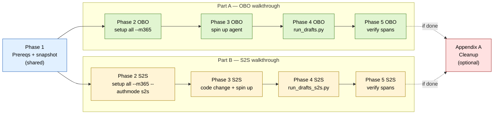
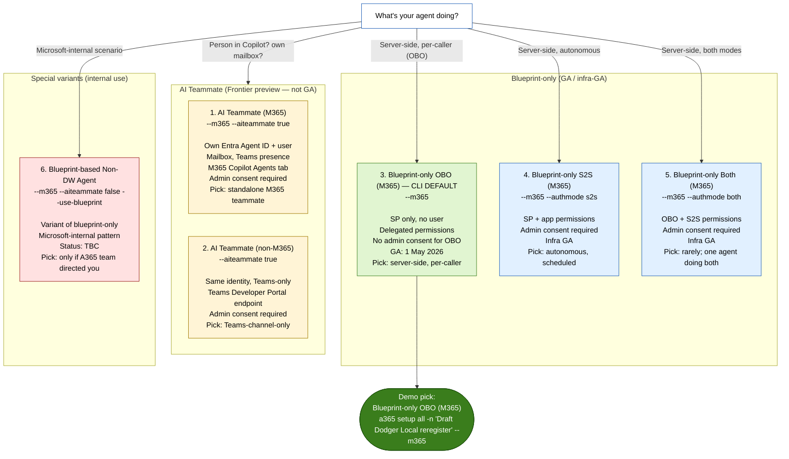

# Duplicate Draft Dodger registration — CLI-only, with observability

> **TL;DR.** Register a parallel, **GA-class** variant of Draft Dodger using only the `a365` CLI (no skills, no portal except the final span-rendering check), wire observability so spans land in the A365 admin-centre Activity tab, and prove the loop end-to-end. Two complete walkthroughs in this doc — pick one based on how your agents authenticate:
>
> - **Part A (OBO).** The agent acts *on behalf of* a calling user, borrowing their delegated token. GA-default, no admin consent. Demo proves the loop via `tests/run_drafts.py`. Use for agents triggered by user actions in M365 / Teams / Copilot.
> - **Part B (S2S).** The agent acts *as itself* using its own app permissions. Admin consent required. Requires a small `observability.py` code change to swap the token resolver. Demo proves the loop via a new `tests/run_drafts_s2s.py`. Use for autonomous pro-code agents (Databricks jobs, schedulers, queue workers) where no user is in the loop.
>
> Live Draft Dodger is untouched throughout, either path. Worked example uses `-n "Draft Dodger Local reregister"` on tunnel `a365-draft-dodger-local-reregister-3979.euw.devtunnels.ms`.

Audience: demo presenter / customer engineer. Assumes Python + Azure CLI literacy at CLAUDE.md-default level.

**What you end up with after Phase 5 (either path):**
- A second blueprint in `copilotstudiotraining.onmicrosoft.com` registered as **Blueprint-only with OBO (M365)** (Part A) or **Blueprint-only with S2S (M365)** (Part B) — both GA / infra-GA as of May 2026.
- A parallel agent service running on a sibling dev tunnel (port 3979), serving its own `/api/messages`.
- Five draft invocations producing structured `InvokeAgentScope` → `InferenceScope` → `OutputScope` spans.
- Those spans visible in [admin.cloud.microsoft](https://admin.cloud.microsoft) → Agents → `Draft Dodger Local reregister` → Activity tab. Part A spans attribute to the calling user; Part B spans attribute to the agent identity.
- Live Draft Dodger still serving real users on its original tunnel.

Phase flow:



---

## 1. Class chooser — two axes, six classes, two picks

This doc covers **two** demo paths: **Blueprint-only OBO (M365)** (Part A) and **Blueprint-only S2S (M365)** (Part B). The class chooser below walks the full six-class matrix so you can defend either pick, or pick a different class for a different scenario.

Authoritative source for this section: `/Users/roelschenk/Downloads/agent365-registration-classes.md`, synthesised from Microsoft Learn (status as of May 2026).

### 1.1 Two fundamental axes

Every A365 registration class is a point in two axes:

**Axis 1 — does the agent have its own Entra identity?**

| Mode | What it means |
|---|---|
| **AI Teammate** (`--aiteammate true`) | Agent gets its own Entra **Agent ID + agentic user account**. Own mailbox, Teams presence, OneDrive, calendar. Acts as a first-class M365 member. |
| **Blueprint-only** (`--aiteammate false`, default) | Agent gets a **blueprint + service principal**, no agentic user. Acts on behalf of a human (OBO) or runs as its own app identity (S2S), without appearing as a human-like M365 member. |

**Axis 2 — how does the agent authenticate to M365 services?**

| Mode | What it means |
|---|---|
| **OBO** (on-behalf-of) | Agent borrows a user's delegated token. Acts *as* that user, capped at that user's permissions. User consent required; **no admin consent for OBO scopes**. |
| **S2S** (server-to-server) | Agent uses its own app permissions. No user in the loop. **Admin consent required**. Headless, scheduled, background. |
| **Both** | Supports both OBO and S2S. Rare; deliberate architectural choice only. |

### 1.2 Class comparison diagram



Each class node links to its Microsoft Learn reference in the table below (Mermaid `click` directives aren't portable across renderers, so we use a footnote table):

| Class | Microsoft Learn |
|---|---|
| 1. AI Teammate (M365) | [Get started — AI teammate flow](https://learn.microsoft.com/en-us/microsoft-agent-365/developer/get-started) · [Identity](https://learn.microsoft.com/en-us/microsoft-agent-365/developer/identity) · [Foundry + Agent 365](https://learn.microsoft.com/en-us/azure/foundry/agents/how-to/agent-365) |
| 2. AI Teammate (non-M365) | [Identity](https://learn.microsoft.com/en-us/microsoft-agent-365/developer/identity) · [Teams Developer Portal](https://dev.teams.microsoft.com/) |
| 3. Blueprint-only OBO (M365) | [CLI setup reference](https://learn.microsoft.com/en-us/microsoft-agent-365/developer/reference/cli/setup) · [Blueprint setup](https://learn.microsoft.com/en-us/microsoft-agent-365/developer/registration) · [Agent registry](https://learn.microsoft.com/en-us/microsoft-365/admin/manage/agent-registry?view=o365-worldwide) |
| 4. Blueprint-only S2S (M365) | [CLI setup — `setup all`](https://learn.microsoft.com/en-us/microsoft-agent-365/developer/reference/cli/setup#setup-all) · [Identity — agent identity auth](https://learn.microsoft.com/en-us/microsoft-agent-365/developer/identity) |
| 5. Blueprint-only Both (M365) | [CLI setup — `setup all`](https://learn.microsoft.com/en-us/microsoft-agent-365/developer/reference/cli/setup#setup-all) · [Identity — authentication flows](https://learn.microsoft.com/en-us/microsoft-agent-365/developer/identity) |
| 6. Blueprint-based Non-DW Agent | [CLI setup](https://learn.microsoft.com/en-us/microsoft-agent-365/developer/reference/cli/setup) · [Dev lifecycle](https://learn.microsoft.com/en-us/microsoft-agent-365/developer/a365-dev-lifecycle) · [Register to registry](https://learn.microsoft.com/en-us/entra/agent-id/identity-platform/publish-agents-to-registry) |

### 1.3 Summary comparison

Single scannable table — the only artefact in §1 you actually need to memorise:

| Class | Own identity | Auth mode | Admin consent | GA? | Complexity |
|---|---|---|---|---|---|
| AI Teammate (M365) | Yes (user + SP) | OBO or S2S | Yes | **Frontier only** | High |
| AI Teammate (non-M365) | Yes (user + SP) | OBO or S2S | Yes | **Frontier only** | High |
| **Blueprint-only OBO (M365)** | No (SP only) | OBO | No | **GA (1 May 2026)** | **Low** |
| Blueprint-only S2S (M365) | No (SP only) | S2S | Yes | Yes (infra) | Medium |
| Blueprint-only Both | No (SP only) | OBO + S2S | Yes | Yes (infra) | High |
| Non-DW Agent | No (SP only) | OBO | TBC | Internal use | N/A |

### 1.4 Picking between the two paths in this doc

| | **Part A — Blueprint-only OBO** | **Part B — Blueprint-only S2S** |
|---|---|---|
| **CLI flags** | `--m365` only | `--m365 --authmode s2s` |
| **GA status** | GA as of 1 May 2026 | Infra GA |
| **Agent acts as** | The calling user (delegated token) | Itself (own app permissions) |
| **Admin consent** | Not required for OBO scopes | **Required** for every scope |
| **User-in-the-loop?** | Yes — needs a calling user / inbound token | No — runs autonomously |
| **Triggering pattern** | Teams turn, Copilot invocation, user-driven test | Cron, Databricks job, queue worker, scheduled task |
| **Audit attribution** | "User X did Y via the agent" | "The agent did Y autonomously" |
| **Code change required?** | No — existing `observability.py` works as-is | Yes — `observability.py` needs an S2S token resolver (~30 lines) |
| **Test harness** | `tests/run_drafts.py` (uses `az login` token) | `tests/run_drafts_s2s.py` (new file; client_credentials) |
| **Compliance story** | User-attributable, scoped to user's permissions | Agent-attributable, scoped to consented app permissions |
| **Demo friction** | Lowest — no consent prompts, no code edits | Higher — Global Admin consent + small code change |

**When to pick OBO (Part A).** Agent is triggered by user actions — chat, Copilot invocation, Teams turn. The audit trail tying every action back to a specific human is a feature, not a constraint. Permissions caps with the user's permissions are acceptable. Default for most customer-facing M365 agents and the common case for Copilot Studio / Foundry agents talking to M365 surfaces.

**When to pick S2S (Part B).** Agent runs autonomously — scheduled jobs, monitoring, batch processing, triggered by external systems (Databricks job runner, queue, webhook) with no user logged in. The agent needs its own permissions that don't depend on who's calling. This is the right pick when "who did this" should answer "the agent" and the agent's own governance / consent surface is what matters.

**Explicitly ruled out for both paths in this doc:**
- *AI Teammate (M365 or non-M365)*: Frontier preview, not GA, so unsuitable as a prod demo target. Draft Dodger today is registered as AI Teammate; that's fine for a trial but doesn't tell a GA story.
- *Blueprint-only Both*: rarely the right answer; Microsoft's own docs say "pick deliberately, not by default". If you genuinely need both, build it from the S2S walkthrough and add OBO as a second auth path — but it's almost always cleaner to split into two agents.
- *Non-DW agent*: internal use only — Microsoft's own docs say "don't, unless A365 product team directed you".

---

## 2. Worked-example state

Every step in §4 (shared) + §5–§8 (Part A) or §9–§12 (Part B) uses these values. Substitute your own if you're on a different tenant.

| Field | Value |
|---|---|
| Tenant | `copilotstudiotraining.onmicrosoft.com` (`efb073bb-283b-4757-a252-22af963721bc`) |
| Subscription | `27216037-5fe2-410b-a462-371cef3847e4` |
| Live agent | `Draft Dodger`, **AI Teammate** (Frontier), tunnel `a365-draft-dodger-3978.euw.devtunnels.ms` |
| **v2 blueprint name (`-n`)** | **`Draft Dodger Local reregister`** |
| **v2 target class — Part A** | **Blueprint-only with OBO (M365)** — flags `--m365` only |
| **v2 target class — Part B** | **Blueprint-only with S2S (M365)** — flags `--m365 --authmode s2s` |
| v2 dev tunnel | `a365-draft-dodger-local-reregister-3979.euw.devtunnels.ms` |
| v2 agent service port | `3979` (sibling to live's `3978`) |
| v2 working directory | `~/Downloads/Projects/A365_Draft_Dodger_Local_Reregister/` |
| Operator role | Global Administrator (Roel) — mandatory for Part B, recommended for Part A |

The worked-example callouts below use this notation:

> **Local-reregister example.** *(specific value or expected output for this scenario)*

---

## 3. Auth prerequisites cheatsheet

Glance at this before the demo to plan who needs to be on the call. Sources: `a365 <cmd> --help` text, `LESSONS_LEARNED.md`, PowerShell-script comments in `deployment script/`.

| Step / CLI action | Required role | Why |
|---|---|---|
| `a365 --version`, `az --version`, etc. | Local user | Read-only local |
| `az login --tenant <id>` | Tenant member | Token issuance for downstream `az` and CLI calls |
| `devtunnel login`, `devtunnel create`, `devtunnel port create` | DevTunnel account holder | User-scoped to the signed-in DevTunnel account |
| `a365 setup blueprint` (alone) | **Agent ID Developer** on the tenant | Per `a365 setup blueprint --help` |
| `a365 setup permissions {mcp,bot,custom,copilotstudio}` | **Global Administrator** | Per `a365 setup permissions --help` (admin-consent grant) |
| `a365 setup all --m365` (Part A — OBO) | Recommended **Global Administrator**; will run as Agent ID Developer but prints an admin-consent URL for non-OBO scopes | Wraps `setup blueprint` + `setup permissions` |
| `a365 setup all --m365 --authmode s2s` (Part B — S2S) | **Global Administrator — mandatory** | App permissions require tenant-wide admin consent; no soft path |
| `a365 setup blueprint --update-endpoint` | Agent ID Developer | Same role as `setup blueprint` |
| `a365 query-entra blueprint-scopes` | Tenant member | Read-only Entra query |
| Graph PATCH to fix leading-space scope bug | **Application Administrator** or Global Administrator | Graph permission on `oauth2PermissionGrants` |
| Start v2 agent service (`uv run python ...`) | Local user | Local process |
| Run `tests/run_drafts.py` | Local user + `az login` for Foundry calls | Direct in-process agent call, hits Foundry Responses API |
| Admin-centre Activity tab (Phase 5 verification) | M365 admin role with agent visibility (Global Admin works) | Portal-side render |
| `a365 cleanup blueprint -n ...` (Appendix A) | Agent ID Developer / blueprint owner | Per `a365 cleanup --help` |

> **If you're not Global Administrator on the demo day:** Phase 2 (`setup all`) will print an admin-consent URL for OBO scopes to be consented to. OBO doesn't strictly require consent, but `setup all` also configures Bot Framework and other scopes that do. Have a Global Admin on standby.

---

## 4. Phase 1 — Prereqs and snapshot

**Goal.** Verify the toolchain, confirm operator role, create the v2 dev tunnel, snapshot the live registration so it can't be confused with the new one.

### Step 1.1 — Verify CLI + supporting tooling

**Why this step.** Most parallel-registration failures trace back to one of: old `a365`, missing `az` login, broken dev tunnel, missing `jq`. Catching them now costs 60 seconds.

**State going in.** Live Draft Dodger running normally.

**Prerequisites.**
- macOS / Linux / WSL shell.
- Local user can run `brew install` if anything's missing.

**Action.**
```bash
a365 --version           # need ≥ 1.1.174
az --version             # any recent
az account show          # confirm tenant + subscription
devtunnel --version
dotnet --version         # need 8+
uv --version
jq --version
```

**Expected output.**
```
1.1.176+f58fdbcd84
azure-cli                         2.x.x
{
  "environmentName": "AzureCloud",
  "tenantId": "efb073bb-283b-4757-a252-22af963721bc",
  ...
}
1.0.1525+abcdef
8.0.x
uv 0.x.x
jq-1.7.1
```

> **Local-reregister example.** All checks return clean. Tenant is `efb073bb-...` — confirm this matches the live Draft Dodger's tenant before continuing.

**Validation.**
- All commands print versions without errors.
- `a365 --version` ≥ `1.1.174`. If older: `dotnet tool update -g Microsoft.Agents.A365.DevTools.Cli` (see [`LESSONS_LEARNED.md` §4](../LESSONS_LEARNED.md#4-a365-cli-11109-endpoint-registration-bug)).
- `az account show` returns the right tenantId.

### Step 1.2 — Confirm operator role

**Why this step.** Phase 2's `setup all` triggers admin-consent prompts when configuring Bot Framework scopes. If the operator isn't Global Admin, you need to know now (so you can pre-arrange one to be on the call).

**State going in.** Step 1.1 passed.

**Prerequisites.**
- Operator is signed into Azure CLI on the right tenant.

**Action.**
```bash
OPERATOR_ID=$(az ad signed-in-user show --query 'id' -o tsv)
az role assignment list --assignee "$OPERATOR_ID" --all \
  --query "[?roleDefinitionName=='Global Administrator'].{role:roleDefinitionName, scope:scope}" -o table
```

**Expected output (operator is Global Admin).**
```
Role                    Scope
----------------------  ------
Global Administrator    /
```

**Expected output (operator is NOT Global Admin).**
```
(empty)
```

> **Local-reregister example.** Roel runs this and sees the Global Administrator row → green light to proceed without a separate consent operator on standby.

**Validation.**
- At least one Global Administrator row appears.
- If empty: pre-arrange a Global Admin to click the admin-consent URL when Phase 2 prompts.

### Step 1.3 — Create the v2 dev tunnel

**Why this step.** The v2 agent service needs its own messaging endpoint so it can run alongside the live agent. Sharing a tunnel won't work — only one bot can listen on a given `/api/messages` URL at a time.

**State going in.** Live tunnel `a365-draft-dodger-3978` is running.

**Prerequisites.**
- DevTunnel CLI installed and logged in.

**Action.**
```bash
devtunnel login                                                    # interactive, opens browser
devtunnel create a365-draft-dodger-local-reregister -a             # -a = anonymous (required for Bot Framework)
devtunnel port create a365-draft-dodger-local-reregister -p 3979
devtunnel show a365-draft-dodger-local-reregister
```

**Expected output.**
```
Tunnel ID:           a365-draft-dodger-local-reregister.euw
Description:         (none)
Region:              euw (West Europe)
Tunnel Endpoints:
  https://a365-draft-dodger-local-reregister-3979.euw.devtunnels.ms
```

> **Local-reregister example.** Tunnel URL: `https://a365-draft-dodger-local-reregister-3979.euw.devtunnels.ms`. This becomes the messaging endpoint registered in Step 2.2.

**Validation.**
- `devtunnel show` returns the new tunnel without "not found".
- The endpoint URL contains `:3979` (sibling to live's `:3978`).

### Step 1.4 — Snapshot the live Draft Dodger

**Why this step.** Even though phase 2 uses `-n` and won't touch the live config, having the live blueprint's IDs in a separate file makes rollback unambiguous and gives you a handle on historical audit-log rows.

**State going in.** Live `a365.generated.config.json` exists in the repo root.

**Prerequisites.**
- Sitting in `~/Downloads/Projects/A365_Draft_Dodger/`.

**Action.**
```bash
cd ~/Downloads/Projects/A365_Draft_Dodger
cp a365.generated.config.json a365.generated.config.json.bak-$(date +%Y%m%d)
jq '{
  liveBlueprintId: .agentBlueprintId,
  liveInstanceId: .agentInstanceId,
  liveBotMsaAppId: .botMsaAppId
}' a365.generated.config.json > ~/pre-duplicate-ids.json
cat ~/pre-duplicate-ids.json
```

**Expected output.**
```json
{
  "liveBlueprintId": "f4762823-1234-5678-9abc-def012345678",
  "liveInstanceId":  "fc3ad290-aaaa-bbbb-cccc-ddddeeee0000",
  "liveBotMsaAppId": "9c8f1234-1111-2222-3333-444455556666"
}
```

> **Local-reregister example.** The three live GUIDs are captured to `~/pre-duplicate-ids.json` outside the repo. Saved for the duration of the demo.

**Validation.**
- `~/pre-duplicate-ids.json` exists, contains three non-null GUIDs.
- The `.bak-YYYYMMDD` file exists alongside the live `a365.generated.config.json`.

---

# Part A — OBO walkthrough (Blueprint-only OBO M365)

> Use this path if your agent is triggered by user actions and acts on behalf of the calling user.
> CLI signature: `a365 setup all -n "Draft Dodger Local reregister" --m365`
> No code changes to `observability.py` required.

## 5. Part A · Phase 2 — Create the v2 blueprint via CLI (OBO)

**Goal.** Stand up the v2 blueprint with class **Blueprint-only OBO (M365)** using only the CLI. By the end of phase 2, the v2 blueprint exists, has its endpoint bound, has the right permissions consented, and the known leading-space scope bug is either fixed or confirmed absent.

### Step 2.1 — Create blueprint + permissions in one shot

**Why this step.** `a365 setup all` runs `setup blueprint`, `setup permissions mcp`, and `setup permissions bot` in sequence. With `-n`, the IDs land in a name-keyed config slot (not the project's `a365.generated.config.json`), so the live blueprint's pointer is untouched.

**State going in.** Live `a365.generated.config.json` still points at the AI Teammate Draft Dodger; v2 tunnel exists; no v2 blueprint yet.

**Prerequisites.**
- Operator role: **Global Administrator** (or have one ready for the admin-consent URL).
- Step 1.1–1.3 passed.

**Action.**
```bash
a365 setup all -n "Draft Dodger Local reregister" --m365
```

Class flags explained:
- **`--m365`**: register the messaging endpoint via MCP Platform (M365-integrated agent).
- **No `--aiteammate`** → CLI default `false` → Blueprint-only (SP, no agentic user).
- **No `--authmode`** → CLI default `obo` → delegated permissions only, no admin consent for OBO scopes.

**Expected output (truncated, all green).**
```
[setup all] Step 1/3: Creating Entra app "Draft Dodger Local reregister Identity"... done.
[setup all]            Service principal created.
[setup all]            Blueprint metadata registered in A365.
[setup all]            MCP Platform linked.
[setup all] Step 2/3: Configuring MCP permissions (delegated/OBO scopes)... done.
[setup all]            All 8 required scopes show consentGranted=true.
[setup all] Step 3/3: Configuring Bot Framework messaging permissions... done.
[setup all]            All 3 required scopes show consentGranted=true.

Blueprint registered:
  agent name        : Draft Dodger Local reregister
  blueprintId       : 7a8b9c0d-eeee-ffff-1111-222233334444
  instanceId        : 1122334455-aaaa-bbbb-cccc-ddddeeeeffff
  botMsaAppId       : abcdef12-3456-7890-1234-567890abcdef
  clientSecret      : (rotated, written to .a365/Draft Dodger Local reregister/generated.config.json)

Next step: a365 setup blueprint -n "Draft Dodger Local reregister" --m365 --update-endpoint <url>
```

> **Local-reregister example.** Three new GUIDs, none matching `~/pre-duplicate-ids.json`. Critically, `jq -r '.agentBlueprintId' a365.generated.config.json` still returns `liveBlueprintId` from the snapshot — the live config is bit-identical to before this step.

**Validation.**
- New `blueprintId`, `instanceId`, `botMsaAppId` printed; all are distinct from `~/pre-duplicate-ids.json`.
- `jq -r '.agentBlueprintId' a365.generated.config.json` unchanged (= `liveBlueprintId`).
- Save the new client secret — Step 3.2 needs it for the v2 `.env`.

### Step 2.2 — Bind the v2 messaging endpoint

**Why this step.** `setup all -n` doesn't have an `a365.config.json` to read `messagingEndpoint` from, so the v2 blueprint has no endpoint bound. `setup blueprint --update-endpoint` is the targeted bind command.

**State going in.** v2 blueprint exists with no messaging endpoint.

**Prerequisites.**
- Operator role: **Agent ID Developer** (same role as `setup blueprint`).
- Step 2.1 succeeded.

**Action.**
```bash
a365 setup blueprint \
  -n "Draft Dodger Local reregister" \
  --m365 \
  --update-endpoint "https://a365-draft-dodger-local-reregister-3979.euw.devtunnels.ms/api/messages"
```

> ⚠️ **`--m365` is mandatory.** Without it the command silently no-ops with "*Skipping messaging endpoint update — this command only applies to M365 agents.*" See [`LESSONS_LEARNED.md` §5.1](../LESSONS_LEARNED.md#51-update-endpoint-requires-m365).

**Expected output.**
```
[setup blueprint] Updating messaging endpoint for blueprintId 7a8b9c0d-...
[setup blueprint] New endpoint: https://a365-draft-dodger-local-reregister-3979.euw.devtunnels.ms/api/messages
[setup blueprint] Done. Blueprint metadata unchanged except for messagingEndpoint.
```

> **Local-reregister example.** Endpoint bind succeeds for the new blueprintId from Step 2.1. The live blueprint's endpoint is untouched.

**Validation.**
- The new endpoint URL prints back without any "skipping" warning.
- Re-run `a365 query-entra blueprint-scopes -n "Draft Dodger Local reregister"` and confirm the endpoint registration is reflected.

### Step 2.3 — Verify permissions landed

**Why this step.** `setup all` already consented the required scopes, but the grant blob is what the agent service will actually use. Confirming it's correct now is cheaper than debugging an `AADSTS65001` in Phase 4.

**State going in.** v2 blueprint exists; permissions consented in Step 2.1.

**Prerequisites.**
- Operator role: tenant member.

**Action.**
```bash
a365 query-entra blueprint-scopes -n "Draft Dodger Local reregister"
a365 query-entra instance-scopes -n "Draft Dodger Local reregister"
```

**Expected output (truncated).**
```
Blueprint scopes for "Draft Dodger Local reregister" (blueprintId 7a8b9c0d-...):
  Microsoft Graph:
    Mail.ReadWrite                      consentGranted=true
    Chat.ReadWrite                      consentGranted=true
    ChannelMessage.Read.All             consentGranted=true
    User.Read                           consentGranted=true
    Sites.Read.All                      consentGranted=true
  Agent 365 Tools:
    McpServersMetadata.Read.All         consentGranted=true
  Messaging Bot API:
    Authorization.user_impersonation    consentGranted=true
  Observability API:
    Agent365.Observability.OtelWrite    consentGranted=true   ⚠ check for leading space — see Step 2.4
  Power Platform API:
    Connectivity.user_impersonation     consentGranted=true
```

> **Local-reregister example.** All eight scopes show `consentGranted=true`. The Observability API scope row is the one we'll inspect in Step 2.4.

**Validation.**
- Every required scope shows `consentGranted=true`.
- Count matches the live Draft Dodger's grant count (run the same command without `-n` to compare if you want).

### Step 2.4 — Preventively fix the leading-space scope bug

**Why this step.** CLI 1.1.174–1.1.176 has a known defect where single-scope grants on the Observability API are emitted with a **leading space** in the `scope` field (`" Agent365.Observability.OtelWrite"` instead of `"Agent365.Observability.OtelWrite"`). At runtime the token-exchange call sees the malformed scope and returns `AADSTS65001 — user or administrator has not consented`. The grant looks correct in the M365 admin centre and in `a365 query-entra`, but the actual Graph object is broken.

Fixing it preventively, before the demo, beats troubleshooting it live. See [`LESSONS_LEARNED.md` §13](../LESSONS_LEARNED.md#13-aadsts65001-on-agent365observabilityotelwrite-despite-a-grant-existing) for the full root-cause analysis.

**State going in.** All scopes appear consented per Step 2.3, but the Observability scope may have an invisible leading space.

**Prerequisites.**
- Operator role: **Application Administrator** or **Global Administrator** (Graph permission on `oauth2PermissionGrants`).

**Action.**

First, find the v2 blueprint's app object ID and the Observability API SP's object ID:

```bash
# v2 blueprint app objectId — derive from blueprintId via Entra
V2_BP_APP_ID=$(jq -r '.agentBlueprintId' ".a365/Draft Dodger Local reregister/generated.config.json")
V2_BP_SP_ID=$(az ad sp list --filter "appId eq '$V2_BP_APP_ID'" --query '[0].id' -o tsv)

# Observability API SP — tenant-wide constant
OBSERVABILITY_SP_ID=$(az ad sp list --filter "appId eq '9b975845-388f-4429-889e-eab1ef63949c'" --query '[0].id' -o tsv)

echo "v2 blueprint SP : $V2_BP_SP_ID"
echo "observability SP: $OBSERVABILITY_SP_ID"
```

Then query the grant and inspect the `scope` field:

```bash
GRANT_JSON=$(az rest -m GET --url \
  "https://graph.microsoft.com/v1.0/oauth2PermissionGrants?\$filter=clientId eq '$V2_BP_SP_ID' and resourceId eq '$OBSERVABILITY_SP_ID'")

echo "$GRANT_JSON" | jq -r '.value[] | {id, scope: .scope, hasLeadingSpace: (.scope | startswith(" "))}'
```

**Expected output — bug present.**
```json
{
  "id": "GRANT-GUID-HERE",
  "scope": " Agent365.Observability.OtelWrite",
  "hasLeadingSpace": true
}
```

**Expected output — bug absent (already fixed or never present).**
```json
{
  "id": "GRANT-GUID-HERE",
  "scope": "Agent365.Observability.OtelWrite",
  "hasLeadingSpace": false
}
```

**If `hasLeadingSpace=true`, PATCH the grant:**

```bash
GRANT_ID=$(echo "$GRANT_JSON" | jq -r '.value[0].id')
az rest -m PATCH \
  --url "https://graph.microsoft.com/v1.0/oauth2PermissionGrants/$GRANT_ID" \
  --headers "Content-Type=application/json" \
  --body '{"scope":"Agent365.Observability.OtelWrite"}'
```

Then re-query to confirm:

```bash
az rest -m GET --url "https://graph.microsoft.com/v1.0/oauth2PermissionGrants/$GRANT_ID" \
  | jq -r '{scope: .scope, hasLeadingSpace: (.scope | startswith(" "))}'
```

**Expected output after PATCH.**
```json
{
  "scope": "Agent365.Observability.OtelWrite",
  "hasLeadingSpace": false
}
```

> **Local-reregister example.** The query returns `hasLeadingSpace: true` (it usually does with CLI 1.1.176). The PATCH runs cleanly. Re-query confirms `hasLeadingSpace: false`. The demo is now insulated against the §13 failure mode.

**Validation.**
- Final query shows `scope` exactly equal to `"Agent365.Observability.OtelWrite"` (no leading whitespace).
- Phase 4's `tests/run_drafts.py` does not produce `AADSTS65001` errors.

---

## 6. Part A · Phase 3 — Spin up the v2 agent service (OBO)

**Goal.** Get a Python process running locally, bound to the v2 blueprint's credentials, listening on port 3979, with observability env-vars set. By the end of phase 3, `/api/health` returns ok and the agent is ready to be invoked.

### Step 3.1 — Set up the v2 working directory

**Why this step.** The Python agent service is bound to one `(CLIENT_ID, CLIENT_SECRET)` pair via `.env`. To run alongside the live agent, the v2 needs its own working directory with its own `.env`. Cloning the repo is the lightest path.

**State going in.** Live repo at `~/Downloads/Projects/A365_Draft_Dodger/`.

**Prerequisites.**
- Local user can write to `~/Downloads/Projects/`.

**Action.**
```bash
cp -R ~/Downloads/Projects/A365_Draft_Dodger ~/Downloads/Projects/A365_Draft_Dodger_Local_Reregister
cd ~/Downloads/Projects/A365_Draft_Dodger_Local_Reregister
```

**Expected output.** No stdout. The directory now exists.

> **Local-reregister example.** The clone takes ~5–10s depending on `.venv` size. Everything in the live repo is copied including `.env`, `a365.generated.config.json` (still pointing at the live blueprint — we'll overwrite the relevant fields in Step 3.2), and the entire `.venv`.

**Validation.**
- `~/Downloads/Projects/A365_Draft_Dodger_Local_Reregister/.env` exists.
- `ls ~/Downloads/Projects/A365_Draft_Dodger_Local_Reregister/agent.py` returns the file.

### Step 3.2 — Stamp the v2 `.env`

**Why this step.** The cloned `.env` still has the live blueprint's `CLIENT_ID`, `CLIENT_SECRET`, port, etc. The v2 service needs the v2 credentials, a different port, and the two manual observability env-var gates (`ENABLE_A365_OBSERVABILITY=true`, `ENABLE_A365_OBSERVABILITY_EXPORTER=true`) which the CLI **does not stamp**.

**State going in.** v2 working directory contains a cloned `.env` with live credentials.

**Prerequisites.**
- Step 2.1 finished and printed (or wrote to the `-n`-keyed generated config) the v2 `blueprintId`, `botMsaAppId`, and `clientSecret`.

**Action.**

First, pull the v2 secrets from the `-n`-keyed generated config:

```bash
V2_GEN=".a365/Draft Dodger Local reregister/generated.config.json"
V2_CLIENT_ID=$(jq -r '.botMsaAppId' "$V2_GEN")
V2_CLIENT_SECRET=$(a365 setup blueprint -n "Draft Dodger Local reregister" --show-secret 2>/dev/null | tail -n 1)
V2_BLUEPRINT_ID=$(jq -r '.agentBlueprintId' "$V2_GEN")
TENANT_ID="efb073bb-283b-4757-a252-22af963721bc"
```

Then patch the v2 `.env`:

```bash
cd ~/Downloads/Projects/A365_Draft_Dodger_Local_Reregister
cp .env .env.live-backup   # safety: keep the live values around in case we typo

# Replace blueprint credentials
sed -i.bak -E "s|^CLIENT_ID=.*|CLIENT_ID=$V2_CLIENT_ID|" .env
sed -i.bak -E "s|^CLIENT_SECRET=.*|CLIENT_SECRET=$V2_CLIENT_SECRET|" .env
sed -i.bak -E "s|^CONNECTIONS__SERVICE_CONNECTION__SETTINGS__CLIENTID=.*|CONNECTIONS__SERVICE_CONNECTION__SETTINGS__CLIENTID=$V2_CLIENT_ID|" .env
sed -i.bak -E "s|^CONNECTIONS__SERVICE_CONNECTION__SETTINGS__CLIENTSECRET=.*|CONNECTIONS__SERVICE_CONNECTION__SETTINGS__CLIENTSECRET=$V2_CLIENT_SECRET|" .env

# Change port
sed -i.bak -E 's|^PORT=.*|PORT=3979|' .env

# Update observability blueprint refs (stamped by CLI but pointed at live)
sed -i.bak -E "s|^AGENT365OBSERVABILITY__AGENTID=.*|AGENT365OBSERVABILITY__AGENTID=$V2_BLUEPRINT_ID|" .env
sed -i.bak -E "s|^AGENT365OBSERVABILITY__AGENTBLUEPRINTID=.*|AGENT365OBSERVABILITY__AGENTBLUEPRINTID=$V2_BLUEPRINT_ID|" .env

# Add the two MANUAL env-var gates the CLI does not stamp
grep -q '^ENABLE_A365_OBSERVABILITY=' .env || echo 'ENABLE_A365_OBSERVABILITY=true' >> .env
grep -q '^ENABLE_A365_OBSERVABILITY_EXPORTER=' .env || echo 'ENABLE_A365_OBSERVABILITY_EXPORTER=true' >> .env

# Useful for the demo — pretty-print spans to stdout
grep -q '^OBSERVABILITY_DEBUG=' .env || echo 'OBSERVABILITY_DEBUG=true' >> .env

rm -f .env.bak
```

**Expected output.** No stdout. `.env` is updated.

> **Local-reregister example.** `grep ENABLE_A365_OBSERVABILITY .env` returns two lines:
> ```
> ENABLE_A365_OBSERVABILITY=true
> ENABLE_A365_OBSERVABILITY_EXPORTER=true
> ```

**Validation.**
```bash
grep -E '^(CLIENT_ID|CLIENT_SECRET|PORT|ENABLE_A365_OBSERVABILITY|AGENT365OBSERVABILITY__AGENTID)=' .env
```
should print the v2 values, port `3979`, both observability gates `=true`, and the v2 blueprintId. Cross-check that `CLIENT_ID` is *not* equal to `liveBotMsaAppId` from `~/pre-duplicate-ids.json`.

### Step 3.3 — Start the v2 agent service

**Why this step.** This is the running process that receives `/api/messages` (or is invoked directly by `run_drafts.py` in Phase 4).

**State going in.** v2 `.env` stamped; v2 working directory ready.

**Prerequisites.**
- Local user; nothing special.

**Action.**
```bash
cd ~/Downloads/Projects/A365_Draft_Dodger_Local_Reregister
uv run python start_with_generic_host.py
```

**Expected output.**
```
2026-05-12 11:23:17 | INFO     | Loaded config from .env
2026-05-12 11:23:17 | INFO     | Observability: A365 exporter enabled (ENABLE_A365_OBSERVABILITY_EXPORTER=true)
2026-05-12 11:23:17 | INFO     | Observability: scopes enabled (ENABLE_A365_OBSERVABILITY=true)
2026-05-12 11:23:17 | INFO     | Agent service starting on port 3979
2026-05-12 11:23:18 | INFO     | DraftDodgerAgent initialised
2026-05-12 11:23:18 | INFO     | Bot Framework adapter ready (clientId=abcdef12-...)
```

> **Local-reregister example.** Leave this process running in its own terminal. Phase 4 invocations land here.

**Validation.**

In a second terminal:

```bash
curl https://a365-draft-dodger-local-reregister-3979.euw.devtunnels.ms/api/health
```

Expected:
```json
{"status": "ok", "agent_type": "DraftDodgerAgent", "agent_initialized": true}
```

If the curl returns a connection error, the tunnel might not be forwarding — re-check `devtunnel show a365-draft-dodger-local-reregister` and confirm `3979` is the listed port.

---

## 7. Part A · Phase 4 — Invoke via `tests/run_drafts.py` (OBO)

**Goal.** Drive the v2 agent through five realistic drafts and confirm structured observability scopes (`InvokeAgentScope` → `InferenceScope` → `OutputScope`) are emitted per turn.

### Step 4.1 — Run the unit-test invocation

**Why this step.** `tests/run_drafts.py` imports `DraftDodgerAgent` directly and calls its draft-processing method five times. No Bot Framework, no HTTP, no manifest, no admin-centre — just the agent logic and Foundry Responses API. This is the fastest path to "I can prove observability works" without needing a Teams turn.

**State going in.** v2 agent service running on port 3979 (it isn't strictly needed for `run_drafts.py` to work since the test is in-process, but the observability env-vars on the *test* invocation matter — see prerequisites).

**Prerequisites.**
- `cd ~/Downloads/Projects/A365_Draft_Dodger_Local_Reregister` so the test picks up the v2 `.env`.
- `az login --tenant efb073bb-...` so the Foundry call has a bearer token.
- The observability env-var gates (`ENABLE_A365_OBSERVABILITY=true`, `ENABLE_A365_OBSERVABILITY_EXPORTER=true`) are set in the v2 `.env` (Step 3.2).

**Action.**
```bash
cd ~/Downloads/Projects/A365_Draft_Dodger_Local_Reregister
uv run python tests/run_drafts.py
```

**Expected output (truncated).**
```
=== 1. NUCLEAR — career-ending resignation rant ===
Verdict: NUCLEAR — do not send.
Reasoning: ...

=== 2. PASSIVE-AGGRESSIVE — chasing a colleague ===
Verdict: PASSIVE-AGGRESSIVE — revise tone.
Reasoning: ...

=== 3. CLEAN — neutral, well-structured ===
Verdict: CLEAN — safe to send.
Reasoning: ...

=== 4. OVER-FORMAL — too stiff ===
Verdict: OVER-FORMAL — loosen up.
Reasoning: ...

=== 5. BORDERLINE — close call ===
Verdict: BORDERLINE — operator review recommended.
Reasoning: ...
```

> **Local-reregister example.** All five drafts return sensible verdicts (the exact wording is non-deterministic, but the verdict labels should match). Exit code 0.

**Validation.**
- Five verdict outputs printed.
- Exit code 0 (`echo $?` after the run).
- No `AADSTS65001` or `EndpointInvalid` errors in the output — those would mean Step 2.4 didn't catch the leading-space bug.

### Step 4.2 — Watch the spans

**Why this step.** Verifying spans are *emitted* (Phase 4) is separate from verifying they *land in admin-centre* (Phase 5). Watching `OBSERVABILITY_DEBUG=true` output proves the first half locally before you walk to the admin centre.

**State going in.** Step 4.1 has just run.

**Prerequisites.**
- `OBSERVABILITY_DEBUG=true` set in Step 3.2.

**Action.** Look at the stdout from `tests/run_drafts.py` (or, if the agent service was running, its log). With `OBSERVABILITY_DEBUG=true`, structured-scope spans pretty-print.

**Expected output (excerpt per invocation).**
```
2026-05-12 11:34:02 | DEBUG    | InvokeAgentScope opened (agent_id=99887766-..., turn_id=...)
2026-05-12 11:34:02 | DEBUG    | InferenceScope opened (model=gpt-5.4-nano, operation=chat)
2026-05-12 11:34:04 | DEBUG    | OutputScope opened (message_count=1)
2026-05-12 11:34:04 | DEBUG    | OutputScope closed
2026-05-12 11:34:04 | DEBUG    | InferenceScope closed
2026-05-12 11:34:04 | DEBUG    | InvokeAgentScope closed
2026-05-12 11:34:04 | DEBUG    | Agent365Exporter posted batch: 3 spans, rejected=0
```

> **Local-reregister example.** Five `InvokeAgentScope opened/closed` pairs, one per draft. Each accompanied by a `posted batch: 3 spans, rejected=0` line confirming the exporter call succeeded.

**Validation.**
- At least five `InvokeAgentScope` open/close pairs.
- All `posted batch` lines show `rejected=0`. Any `rejected > 0` means the A365 ingest endpoint refused the span — most likely the leading-space scope bug (re-check Step 2.4).

---

## 8. Part A · Phase 5 — Verify observability lands in A365 (OBO)

**Goal.** Spans are emitted (Phase 4 proved this) **and** they render in the M365 admin-centre Activity tab under the v2 blueprint.

### Step 5.1 — Wait for propagation

**Why this step.** The Activity tab has a 1–3 minute lag between span ingestion and UI rendering. Don't refresh frantically in the first 30 seconds and conclude the demo's broken.

**State going in.** Phase 4 just finished; `Agent365Exporter posted batch: ... rejected=0` confirmed.

**Action.** Wait ~2 minutes. While waiting, glance at the agent service log for any retry/error lines.

> **Local-reregister example.** Set a timer for 2 minutes; spend it explaining to the audience what's about to render.

### Step 5.2 — Open the v2 Activity tab

**Why this step.** This is where the demo lands: the spans visible in Microsoft's own admin UI, against a row labelled with the v2 blueprint's name.

**State going in.** Propagation window elapsed.

**Prerequisites.**
- Browser logged into a Microsoft 365 admin role with agent-registry visibility (Global Admin works; the [Agent details docs](https://learn.microsoft.com/en-us/microsoft-365/admin/manage/agent-details?view=o365-worldwide) list the exact roles).

**Action.** Navigate:

1. <https://admin.cloud.microsoft> → Agents.
2. Filter / search for `Draft Dodger Local reregister`.
3. Click into the agent row.
4. Open the **Activity** tab.

**Expected output.**
- A row per `tests/run_drafts.py` invocation (5 total from Phase 4).
- Each row shows the invocation timestamp, model used (gpt-5.4-nano), and the structured-scope content.

> **Local-reregister example.** Five Activity rows visible. Live Draft Dodger row in the same admin-centre Agents inventory is unaffected — it still shows its own (separate) activity history.

**Validation.**
- Five rows visible under the v2 agent's Activity tab.
- Live Draft Dodger's row count is unchanged from before the demo.

### Step 5.3 — Cross-check with exporter logs

**Why this step.** Belt-and-braces — if the Activity tab is missing rows, the exporter logs tell you whether the spans were even sent. Useful if Step 5.2 doesn't render and you need to diagnose during the demo.

**State going in.** Step 4.2 captured exporter log lines.

**Action.** Grep the v2 agent service log:

```bash
grep -E "Agent365Exporter posted batch" agent-service.log
```

(or scroll back in the terminal running the agent service).

**Expected output.**
```
2026-05-12 11:34:04 | DEBUG    | Agent365Exporter posted batch: 3 spans, rejected=0
2026-05-12 11:34:14 | DEBUG    | Agent365Exporter posted batch: 3 spans, rejected=0
2026-05-12 11:34:24 | DEBUG    | Agent365Exporter posted batch: 3 spans, rejected=0
2026-05-12 11:34:34 | DEBUG    | Agent365Exporter posted batch: 3 spans, rejected=0
2026-05-12 11:34:44 | DEBUG    | Agent365Exporter posted batch: 3 spans, rejected=0
```

> **Local-reregister example.** Five posted-batch lines, all with `rejected=0`. If any show `rejected > 0`, those spans did not make it into the Activity tab.

**Validation.**
- Five `posted batch` lines (one per draft).
- All `rejected=0`.

---

# Part B — S2S walkthrough (Blueprint-only S2S M365)

> Use this path if your agents authenticate **as themselves** — autonomous pro-code agents (Databricks jobs, schedulers, queue workers) where no user is in the loop.
> CLI signature: `a365 setup all -n "Draft Dodger Local reregister" --m365 --authmode s2s`
> Requires a small `observability.py` code change (new sync token resolver using client_credentials).
> Admin consent is mandatory.

If you've already completed Phase 1 from Part A's run, skip ahead to §9. Phase 1 (prereqs + snapshot) is shared between both paths.

## 9. Part B · Phase 2 — Create the v2 blueprint via CLI (S2S)

**Goal.** Stand up the v2 blueprint with class **Blueprint-only S2S (M365)** using only the CLI. By the end of phase 2, the v2 blueprint exists with app-permission grants (not delegated), its endpoint is bound, and any scope-anomaly is verified absent or fixed.

### Step 9.1 — Create blueprint + permissions in one shot (S2S)

**Why this step.** `a365 setup all --authmode s2s` produces a Blueprint-only registration with **app permissions** on the agent identity instead of delegated OBO scopes. The agent will authenticate via `client_credentials` using its own clientId/secret, not via OBO token exchange.

**State going in.** Live `a365.generated.config.json` still points at the live AI Teammate Draft Dodger; v2 tunnel exists; no v2 blueprint yet. Phase 1 done.

**Prerequisites.**
- Operator role: **Global Administrator — mandatory**. Unlike the OBO path, this isn't optional — every app-permission scope requires tenant-wide consent.
- Step 1.1–1.3 passed.

**Action.**
```bash
a365 setup all -n "Draft Dodger Local reregister" --m365 --authmode s2s
```

Class flags explained:
- **`--m365`**: register the messaging endpoint via MCP Platform (M365-integrated agent).
- **No `--aiteammate`** → CLI default `false` → Blueprint-only (SP, no agentic user).
- **`--authmode s2s`**: app permissions (not delegated). Agent authenticates as itself.

**Expected output (truncated; admin consent path).**
```
[setup all] Step 1/3: Creating Entra app "Draft Dodger Local reregister Identity"... done.
[setup all]            Service principal created.
[setup all]            Blueprint metadata registered in A365.
[setup all]            MCP Platform linked.
[setup all] Step 2/3: Configuring MCP permissions (S2S — application scopes)... done.
[setup all]            Granting admin consent... done.
[setup all]            All required app permissions show appRoleAssignment created.
[setup all] Step 3/3: Configuring Bot Framework messaging permissions (S2S)... done.
[setup all]            Granting admin consent... done.

Blueprint registered:
  agent name        : Draft Dodger Local reregister
  authmode          : s2s
  blueprintId       : 7a8b9c0d-eeee-ffff-1111-222233334444
  instanceId        : 1122334455-aaaa-bbbb-cccc-ddddeeeeffff
  botMsaAppId       : abcdef12-3456-7890-1234-567890abcdef
  clientSecret      : (rotated, written to .a365/Draft Dodger Local reregister/generated.config.json)

Next step: a365 setup blueprint -n "Draft Dodger Local reregister" --m365 --update-endpoint <url>
```

> **Local-reregister example (S2S).** Three new GUIDs, none matching `~/pre-duplicate-ids.json`. The output explicitly shows `authmode: s2s` and `appRoleAssignment created` lines instead of OBO's `consentGranted=true` for delegated scopes. The live `a365.generated.config.json` is untouched.

> **If operator is not Global Admin.** The output replaces "Granting admin consent... done." with an admin-consent URL. The blueprint is created but no app permissions are usable until a Global Admin visits the URL and consents. Block on that before continuing.

**Validation.**
- New `blueprintId`, `instanceId`, `botMsaAppId` printed; all distinct from `~/pre-duplicate-ids.json`.
- `jq -r '.agentBlueprintId' a365.generated.config.json` (in the live repo) unchanged.
- Save the new client secret — Step 10.2 needs it for the v2 `.env`.

### Step 9.2 — Bind the v2 messaging endpoint

**Why this step.** Identical to OBO Step 5.2 — `-n` mode has no `a365.config.json` for the endpoint, so it must be bound explicitly via `--update-endpoint`. The endpoint command is class-agnostic.

**State going in.** v2 S2S blueprint exists with no messaging endpoint.

**Prerequisites.**
- Operator role: **Agent ID Developer**.

**Action.**
```bash
a365 setup blueprint \
  -n "Draft Dodger Local reregister" \
  --m365 \
  --update-endpoint "https://a365-draft-dodger-local-reregister-3979.euw.devtunnels.ms/api/messages"
```

> ⚠️ **`--m365` is still mandatory** even for S2S. Without it the command silently no-ops. See [`LESSONS_LEARNED.md` §5.1](../LESSONS_LEARNED.md#51-update-endpoint-requires-m365).

**Expected output.** Same shape as OBO Step 5.2. The endpoint binding is unrelated to auth mode.

**Validation.** New endpoint URL prints back without "skipping" warning.

### Step 9.3 — Verify app-permission grants landed

**Why this step.** S2S grants live on `appRoleAssignments` (app permissions) rather than `oauth2PermissionGrants` (delegated). `query-entra` shows them differently. Confirming the right shape now beats debugging at Phase 4.

**State going in.** v2 S2S blueprint exists; admin consent granted in Step 9.1.

**Prerequisites.**
- Operator role: tenant member.

**Action.**
```bash
a365 query-entra blueprint-scopes -n "Draft Dodger Local reregister"
a365 query-entra instance-scopes -n "Draft Dodger Local reregister"
```

**Expected output (truncated, S2S shape).**
```
Blueprint scopes for "Draft Dodger Local reregister" (blueprintId 7a8b9c0d-...):
  Permission type   : Application (S2S)
  Microsoft Graph:
    Mail.Read                           appRoleAssignment=Granted   (admin-consented)
    Chat.Read.All                       appRoleAssignment=Granted   (admin-consented)
    ChannelMessage.Read.All             appRoleAssignment=Granted   (admin-consented)
    Sites.Read.All                      appRoleAssignment=Granted   (admin-consented)
  Agent 365 Tools:
    McpServersMetadata.Read.All         appRoleAssignment=Granted   (admin-consented)
  Messaging Bot API:
    Authorization                       appRoleAssignment=Granted   (admin-consented)
  Observability API:
    Agent365.Observability.OtelWrite    appRoleAssignment=Granted   (admin-consented)
```

Key differences from OBO Step 5.3:
- Permission type column reads `Application (S2S)`, not `Delegated`.
- Grants show as `appRoleAssignment=Granted`, not `consentGranted=true`.
- Scope shapes are slightly different (e.g. `Mail.Read` not `Mail.ReadWrite` — app permissions are usually more conservative; check what your agent actually needs).

> **Local-reregister example (S2S).** All required app-permission scopes show `appRoleAssignment=Granted (admin-consented)`. No row is missing consent.

**Validation.**
- Every row shows `appRoleAssignment=Granted`.
- The `Permission type` column reads `Application (S2S)`.
- If any row shows `Granted (consent-pending)` or similar, a Global Admin still needs to consent — block here.

### Step 9.4 — Verify the app-permission grant shape (no leading-space equivalent)

**Why this step.** The leading-space scope bug from OBO Step 5.4 ([`LESSONS_LEARNED.md` §13](../LESSONS_LEARNED.md#13-aadsts65001-on-agent365observabilityotelwrite-despite-a-grant-existing)) was specific to **single-scope `oauth2PermissionGrants`** (delegated). App permissions on S2S live in `appRoleAssignments` and don't string-join scopes the same way. The bug as documented does not apply.

However: app-permission grants have their *own* family of edge cases (wrong appRoleId in the assignment, role assigned to the SP but not consented at the tenant level, etc.). It's worth a quick verification.

**State going in.** Steps 9.1–9.3 done; admin consent granted.

**Prerequisites.**
- Operator role: **Application Administrator** or Global Administrator (Graph read on `appRoleAssignments`).

**Action.**
```bash
V2_BP_APP_ID=$(jq -r '.agentBlueprintId' ".a365/Draft Dodger Local reregister/generated.config.json")
V2_BP_SP_ID=$(az ad sp list --filter "appId eq '$V2_BP_APP_ID'" --query '[0].id' -o tsv)
OBSERVABILITY_SP_ID=$(az ad sp list --filter "appId eq '9b975845-388f-4429-889e-eab1ef63949c'" --query '[0].id' -o tsv)

# Query the appRoleAssignments granted to the v2 SP on the Observability API SP.
az rest -m GET --url \
  "https://graph.microsoft.com/v1.0/servicePrincipals/$V2_BP_SP_ID/appRoleAssignments" \
  | jq '[.value[] | select(.resourceId == env.OBSERVABILITY_SP_ID) | {id, appRoleId, principalDisplayName, resourceDisplayName}]'
```

**Expected output.**
```json
[
  {
    "id": "ASSIGNMENT-GUID",
    "appRoleId": "<expected-role-guid-for-OtelWrite-app-permission>",
    "principalDisplayName": "Draft Dodger Local reregister Identity",
    "resourceDisplayName": "Agent 365 Observability"
  }
]
```

The `appRoleId` should match the Observability API SP's published `Agent365.Observability.OtelWrite` app role. To verify, fetch the published roles:

```bash
az rest -m GET --url \
  "https://graph.microsoft.com/v1.0/servicePrincipals/$OBSERVABILITY_SP_ID" \
  | jq '.appRoles[] | select(.value == "Agent365.Observability.OtelWrite") | {id, value, displayName}'
```

If the `appRoleId` in the assignment matches the `id` from the published role, the grant is sound.

> **Local-reregister example (S2S).** One appRoleAssignment for the v2 SP on the Observability API SP, with `appRoleId` matching the published `Agent365.Observability.OtelWrite` role. No anomaly. The leading-space defect that bites OBO does not appear here.

**Validation.**
- Exactly one appRoleAssignment for the v2 SP on the Observability API SP.
- The `appRoleId` in that assignment equals the `id` of the published `Agent365.Observability.OtelWrite` app role.
- No `principalId` mismatch (the assignment's `principalId` should equal `$V2_BP_SP_ID`).

---

## 10. Part B · Phase 3 — Code changes + spin up the v2 agent service (S2S)

**Goal.** Adapt `observability.py` to acquire the OtelWrite token via `client_credentials` instead of OBO token-exchange. Stamp the v2 `.env`. Start the v2 agent service.

This phase has more substance than OBO Phase 3 because the existing observability token resolver is OBO-only. S2S needs a parallel resolver. Both can coexist behind an `AGENT_AUTH_MODE` env-var switch.

### Step 10.1 — Set up the v2 working directory

**Why this step.** Identical to OBO Step 6.1 — the v2 needs its own working directory with its own `.env`.

**Action.**
```bash
cp -R ~/Downloads/Projects/A365_Draft_Dodger ~/Downloads/Projects/A365_Draft_Dodger_Local_Reregister
cd ~/Downloads/Projects/A365_Draft_Dodger_Local_Reregister
```

**Validation.** Directory exists; `.env` is present.

### Step 10.2 — Stamp the v2 `.env` (S2S)

**Why this step.** Replace blueprint credentials, change port, add the observability env-var gates, **and** add `AGENT_AUTH_MODE=s2s` so the code change in Step 10.3 selects the S2S token resolver.

**Prerequisites.** Step 9.1 finished and printed (or wrote) the v2 `blueprintId`, `botMsaAppId`, and `clientSecret`.

**Action.**

```bash
V2_GEN=".a365/Draft Dodger Local reregister/generated.config.json"
V2_CLIENT_ID=$(jq -r '.botMsaAppId' "$V2_GEN")
V2_CLIENT_SECRET=$(a365 setup blueprint -n "Draft Dodger Local reregister" --show-secret 2>/dev/null | tail -n 1)
V2_BLUEPRINT_ID=$(jq -r '.agentBlueprintId' "$V2_GEN")
TENANT_ID="efb073bb-283b-4757-a252-22af963721bc"

cd ~/Downloads/Projects/A365_Draft_Dodger_Local_Reregister
cp .env .env.live-backup

# Same blueprint credential replacements as OBO Step 6.2
sed -i.bak -E "s|^CLIENT_ID=.*|CLIENT_ID=$V2_CLIENT_ID|" .env
sed -i.bak -E "s|^CLIENT_SECRET=.*|CLIENT_SECRET=$V2_CLIENT_SECRET|" .env
sed -i.bak -E "s|^CONNECTIONS__SERVICE_CONNECTION__SETTINGS__CLIENTID=.*|CONNECTIONS__SERVICE_CONNECTION__SETTINGS__CLIENTID=$V2_CLIENT_ID|" .env
sed -i.bak -E "s|^CONNECTIONS__SERVICE_CONNECTION__SETTINGS__CLIENTSECRET=.*|CONNECTIONS__SERVICE_CONNECTION__SETTINGS__CLIENTSECRET=$V2_CLIENT_SECRET|" .env
sed -i.bak -E 's|^PORT=.*|PORT=3979|' .env
sed -i.bak -E "s|^AGENT365OBSERVABILITY__AGENTID=.*|AGENT365OBSERVABILITY__AGENTID=$V2_BLUEPRINT_ID|" .env
sed -i.bak -E "s|^AGENT365OBSERVABILITY__AGENTBLUEPRINTID=.*|AGENT365OBSERVABILITY__AGENTBLUEPRINTID=$V2_BLUEPRINT_ID|" .env

# Observability env-var gates (manual; CLI doesn't stamp these)
grep -q '^ENABLE_A365_OBSERVABILITY=' .env || echo 'ENABLE_A365_OBSERVABILITY=true' >> .env
grep -q '^ENABLE_A365_OBSERVABILITY_EXPORTER=' .env || echo 'ENABLE_A365_OBSERVABILITY_EXPORTER=true' >> .env
grep -q '^OBSERVABILITY_DEBUG=' .env || echo 'OBSERVABILITY_DEBUG=true' >> .env

# NEW for S2S: gate the S2S token resolver
grep -q '^AGENT_AUTH_MODE=' .env && \
  sed -i.bak -E 's|^AGENT_AUTH_MODE=.*|AGENT_AUTH_MODE=s2s|' .env || \
  echo 'AGENT_AUTH_MODE=s2s' >> .env

# Optional but useful: explicitly empty out AUTH_HANDLER_NAME so the inbound-JWT path is bypassed
sed -i.bak -E 's|^AUTH_HANDLER_NAME=.*|AUTH_HANDLER_NAME=|' .env

rm -f .env.bak
```

**Validation.**
```bash
grep -E '^(CLIENT_ID|CLIENT_SECRET|PORT|ENABLE_A365_OBSERVABILITY|AGENT365OBSERVABILITY__AGENTID|AGENT_AUTH_MODE|AUTH_HANDLER_NAME)=' .env
```

Expected to print the v2 values, port `3979`, both observability gates `=true`, `AGENT_AUTH_MODE=s2s`, and `AUTH_HANDLER_NAME=` (empty).

### Step 10.3 — Add the S2S token resolver to `observability.py`

**Why this step.** The current `observability.py` token resolver (`_agentic_user_token_resolver`) reads from `token_cache.py`, which is populated by `host_agent_server.py` after exchanging the inbound Bot Framework JWT. That whole machinery is OBO-only — no inbound JWT means an empty token cache means no exported spans.

For S2S, the resolver should acquire the OtelWrite token via `client_credentials` using the v2 blueprint's clientId/secret. Self-contained, no `token_cache`, no inbound JWT.

**Prerequisites.** `msal` is already in `pyproject.toml` (used by Bot Framework); confirm with `uv run python -c "import msal; print(msal.__version__)"`.

**Action.** Open `observability.py` and add a new resolver function plus a branch. Recommended diff:

```python
# Near the top of observability.py, alongside the existing imports:
import msal

# Add new module-level cache (separate from token_cache.py to keep concerns separate):
_s2s_token_cache: dict[str, tuple[str, float]] = {}  # tenant_id -> (token, exp_unix)


def _s2s_token_resolver(agent_id: str, tenant_id: str) -> Optional[str]:
    """
    S2S token resolver: acquires Agent365.Observability.OtelWrite via client_credentials
    using the blueprint's own clientId/secret. No inbound JWT, no token_cache.

    MUST be synchronous — see LESSONS_LEARNED.md §14 Bug 3.
    """
    import time

    # Cheap cache hit (≥ 60s remaining)
    cached = _s2s_token_cache.get(tenant_id)
    if cached and cached[1] - time.time() > 60:
        return cached[0]

    client_id = os.getenv("CLIENT_ID")
    client_secret = os.getenv("CLIENT_SECRET")
    if not client_id or not client_secret:
        logger.error("S2S resolver: CLIENT_ID/CLIENT_SECRET missing from env")
        return None

    app = msal.ConfidentialClientApplication(
        client_id=client_id,
        client_credential=client_secret,
        authority=f"https://login.microsoftonline.com/{tenant_id}",
    )
    result = app.acquire_token_for_client(
        scopes=["api://9b975845-388f-4429-889e-eab1ef63949c/.default"]
    )

    if "access_token" not in result:
        logger.error(
            "S2S resolver: token acquisition failed: %s",
            result.get("error_description", result),
        )
        return None

    token = result["access_token"]
    # exp_in is `expires_in` seconds from now; convert to absolute unix.
    exp = time.time() + result.get("expires_in", 3600)
    _s2s_token_cache[tenant_id] = (token, exp)
    return token


# Then in configure() (or wherever Agent365ExporterOptions is built), branch on AGENT_AUTH_MODE:
auth_mode = os.getenv("AGENT_AUTH_MODE", "obo").lower()
if auth_mode == "s2s":
    logger.info("Observability: using S2S token resolver (client_credentials)")
    token_resolver = _s2s_token_resolver
else:
    logger.info("Observability: using OBO token resolver (agentic-user token cache)")
    token_resolver = _agentic_user_token_resolver  # existing function

exporter_options = Agent365ExporterOptions(
    # ... existing options ...
    token_resolver=token_resolver,
)
```

> **Why a sync function.** Per [`LESSONS_LEARNED.md` §14 Bug 3](../LESSONS_LEARNED.md#bug-3--agent365exporteroptionstoken_resolver-must-be-synchronous), the SDK calls `token_resolver(agent_id, tenant_id)` without `await`. Making this `async def` produces a coroutine object that gets stringified into `Authorization: Bearer <coroutine ...>` and every export returns HTTP 400 `EndpointInvalid: Tenant id is invalid`. The function above is deliberately sync.

> **Why a separate cache.** `_s2s_token_cache` is per-tenant (S2S doesn't have a per-user identity). Keeping it separate from `token_cache.py`'s OBO cache avoids confusion if the agent ever supports both modes simultaneously.

**Validation.**

```bash
# Lint check:
uv run python -c "from observability import _s2s_token_resolver; print('importable')"

# Smoke test the resolver in isolation (requires .env to be stamped):
uv run python -c "
from dotenv import load_dotenv
load_dotenv()
from observability import _s2s_token_resolver
import os
token = _s2s_token_resolver('any', os.getenv('TENANT_ID'))
print('got token, length:', len(token) if token else 'NONE')
"
```

Expected: `got token, length: 1500-2500` (JWT length range). If it prints `NONE`, the resolver failed — check logs for `S2S resolver: ...` messages.

### Step 10.4 — Start the v2 agent service (S2S)

**Why this step.** Identical mechanics to OBO Step 6.3 — start the Python process. The branch on `AGENT_AUTH_MODE=s2s` at startup means the S2S resolver gets wired up.

**Action.**
```bash
cd ~/Downloads/Projects/A365_Draft_Dodger_Local_Reregister
uv run python start_with_generic_host.py
```

**Expected output.**
```
2026-05-12 11:23:17 | INFO     | Loaded config from .env
2026-05-12 11:23:17 | INFO     | Observability: A365 exporter enabled
2026-05-12 11:23:17 | INFO     | Observability: scopes enabled
2026-05-12 11:23:17 | INFO     | Observability: using S2S token resolver (client_credentials)
2026-05-12 11:23:17 | INFO     | Agent service starting on port 3979
2026-05-12 11:23:18 | INFO     | DraftDodgerAgent initialised
2026-05-12 11:23:18 | INFO     | Bot Framework adapter ready (clientId=abcdef12-...)
```

Key new line: **"using S2S token resolver (client_credentials)"** — confirms the code change from Step 10.3 took effect.

**Validation.** `curl https://a365-draft-dodger-local-reregister-3979.euw.devtunnels.ms/api/health` returns ok, same as OBO Step 6.3.

---

## 11. Part B · Phase 4 — Invoke via `tests/run_drafts_s2s.py` (S2S)

**Goal.** Drive the v2 agent through five drafts using a Foundry token acquired via `client_credentials` — proving the S2S auth path end-to-end. `tests/run_drafts.py` (OBO) relies on `az login` (developer's user token) and so doesn't exercise the S2S flow; the new test does.

### Step 11.1 — Create `tests/run_drafts_s2s.py`

**Why this step.** This is the test harness that proves S2S works. It mirrors `tests/run_drafts.py` but acquires the Foundry token via `client_credentials` using the blueprint's clientId/secret instead of the developer's `az login` token.

**Prerequisites.** Step 10.3 done; `msal` importable.

**Action.** Create the new file:

```bash
cd ~/Downloads/Projects/A365_Draft_Dodger_Local_Reregister
```

Then write `tests/run_drafts_s2s.py`:

```python
"""Run a few diverse drafts through Draft Dodger end-to-end, using S2S auth.

Foundry call uses a token acquired via client_credentials with the
blueprint's own clientId/secret — proves the S2S auth path works.

Run with:
    uv run python tests/run_drafts_s2s.py
"""

import asyncio
import os
import sys
from pathlib import Path

sys.path.insert(0, str(Path(__file__).resolve().parent.parent))

from dotenv import load_dotenv
import msal

load_dotenv()

from agent import DraftDodgerAgent


def acquire_foundry_token() -> str:
    """Acquire a Foundry-API-scoped token via client_credentials."""
    client_id = os.environ["CLIENT_ID"]
    client_secret = os.environ["CLIENT_SECRET"]
    tenant_id = os.environ["TENANT_ID"]

    app = msal.ConfidentialClientApplication(
        client_id=client_id,
        client_credential=client_secret,
        authority=f"https://login.microsoftonline.com/{tenant_id}",
    )
    # Foundry / Cognitive Services resource:
    result = app.acquire_token_for_client(
        scopes=["https://cognitiveservices.azure.com/.default"]
    )
    if "access_token" not in result:
        raise RuntimeError(
            f"S2S token acquisition failed: {result.get('error_description', result)}"
        )
    return result["access_token"]


# Reuse the same drafts as the OBO test.
DRAFTS: list[tuple[str, str]] = [
    # ... copy the 5 DRAFTS tuples from tests/run_drafts.py verbatim ...
]


async def main() -> None:
    foundry_token = acquire_foundry_token()
    print(f"S2S Foundry token acquired (len {len(foundry_token)})")

    # The agent's OpenAI client needs to use this token instead of the az-login one.
    # Pass it explicitly to DraftDodgerAgent.
    agent = DraftDodgerAgent(foundry_bearer_token=foundry_token)
    for label, draft in DRAFTS:
        print(f"\n=== {label} ===")
        verdict = await agent.process_draft(draft)
        print(verdict)


if __name__ == "__main__":
    asyncio.run(main())
```

> **A note on `DraftDodgerAgent(foundry_bearer_token=...)`.** This assumes the agent class accepts an explicit bearer token override. If it doesn't today (`agent.py` constructs the OpenAI client internally using its own credential strategy), you'll either need to add that constructor argument or monkey-patch the OpenAI client before invocation. The latter is a 3-line change inside `acquire_foundry_token`-then-monkey-patch pattern — keep it in this test file rather than touching `agent.py` to avoid leaking S2S concerns into the main agent code.

**Validation.**
```bash
uv run python -c "
import ast
with open('tests/run_drafts_s2s.py') as f:
    ast.parse(f.read())
print('syntactically valid')
"
```

### Step 11.2 — Run the S2S unit-test invocation

**Why this step.** This is the equivalent of OBO Step 7.1 — proves five drafts run end-to-end. The novelty is that no `az login` is involved; the Foundry call uses the blueprint's own credentials.

**Prerequisites.** Step 11.1 done. v2 `.env` has `CLIENT_ID`, `CLIENT_SECRET`, `TENANT_ID` set to v2 values.

**Action.**
```bash
cd ~/Downloads/Projects/A365_Draft_Dodger_Local_Reregister
uv run python tests/run_drafts_s2s.py
```

**Expected output.**
```
S2S Foundry token acquired (len 2156)

=== 1. NUCLEAR — career-ending resignation rant ===
Verdict: NUCLEAR — do not send.
...

=== 5. BORDERLINE — close call ===
Verdict: BORDERLINE — operator review recommended.
...
```

> **Local-reregister example (S2S).** The "S2S Foundry token acquired" line at the top confirms client_credentials worked. Five verdicts follow. Exit code 0.

**Validation.**
- "S2S Foundry token acquired" line at top, with a token length in the 1500–2500 range.
- Five verdict outputs.
- Exit code 0.
- No `AADSTS` errors.

### Step 11.3 — Watch the spans (S2S)

**Why this step.** Identical to OBO Step 7.2 — confirm spans are emitted locally before walking to the admin centre. With S2S, the spans attribute to the agent identity, not a calling user.

**Action.** Look at stdout from `tests/run_drafts_s2s.py` (or the agent service log). With `OBSERVABILITY_DEBUG=true`:

```
2026-05-12 11:34:02 | DEBUG    | S2S resolver: token acquired (cache miss)
2026-05-12 11:34:02 | DEBUG    | InvokeAgentScope opened (agent_id=7a8b9c0d-..., turn_id=...)
2026-05-12 11:34:02 | DEBUG    | InferenceScope opened (model=gpt-5.4-nano, operation=chat)
2026-05-12 11:34:04 | DEBUG    | OutputScope opened (message_count=1)
2026-05-12 11:34:04 | DEBUG    | OutputScope closed
2026-05-12 11:34:04 | DEBUG    | InferenceScope closed
2026-05-12 11:34:04 | DEBUG    | InvokeAgentScope closed
2026-05-12 11:34:04 | DEBUG    | Agent365Exporter posted batch: 3 spans, rejected=0
```

Differences from OBO Step 7.2:
- `S2S resolver: token acquired (cache miss)` once on first invocation; subsequent invocations hit the cache and skip this line.
- `agent_id` in `InvokeAgentScope` is the v2 blueprint's ID (not an agentic-user identity per turn).

**Validation.**
- Five `InvokeAgentScope` open/close pairs.
- All `posted batch` lines show `rejected=0`.
- `S2S resolver: token acquired (cache miss)` once at the start; cache hits silent thereafter.

---

## 12. Part B · Phase 5 — Verify observability lands in A365 (S2S)

**Goal.** Same end-state as OBO Phase 5 — spans visible in admin-centre Activity tab under the v2 blueprint. Differences are in attribution metadata: S2S rows show the agent as the actor, not a calling user.

### Step 12.1 — Wait for propagation

Identical to OBO Step 8.1 — 1–3 min lag.

### Step 12.2 — Open the v2 Activity tab

Identical navigation to OBO Step 8.2: <https://admin.cloud.microsoft> → Agents → `Draft Dodger Local reregister` → Activity tab.

**Expected difference vs OBO.**
- Activity rows still appear, one per invocation.
- The actor column reads the **agent identity** (e.g. "Draft Dodger Local reregister Identity"), not a user.
- The `agentId` field in the row's structured-scope content equals the v2 blueprintId from Step 9.1, not an agentic-user GUID.

> **Local-reregister example (S2S).** Five Activity rows visible. Actor column shows the agent SP name. Compliance audit query "who triggered this?" answers "the agent itself, autonomously" — which is the demo's headline point for the customer's pro-code use case.

**Validation.**
- Five rows under the v2 agent's Activity tab.
- Actor column = agent identity name (not a user name).
- `agentId` in the structured-scope content = v2 blueprintId.

### Step 12.3 — Cross-check with exporter logs

Identical to OBO Step 8.3 — grep for `Agent365Exporter posted batch` lines; confirm `rejected=0` for all five.

---

## 13. Troubleshooting (in-line cross-references)

Rows tagged **OBO** apply to Part A, **S2S** to Part B, **both** to either.

| Path | Symptom | Likely cause | Lesson |
|---|---|---|---|
| **OBO** | `AADSTS65001 — user or administrator has not consented` on first turn | Leading-space bug on Observability scope grant | [`LESSONS_LEARNED.md` §13](../LESSONS_LEARNED.md#13-aadsts65001-on-agent365observabilityotelwrite-despite-a-grant-existing) — Step 5.4 should've prevented this; re-run it. |
| **S2S** | `AADSTS501051` / `Invalid resource` from `acquire_token_for_client` | Wrong `.default` scope, or the resource SP doesn't exist | Verify the scope is `api://9b975845-388f-4429-889e-eab1ef63949c/.default` exactly. Verify the Observability API SP exists: `az ad sp list --filter "appId eq '9b975845-388f-4429-889e-eab1ef63949c'"`. |
| **S2S** | `Insufficient privileges to complete the operation` from the OtelWrite call | Admin consent didn't actually land in Step 9.1 | Re-run `a365 query-entra blueprint-scopes -n "Draft Dodger Local reregister"`. If any row shows `consent-pending`, get a Global Admin to consent before retrying. |
| **both** | Agent service log says `Agent365Exporter posted batch: ... rejected=0` but **Activity tab is empty** | Plain `tracer.start_as_current_span` spans don't render; only structured-scope spans do | [`LESSONS_LEARNED.md` §15](../LESSONS_LEARNED.md#15-plain-otel-spans-get-ingested-but-dont-render-in-the-activity-ui--must-use-the-sdks-structured-scopes) + [`LESSONS_LEARNED.md` §20](../LESSONS_LEARNED.md#20-server-accepts-spans-with-http-200--rejectedspans0-but-the-activity-tab-stays-empty--four-required-attributes-the-sdk-wont-auto-fill) |
| **both** | Exporter HTTP 400 `EndpointInvalid: Tenant id is invalid` | Token resolver returned a coroutine (resolver is async by mistake) | [`LESSONS_LEARNED.md` §14 Bug 3](../LESSONS_LEARNED.md#bug-3--agent365exporteroptionstoken_resolver-must-be-synchronous) — applies to both the OBO `_agentic_user_token_resolver` and the new S2S `_s2s_token_resolver`. |
| **both** | Bursts of 502s on `POST /api/messages` for first 5–10 min | Bot Framework onboarding storm; harmless | [`LESSONS_LEARNED.md` §8](../LESSONS_LEARNED.md#8-bot-framework-502-retry-storm-during-onboarding) |
| **OBO** | `[CLIENT_APP_VALIDATION_FAILED] Client app is missing required API permissions` | Custom client app's Graph permissions incomplete | [`LESSONS_LEARNED.md` §6](../LESSONS_LEARNED.md#6-required-microsoft-graph-permissions-for-the-custom-client-app) |
| **S2S** | `S2S resolver: CLIENT_ID/CLIENT_SECRET missing from env` in agent service log | `.env` wasn't loaded, or variables are misnamed | Confirm `dotenv` is loading the v2 working directory's `.env`; confirm `grep -E '^(CLIENT_ID\|CLIENT_SECRET)=' .env` returns v2 values. |
| **both** | `Skipping messaging endpoint update — this command only applies to M365 agents` | Forgot `--m365` flag on `setup blueprint --update-endpoint` | [`LESSONS_LEARNED.md` §5.1](../LESSONS_LEARNED.md#51-update-endpoint-requires-m365) |
| **S2S** | `tests/run_drafts_s2s.py` errors with `DraftDodgerAgent() got an unexpected keyword argument 'foundry_bearer_token'` | Agent class doesn't accept the token override | Either add the constructor argument to `agent.py` or monkey-patch the OpenAI client in the test file (see note under Step 11.1). |

---

## Appendix A — Cleanup (optional)

> Run this only when you're done with the v2 blueprint. The live Draft Dodger is untouched by any step in this appendix.

### A.1 — Stop the v2 agent service

```bash
# In the terminal running uv run python start_with_generic_host.py:
Ctrl-C
```

### A.2 — Destroy the v2 blueprint

**Auth role:** Agent ID Developer or blueprint owner.

```bash
a365 cleanup blueprint -n "Draft Dodger Local reregister" -y
a365 cleanup instance  -n "Draft Dodger Local reregister" -y
```

**Validation.**
```bash
a365 query-entra blueprint-scopes -n "Draft Dodger Local reregister"
# Expected: error / "blueprint not found"
```

### A.3 — Delete the v2 dev tunnel

```bash
devtunnel delete a365-draft-dodger-local-reregister
```

**Validation.**
```bash
devtunnel show a365-draft-dodger-local-reregister
# Expected: "Tunnel not found"
```

### A.4 — Remove the v2 working directory

```bash
rm -rf ~/Downloads/Projects/A365_Draft_Dodger_Local_Reregister
```

### A.5 — Clean up stray snapshots in the live repo

```bash
ls ~/Downloads/Projects/A365_Draft_Dodger/a365.generated.config.json.bak-* 2>/dev/null
# If any exist and you don't need them:
rm ~/Downloads/Projects/A365_Draft_Dodger/a365.generated.config.json.bak-*
```

**Post-cleanup state.** Live Draft Dodger is identical to before this demo started. Confirm with:

```bash
jq -r '.agentBlueprintId' ~/Downloads/Projects/A365_Draft_Dodger/a365.generated.config.json
# Expected: same value as liveBlueprintId in ~/pre-duplicate-ids.json
```

---

## 14. Microsoft Learn references

Mirroring the canonical list in `/Users/roelschenk/Downloads/agent365-registration-classes.md`:

**Core docs**
- [Agent 365 overview](https://learn.microsoft.com/en-us/microsoft-agent-365/overview)
- [Get started with Agent 365 development](https://learn.microsoft.com/en-us/microsoft-agent-365/developer/get-started)
- [Agent 365 dev lifecycle](https://learn.microsoft.com/en-us/microsoft-agent-365/developer/a365-dev-lifecycle)
- [Agent 365 Identity (OBO vs S2S explained)](https://learn.microsoft.com/en-us/microsoft-agent-365/developer/identity)
- [Agent blueprint setup (`a365 setup`)](https://learn.microsoft.com/en-us/microsoft-agent-365/developer/registration)
- [CLI reference — all commands](https://learn.microsoft.com/en-us/microsoft-agent-365/developer/reference/cli)
- [CLI reference — `setup` command](https://learn.microsoft.com/en-us/microsoft-agent-365/developer/reference/cli/setup)
- [CLI reference — `query-entra`](https://learn.microsoft.com/en-us/microsoft-agent-365/developer/reference/cli/query-entra)

**Admin center**
- [Agent 365 overview dashboard](https://learn.microsoft.com/en-us/microsoft-365/admin/manage/agent-365-overview?view=o365-worldwide)
- [Agent registry](https://learn.microsoft.com/en-us/microsoft-365/admin/manage/agent-registry?view=o365-worldwide)
- [Agent details (Data & tools, Security tab)](https://learn.microsoft.com/en-us/microsoft-365/admin/manage/agent-details?view=o365-worldwide)
- [Agent settings (allowed types, user access)](https://learn.microsoft.com/en-us/microsoft-365/admin/manage/agent-settings?view=o365-worldwide)

**Entra Agent ID**
- [Agent identity blueprints](https://learn.microsoft.com/en-us/entra/agent-id/agent-blueprint)
- [Register agents to the registry (Graph API)](https://learn.microsoft.com/en-us/entra/agent-id/identity-platform/publish-agents-to-registry)
- [Agent registry convergence](https://learn.microsoft.com/en-us/entra/agent-id/agent-registry-convergence)

**Integrations**
- [Agent 365 + Azure Foundry](https://learn.microsoft.com/en-us/azure/foundry/agents/how-to/agent-365)
- [Windows 365 for Agents](https://learn.microsoft.com/en-us/windows-365/agents/)

**Announcements**
- [GA announcement (May 2026, Security Blog)](https://www.microsoft.com/en-us/security/blog/2026/05/01/microsoft-agent-365-now-generally-available-expands-capabilities-and-integrations/)
- [Agent 365 product page + pricing](https://www.microsoft.com/en-us/microsoft-agent-365)
- [What's New — May 2026 (Tech Community)](https://techcommunity.microsoft.com/blog/agent-365-blog/what%e2%80%99s-new-in-agent-365-may-2026/4516340)
- [Frontier program (preview access)](https://adoption.microsoft.com/copilot/frontier-program/)

---

## 15. See also

- [`AGENT-CLASS-MIGRATION.md`](AGENT-CLASS-MIGRATION.md) — customer-facing version of the parallel-then-decommission flow (full re-registration of an existing live agent into a new class).
- [`RE-REGISTRATION.md`](RE-REGISTRATION.md) — internal 5-scenario runbook (endpoint swap, manifest re-publish, permissions re-grant, full migration, side-by-side parallel).
- [`SETUP.md`](../SETUP.md) — fresh-tenant deployment runbook for Draft Dodger itself.
- [`LESSONS_LEARNED.md`](../LESSONS_LEARNED.md) — error → root cause → fix reference. Especially §5, §6, §8, §12–§16, §20, §22.
- `/Users/roelschenk/Downloads/agent365-registration-classes.md` — your authoritative classes master copy outside the repo. Source for §1's diagram and tables.
