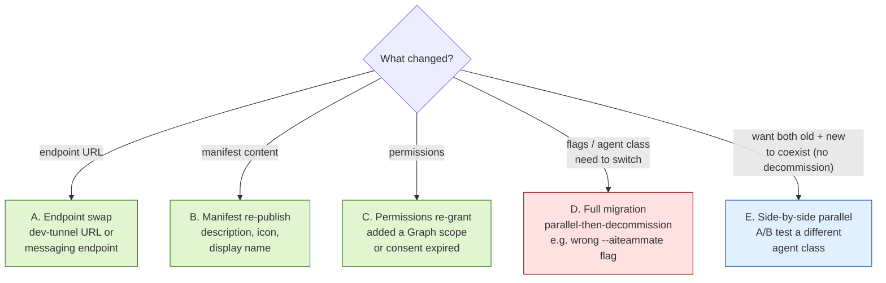
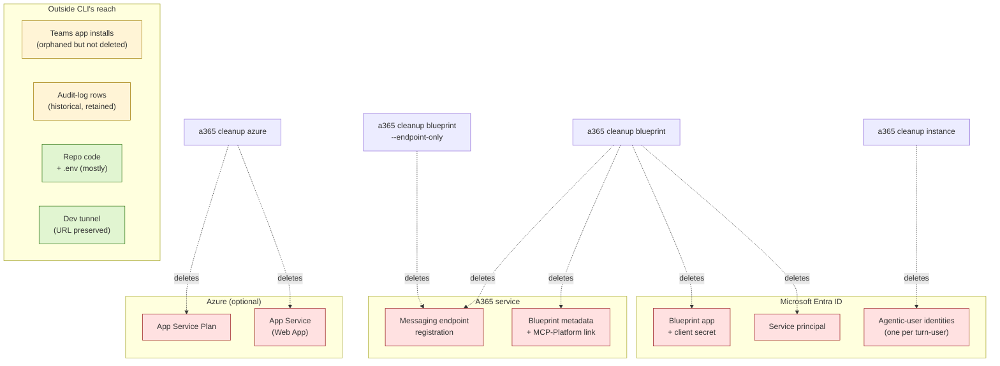

# Re-registering an Agent 365 agent

> Pick the smallest scenario that matches what you actually need to change.
> The full migration scenario (D) is **parallel-then-decommission by default** — old blueprint stays alive until the new one is verified end-to-end.

`SETUP.md` is for first-time registration. **This file is for an agent that's already registered** and you need to change something. Microsoft's official CLI reference covers the individual commands — see [Agent 365 CLI Reference](https://learn.microsoft.com/en-us/microsoft-agent-365/developer/reference/cli/) — but doesn't give you an end-to-end workflow keyed to *what changed*. That's what this file is for.

Every scenario below uses the same worked-example layout: **State going in → Prerequisites → Action → Expected output → Validation**. Substitute your own values where you see `Draft Dodger`, dev-tunnel names, etc.

## Pick your scenario



Quick-glance summary:

| What changed | Scenario | Destructive? |
|---|---|---|
| Dev tunnel URL / messaging endpoint | [A. Endpoint swap](#a-endpoint-swap-non-destructive) | No |
| Manifest description, icon, display name | [B. Manifest re-publish](#b-manifest-re-publish-non-destructive) | No |
| Permissions / consent grants | [C. Permissions re-grant](#c-permissions-re-grant-non-destructive) | No |
| Initial flag was wrong (e.g. missing `--m365`) | [D. Full migration (parallel-then-decommission)](#d-full-migration-parallel-then-decommission) | Only the final step |
| Want a parallel test registration | [E. Side-by-side parallel](#e-side-by-side-parallel-registration-non-destructive) | No |

> **Customer-facing version of Scenario D.** [`AGENT-CLASS-MIGRATION.md`](AGENT-CLASS-MIGRATION.md) covers the `--aiteammate` migration in full runbook depth, using `ContosoAgent` as the worked example throughout. Read this file for the internal project-team view; read that one if you're handing the runbook to a customer.

---

## A. Endpoint swap (non-destructive)

**Use case.** Your dev-tunnel URL changed (laptop reset, region migration, new tunnel name). You want the existing blueprint to point at a new `https://…/api/messages` URL. Nothing else changes — same blueprint ID, same agentic-user identities, same Teams installs.

### Step A.1 — Confirm the swap is what you need

**Why this step.** It's easy to reach for the endpoint-swap command when the actual problem is a stopped tunnel or a misconfigured `.env`. Verify the endpoint really did move.

**State going in.** Old endpoint registered with A365; tunnel possibly stopped or moved.

**Prerequisites.**
- You're in the repo root.

**Action.**
```bash
# What does the local config think the endpoint is?
jq -r '.messagingEndpoint' a365.config.json

# What does the project's generated config show for the live blueprint?
jq -r '.agentBlueprintId' a365.generated.config.json

# Is the tunnel actually running?
devtunnel show <your-tunnel-name>
```

**Expected output.**
```
https://draft-dodger-3978.uks.devtunnels.ms/api/messages
f4762823-1234-5678-9abc-def012345678
Tunnel ID         : draft-dodger.uks
Description       : (none)
Region            : uks (UK South)
Tunnel Endpoints  : https://draft-dodger-3978.uks.devtunnels.ms
```

> **Draft Dodger example.** The tunnel `draft-dodger-3978` is running and matches what `a365.config.json` says. If your laptop was reset, `devtunnel show` will say "tunnel not found" — that's the signal you need to recreate the tunnel first.

**Validation.**
- The blueprintId in `a365.generated.config.json` is the one you intend to keep.
- `devtunnel show` returns a running tunnel.

### Step A.2 — Apply the endpoint swap

**Why this step.** This is the actual rebind. The CLI updates only the `messagingEndpoint` field on the existing blueprint — no IDs change, no identities are rotated.

**State going in.** Blueprint registered against the *old* endpoint URL.

**Prerequisites.**
- Step A.1 verified the new tunnel URL.
- `a365 --version` ≥ 1.1.174.

**Action.**
```bash
a365 setup blueprint \
  --m365 \
  --update-endpoint "https://<your-tunnel-name>-3978.<region>.devtunnels.ms/api/messages"
```

> ⚠️ **`--m365` is required.** Without it the command silently no-ops with the message *"Skipping messaging endpoint update — this command only applies to M365 agents."* See [`LESSONS_LEARNED.md` §5.1](LESSONS_LEARNED.md#51-update-endpoint-requires-m365).

**Expected output.**
```
[setup blueprint] Updating messaging endpoint for blueprintId f4762823-...
[setup blueprint] New endpoint: https://draft-dodger-3978.uks.devtunnels.ms/api/messages
[setup blueprint] Done. Blueprint metadata unchanged except for messagingEndpoint.
```

> **Draft Dodger example.** The blueprintId in the output matches what was in `a365.generated.config.json` before this command ran. Nothing else changed.

**Validation.**
- Send one Teams turn. Agent log should show `POST /api/messages HTTP/1.1 202`.
- If you get 502s, the Bot Framework still has the old URL cached — see [`LESSONS_LEARNED.md` §8](LESSONS_LEARNED.md#8-bot-framework-502-retry-storm-during-onboarding) for the self-heal timing.
- `jq -r '.agentBlueprintId' a365.generated.config.json` is unchanged.

---

## B. Manifest re-publish (non-destructive)

**Use case.** You edited the agent display name, description, icon, or accent colour and need the change to surface in the M365 Admin Center.

### Step B.1 — Snapshot the current manifest

**Why this step.** `a365 publish` overwrites your custom description with a generic placeholder ([`LESSONS_LEARNED.md` §5.2](LESSONS_LEARNED.md#52-a365-publish-no-longer-auto-uploads-to-teams)). The snapshot is how you remember what to put back.

**State going in.** Customised `manifest/manifest.json` checked in or working-tree edits in place.

**Prerequisites.**
- You're in the repo root.

**Action.**
```bash
cp manifest/manifest.json manifest/manifest.json.bak
```

**Expected output.** (none — copy is silent)

> **Draft Dodger example.** `manifest/manifest.json.bak` now exists alongside the original.

**Validation.**
- `ls -la manifest/manifest.json*` shows both files with identical sizes.

### Step B.2 — Regenerate the manifest and re-apply customisations

**Why this step.** `a365 publish` produces the canonical manifest zip the admin centre expects. You then re-edit the fields the CLI overwrote.

**State going in.** Snapshot taken; old manifest still installed in admin centre.

**Prerequisites.**
- Step B.1 done.

**Action.**
```bash
a365 publish

# Restore your customisations from the snapshot or re-edit by hand:
$EDITOR manifest/manifest.json

# Re-zip with the edited manifest:
cd manifest && zip -r manifest.zip manifest.json color.png outline.png agenticUserTemplateManifest.json && cd ..
```

**Expected output.**
```
[publish] Generating manifest from blueprint metadata... done.
[publish] Wrote manifest/manifest.json
[publish] Wrote manifest/manifest.zip (4 files)
WARNING: The "description.full" field has been overwritten with the CLI's
generic placeholder text. Re-edit it before uploading to admin.microsoft.com.

# (after zip)
  adding: manifest.json (deflated 65%)
  adding: color.png (deflated 0%)
  adding: outline.png (deflated 0%)
  adding: agenticUserTemplateManifest.json (deflated 70%)
```

> **Draft Dodger example.** The new `manifest/manifest.zip` is ~40 KB. The description in `manifest.json` now matches your snapshot, not the CLI's generic placeholder.

**Validation.**
- `ls -la manifest/manifest.zip` shows a recent timestamp.
- `unzip -p manifest/manifest.zip manifest.json | jq .description` shows your customised description.

### Step B.3 — Upload via M365 Admin Center

**Why this step.** The CLI used to auto-upload; it doesn't any more (1.1.174+). The admin-centre upload is the only path.

**State going in.** Re-zipped manifest ready locally.

**Prerequisites.**
- Step B.2 done.

**Action.**
1. <https://admin.microsoft.com> → Agents → All agents.
2. Click **Upload custom agent** → pick `manifest/manifest.zip`.

**Expected output.**
- The agent row updates within ~1 minute.

> **Draft Dodger example.** The Draft Dodger row's description column refreshes to the new text. Existing Teams installs auto-upgrade to the new manifest version (the manifest ID is unchanged).

**Validation.**
- M365 Admin Center → Agents → Draft Dodger shows the new description / icon / display name.
- Existing users still have working installs (manifest ID didn't change).

---

## C. Permissions re-grant (non-destructive)

**Use case.** You added a new Graph scope to the agent, consent expired, or you re-installed a permission via Graph PowerShell and need the CLI's record of consent to match.

### Step C.1 — Re-grant via the CLI

**Why this step.** Adds the consent records the CLI tracks. If you're a Global Admin, this is one-shot. If not, the CLI prints an admin-consent URL for a Global Admin to visit.

**State going in.** Blueprint live; one or more scopes are missing consent (you'll have seen `AADSTS65001` or `CLIENT_APP_VALIDATION_FAILED`).

**Prerequisites.**
- Blueprint exists.
- A Global Administrator is available (operator OR a separate Global Admin clicking the consent URL).

**Action.**
```bash
a365 setup permissions mcp     # MCP-tool resource consents (Mail.ReadWrite, Chat.ReadWrite, etc.)
a365 setup permissions bot     # Bot-framework messaging consents
```

**Expected output (operator is Global Admin).**
```
[setup permissions mcp] Granting Mail.ReadWrite, Chat.ReadWrite, ChannelMessage.Read.All... done.
[setup permissions mcp] All 8 required scopes show consentGranted=true.
[setup permissions bot] Granting Bot Framework messaging scopes... done.
[setup permissions bot] All 3 required scopes show consentGranted=true.
```

**Expected output (operator is not Global Admin).**
```
[setup permissions mcp] Cannot grant consent — operator lacks Global Administrator role.
[setup permissions mcp] Next step: have a Global Admin visit
    https://login.microsoftonline.com/<tenant>/adminconsent?client_id=<your-app-id>
[setup permissions mcp] After they consent, re-run `a365 query-entra` to confirm.
```

> **Draft Dodger example.** If your operator is the Global Admin, both `setup permissions` commands return clean. Otherwise, the admin-consent URL points at the Draft Dodger Identity app's tenant-wide consent page.

**Validation.**
```bash
a365 query-entra
```
should show every required scope with `"consentGranted": true`. If `consentGranted=false` after a Global Admin granted consent, you may have hit the leading-space-scope bug — see [`LESSONS_LEARNED.md` §13](LESSONS_LEARNED.md#13-aadsts65001-on-agent365observabilityotelwrite-despite-a-grant-existing).

### Step C.2 — Verify the previously-failing path now works

**Why this step.** A grant in Entra and a working code path aren't the same thing. Confirm by exercising the path that was failing before.

**State going in.** All scopes show `consentGranted=true`.

**Prerequisites.**
- Step C.1 returned clean.

**Action.**
Trigger a Teams turn that exercises the previously-broken scope.

**Expected output.**
- Agent service log shows `202` on `POST /api/messages` (no 401, no `AADSTS65001`).

**Validation.**
- The error message that prompted scenario C is gone.

---

## D. Full migration (parallel-then-decommission)

**Use case.** Your initial registration was wrong in a way only re-doing it can fix — e.g., missing `--m365`, wrong agent class (`--aiteammate true` vs `false`), bad tenant. There's no incremental edit path; the blueprint has to be replaced.

**The pattern this scenario uses:** stand up the new blueprint **alongside** the old one with `-n`, verify it end-to-end with a pilot, migrate users, and only THEN decommission the old. The old keeps serving traffic through phases 1–3. Destruction is the last step, not the first.

> **Customer-facing depth.** [`AGENT-CLASS-MIGRATION.md`](AGENT-CLASS-MIGRATION.md) walks the same flow with every step expanded, using `ContosoAgent` as a worked example. This section gives you the project-internal version.

### Phase D.1 — Stand up the new blueprint

#### Step D.1.1 — Snapshot the live blueprint IDs

**Why this step.** You need the old IDs to query historical audit-log rows after migration and as a recovery handle if anything goes wrong.

**State going in.** Old blueprint live; project config points at it.

**Prerequisites.** Repo root cwd.

**Action.**
```bash
cp a365.generated.config.json a365.generated.config.json.bak-$(date +%Y%m%d)
jq '{
  oldBlueprintId: .agentBlueprintId,
  oldInstanceId: .agentInstanceId,
  oldBotMsaAppId: .botMsaAppId
}' a365.generated.config.json > pre-migration-ids.json
cat pre-migration-ids.json
```

**Expected output.**
```json
{
  "oldBlueprintId": "f4762823-1234-5678-9abc-def012345678",
  "oldInstanceId": "fc3ad290-aaaa-bbbb-cccc-ddddeeee0000",
  "oldBotMsaAppId": "9c8f1234-1111-2222-3333-444455556666"
}
```

> **Draft Dodger example.** This captures the three GUIDs you'll cross-reference at phase D.4.

**Validation.** `pre-migration-ids.json` exists and contains three non-null GUIDs. Save outside the repo.

#### Step D.1.2 — Create the new blueprint with `-n`

**Why this step.** `-n` keeps the new blueprint's config separate (under `.a365/<name>/`), so the project's `a365.generated.config.json` is untouched. The old blueprint keeps running.

**State going in.** Old blueprint live; live config unchanged.

**Prerequisites.**
- A second dev tunnel exposing port `3978` (or `3979`, whichever the second agent service will listen on).
- `a365 --version` ≥ 1.1.174.

**Pick the target class.** The flags below are validated against CLI 1.1.176 — run `a365 setup all --help` and `a365 publish --help` on your machine to verify before committing.

| Class | Flags | What you get |
|---|---|---|
| **AI Teammate (M365)** | `--m365 --aiteammate true` | Blueprint + Entra agent-identity user. Surfaces in M365 Copilot Agents tab. Admin consent required. Draft Dodger's current class. |
| **AI Teammate (non-M365)** | `--aiteammate true` (no `--m365`) | Same as above but endpoint configured via Teams Developer Portal, not MCP Platform. |
| **Blueprint-only with OBO (M365)** *— CLI default* | `--m365` (no `--aiteammate`, no `--authmode`) | Blueprint + service principal (no Entra user). Delegated permissions; no admin consent for OBO. |
| **Blueprint-only with S2S (M365)** | `--m365 --authmode s2s` | Blueprint + SP with app permissions. Admin consent required. |
| **Blueprint-only with both grants** | `--m365 --authmode both` | OBO + S2S both configured. |
| **Blueprint-based non-DW agent** | `--m365 --aiteammate false --use-blueprint` | Variant of blueprint-only; not a digital-worker agent. |

For the Draft Dodger example below we're migrating from **AI Teammate (M365)** → **Blueprint-based non-DW agent**.

**Action.** Class-aware setup lives on `a365 setup all` (not `setup blueprint`). Endpoint is set in a second command because `-n` mode has no `a365.config.json` to read it from.

```bash
# One-shot: blueprint + permissions in the chosen class.
a365 setup all \
  -n "Draft Dodger v2" \
  --m365 \
  --aiteammate false \
  --use-blueprint

# Then bind the messaging endpoint for the new blueprint:
a365 setup blueprint \
  -n "Draft Dodger v2" \
  --m365 \
  --update-endpoint "https://draft-dodger-v2-3978.uks.devtunnels.ms/api/messages"
```

**Expected output (truncated).**
```
[setup all] Step 1/3: Creating Entra app "Draft Dodger v2 Identity"... done.
[setup all] Step 2/3: Configuring MCP permissions... done.
[setup all] Step 3/3: Configuring Bot Framework permissions... done.

Blueprint registered:
  blueprintId    : 7a8b9c0d-eeee-ffff-1111-222233334444
  instanceId     : 1122334455-aaaa-bbbb-cccc-ddddeeeeffff
  botMsaAppId    : abcdef12-3456-7890-1234-567890abcdef
  clientSecret   : (rotated)

[setup blueprint --update-endpoint]
  New endpoint: https://draft-dodger-v2-3978.uks.devtunnels.ms/api/messages
  Done.
```

> **Draft Dodger example.** Three new GUIDs, none matching `pre-migration-ids.json`. `jq -r '.agentBlueprintId' a365.generated.config.json` still equals `oldBlueprintId` — i.e. live config untouched.

**Validation.**
- New blueprintId, instanceId, botMsaAppId printed.
- Live `a365.generated.config.json` unchanged.
- `a365 query-entra blueprint-scopes -n "Draft Dodger v2"` shows the expected scopes (consent step may be pending if operator isn't Global Admin — see D.1.3).

#### Step D.1.3 — Verify or grant permissions for the new blueprint

**Why this step.** If you used `setup all` above, permissions have already been wired up — this step verifies. If you ran `setup blueprint` granularly (without `setup all`), you'll need the permission subcommands explicitly.

**State going in.** New blueprint exists.

**Prerequisites.** A Global Admin available (if the original operator isn't one).

**Action (verification only, if you used `setup all`).**
```bash
a365 query-entra blueprint-scopes -n "Draft Dodger v2"
a365 query-entra instance-scopes -n "Draft Dodger v2"
```

**Action (granular path, only if you ran `setup blueprint` instead of `setup all`).**
```bash
a365 setup permissions mcp -n "Draft Dodger v2"
a365 setup permissions bot -n "Draft Dodger v2"
# Optionally, if the agent calls custom resources or Copilot Studio:
# a365 setup permissions custom -n "Draft Dodger v2"
# a365 setup permissions copilotstudio -n "Draft Dodger v2"
```

**Expected output (granular path).** Same shape as scenario C.1.

**Validation.** `a365 query-entra blueprint-scopes -n "Draft Dodger v2"` shows all required scopes `consentGranted=true`.

### Phase D.2 — Verify the new blueprint end-to-end

#### Step D.2.1 — Stand up a second agent service

**Why this step.** The agent service has one `(CLIENT_ID, CLIENT_SECRET)` from `.env`. To serve the new blueprint, you need a second process.

**State going in.** Old service running on production tunnel; new blueprint live but has no process behind it.

**Prerequisites.** Step D.1.3 passed; second dev tunnel up.

**Action.**
```bash
# Clone the repo to a sibling directory, edit .env, run:
cp -R A365_Draft_Dodger A365_Draft_Dodger_v2
cd A365_Draft_Dodger_v2

# Update CLIENT_ID, CLIENT_SECRET, PORT in .env to the new blueprint's values.
# Then:
uv run python start_with_generic_host.py
```

**Expected output.**
```
2026-05-11 14:23:17 | INFO     | Agent service starting on port 3979
2026-05-11 14:23:18 | INFO     | DraftDodgerAgent initialised
2026-05-11 14:23:18 | INFO     | Bot Framework adapter ready (clientId=abcdef12-...)
```

> **Draft Dodger example.** Two Python processes running locally: original on `3978`, new on `3979`. Both healthy.

**Validation.** `curl https://draft-dodger-v2-3978.uks.devtunnels.ms/api/health` returns ok.

#### Step D.2.2 — Generate, customise, upload the new manifest

**Why this step.** Users can't talk to the new blueprint until a manifest binds it to a user-installable Teams app. Use a distinguishing display name so the admin-centre row doesn't collide.

**State going in.** New service running; admin-centre still only shows the old Draft Dodger.

**Prerequisites.** Step D.2.1 healthy.

**Action.**
```bash
# In the v2 working directory:
a365 publish -n "Draft Dodger v2"
$EDITOR manifest/manifest.json   # change "name.short" to "Draft Dodger (v2)" and set a new "id" GUID
cd manifest && zip -r manifest.zip manifest.json color.png outline.png agenticUserTemplateManifest.json && cd ..
```

Then upload `manifest/manifest.zip` via admin.microsoft.com → Agents → Upload custom agent.

**Expected output.** A new agent row `Draft Dodger (v2)` appears in admin-centre. Original `Draft Dodger` row is unchanged.

> **Draft Dodger example.** Two rows visible in admin-centre. New row's Platform column shows the value you expected for the new `--aiteammate` flag.

**Validation.** Two rows in admin-centre; Platform column on the new row matches the new class.

#### Step D.2.3 — Pilot activation and validation

**Why this step.** Real Teams turns are the only way to validate behaviour. Pilot before going wide.

**State going in.** New agent row exists; Activated-for: nobody.

**Prerequisites.** Step D.2.2 done; pilot user group identified.

**Action.**
1. M365 Admin Center → Agents → `Draft Dodger (v2)` → Update.
2. Activated for: select pilot group → Save.
3. Have a pilot user open Copilot → Agents → `Draft Dodger (v2)` and send a test turn.

**Expected output.** Second agent service log:
```
2026-05-11 14:41:02 | INFO     | POST /api/messages HTTP/1.1 202
```

> **Draft Dodger example.** Pilot turn returns 202 on the v2 service. The agentic-user GUID provisioned for this turn is not in `pre-migration-ids.json`. Platform column matches expectation.

**Validation.**
- `POST /api/messages` returns 202 on v2 service.
- Agentic-user GUIDs are *new* (not in `pre-migration-ids.json`).
- Platform column / class behaviour matches expectation.
- Old agent service still serving everyone else (verify its log).

### Phase D.3 — Migrate users from old to new

#### Step D.3.1 — Announce migration and widen activation

**Why this step.** Users don't migrate themselves. Open the new agent up to everyone and tell them to use it.

**State going in.** New agent active for pilot only; sunset window not yet started.

**Prerequisites.** Phase D.2 verification green.

**Action.**
1. Send org-wide announcement: *"Draft Dodger is being upgraded. Please switch to 'Draft Dodger (v2)'. The old version will be retired on <date+2 weeks>."*
2. Admin Center → `Draft Dodger (v2)` → Update → Activated for: All users → Save.

**Expected output.** All users see `Draft Dodger (v2)` in Copilot → Agents within ~15 min.

**Validation.** Spot-check 3 random users; all see the new agent.

#### Step D.3.2 — Sunset window monitoring

**Why this step.** Full-scale traffic surfaces issues the pilot didn't. The sunset window is your last chance to catch them while the old agent is still a fallback.

**State going in.** All users have both agents.

**Action.** Watch v2 service logs daily; track audit rows for the new blueprintId; monitor help-desk tickets for ~2 weeks.

**Expected output.** Error rate / latency comparable to old agent; old agent's traffic curve approaches zero.

**Validation.** Old agent has zero turns for at least 48 consecutive hours before proceeding to phase D.4.

### Phase D.4 — Decommission the old (the only destructive step)

#### Step D.4.1 — Pre-destruction sanity check

**Why this step.** Once cleanup runs, the old blueprint is gone. 60 seconds of verification now prevents Friday-evening Slack threads.

**State going in.** Sunset window over; old agent at zero traffic.

**Prerequisites.** Step D.3.2 confirmed.

**Action.**
```bash
pwd
# Should print the ORIGINAL working directory, NOT A365_Draft_Dodger_v2.

jq -r '.agentBlueprintId' a365.generated.config.json
# Should equal pre-migration-ids.json's "oldBlueprintId".
```

**Expected output.**
```
/path/to/A365_Draft_Dodger
f4762823-1234-5678-9abc-def012345678
```

**Validation.** Working directory and blueprintId match what you intend to destroy. **Stop here** if either doesn't match.

#### Step D.4.2 — Destroy the old blueprint

**Why this step.** This is the actual destructive step. After this, the old blueprint is gone and the Entra app is in 30-day soft-delete.

**State going in.** Old blueprint live but unused.

**Prerequisites.** Step D.4.1 fully green.

**Action.**
```bash
a365 cleanup blueprint -y
a365 cleanup instance -y
```

**Expected output.**
```
[cleanup blueprint] Deleting messaging endpoint registration... done.
[cleanup blueprint] Deleting blueprint metadata... done.
[cleanup blueprint] Deleting Entra service principal... done.
[cleanup blueprint] Deleting Entra app (soft-deleted, 30-day restore window)... done.
[cleanup instance] Deleted 17 agentic-user identity associations.
```

> **Draft Dodger example.** The old Draft Dodger Entra app is soft-deleted; the 17 agentic-users accumulated under it are removed. Audit rows under the old blueprintId remain queryable (data is retained; just no new rows).

**Validation.** `a365 query-entra` no longer finds the old blueprint.

#### Step D.4.3 — Object graph reference

Use this when explaining to a stakeholder what each cleanup subcommand actually destroyed:



Grey boxes are *outside* what the CLI controls — Teams installs and audit rows persist regardless of cleanup.

### Rollback at each phase

- **Phase D.1 fails.** Live blueprint untouched. `a365 cleanup blueprint -n "Draft Dodger v2" -y` to clean up the partial new blueprint and retry.
- **Phase D.2 verification fails.** Don't migrate users. Fix v2 or abandon it with `a365 cleanup blueprint -n "Draft Dodger v2" -y`.
- **Phase D.3 surfaces issues.** Tell users to revert to the old agent (still active and installed); pause migration; fix v2; re-announce.
- **Phase D.4 fails halfway.** Restore the Entra app from soft-delete:

```bash
az ad app list --filter "displayName eq 'Draft Dodger Identity'" --include-deleted-applications
az ad app restore --id <appId>
```

Note: only the Entra app comes back via soft-delete. Blueprint metadata in A365 is not soft-deleted and needs to be re-created. Recovery is messier than prevention — step D.4.1's check is what keeps you out of here.

---

## E. Side-by-side parallel registration (non-destructive)

**Use case.** You want to test whether a different agent class produces a different MAC inventory Platform classification — *without* eventually decommissioning the old one. Both blueprints coexist in the tenant indefinitely.

> This is **scenario D's verification phase, without the decommission**. If you intend to migrate users and remove the old blueprint, use scenario D. If you genuinely want two blueprints to live side-by-side (e.g. for ongoing A/B testing), use this one.

### Step E.1 — Register a parallel blueprint

**Why this step.** `-n` keeps the new registration's config separate from the project's main config, so the live blueprint is unaffected.

**State going in.** Live blueprint serving traffic.

**Prerequisites.** Tunnel/service capacity for a second agent (or willingness to leave the second blueprint without an agent process, if you're only verifying admin-centre / class behaviour).

**Action.**
```bash
a365 setup all -n "Draft Dodger Test" --m365 --aiteammate false --use-blueprint
```

**Expected output.** Same shape as step D.1.2 — new GUIDs printed, live config untouched.

> **Draft Dodger example.** A second row appears in M365 Admin Center → Agents under the name `Draft Dodger Test`. The original Draft Dodger row is unchanged.

**Validation.** Two rows in admin-centre. `jq -r '.agentBlueprintId' a365.generated.config.json` still shows the live blueprintId.

### Step E.2 — Compare the two

**Why this step.** Use real admin-centre / audit-log data to compare the two classes side-by-side.

**State going in.** Both blueprints registered.

**Action.**
- M365 Admin Center → Agents — compare the Platform column values, the class label, the agentic-user-template configuration.
- `scripts/query-audit.sh` filters by agentic-user GUID; each blueprint's audit rows are clearly separated.

**Expected output.** Differences in Platform column, agentic-user-template visibility, etc. — exactly what you wanted to verify.

**Validation.** You can answer "does flipping `--aiteammate` change behaviour X?" with direct evidence.

### Step E.3 — Cleanup when done

**Why this step.** If you only wanted the test, this removes the parallel blueprint cleanly.

**Action.**
```bash
a365 cleanup blueprint -n "Draft Dodger Test" -y
```

**Validation.** Admin Center → Agents shows only the original row again.

---

## Quick-glance command reference

| Command | Effect | Destructive? |
|---|---|---|
| `a365 cleanup blueprint --endpoint-only` | Removes endpoint registration only | No |
| `a365 cleanup blueprint` | Removes Entra app + service principal + endpoint + blueprint metadata | **Yes** |
| `a365 cleanup blueprint -n "<name>"` | Same, for a `-n`-isolated blueprint | **Yes** (scoped) |
| `a365 cleanup instance` | Removes agentic-user identities | **Yes** |
| `a365 cleanup azure` | Removes App Service + Plan | **Yes** (but optional in our setup — we use a dev tunnel, not App Service) |
| `a365 setup blueprint --update-endpoint <url> --m365` | Rebinds endpoint without touching the rest | No |
| `a365 setup blueprint --m365` | Creates new blueprint in the project config | New IDs |
| `a365 setup blueprint -n "<name>"` | Creates parallel blueprint with isolated config | New IDs |
| `a365 setup all --m365` | Setup blueprint + permissions in one shot | New IDs |
| `a365 publish` | Generates `manifest/manifest.zip` (overwrites your description) | No (but see [`LESSONS_LEARNED.md` §5.2](LESSONS_LEARNED.md#52-a365-publish-no-longer-auto-uploads-to-teams)) |
| `a365 query-entra` | Inspects consent state for the project's main blueprint | No |
| `a365 query-entra -n "<name>"` | Same, for a `-n`-isolated blueprint | No |

---

## Troubleshooting → existing lessons

| Symptom | Lesson |
|---|---|
| `Skipping messaging endpoint update — this command only applies to M365 agents` | [§5.1 — `--update-endpoint` requires `--m365`](LESSONS_LEARNED.md#51-update-endpoint-requires-m365) |
| Agent description shows generic placeholder text in M365 admin center | [§5.2 — `a365 publish` no longer auto-uploads](LESSONS_LEARNED.md#52-a365-publish-no-longer-auto-uploads-to-teams) |
| `[CLIENT_APP_VALIDATION_FAILED] Client app is missing required API permissions` | [§6 — required Graph permissions for the custom client app](LESSONS_LEARNED.md#6-required-microsoft-graph-permissions-for-the-custom-client-app) |
| Lots of 502s on `POST /api/messages` right after re-registration | [§8 — Bot Framework 502 retry storm during onboarding](LESSONS_LEARNED.md#8-bot-framework-502-retry-storm-during-onboarding) |
| `AADSTS65001 — user or administrator has not consented` | [§13 — leading-space scope bug; PATCH the grant via Graph](LESSONS_LEARNED.md#13-aadsts65001-on-agent365observabilityotelwrite-despite-a-grant-existing) |
| `HTTP 400 EndpointInvalid: Tenant id  is invalid` from the live agent | [§17 — `agent_id` must be the agentic-user identity, not the blueprint id](LESSONS_LEARNED.md#17-agentdetailsagent_id-must-be-the-agentic-user-identity-not-the-blueprint-id) |
| MAC inventory's "Platform" column stays empty after re-registration | [§23 — server-stamped enum, no client-side lever](LESSONS_LEARNED.md#23-mac-inventory-platform-column--server-stamped-no-client-lever) |

---

## See also

- [Agent 365 CLI Reference](https://learn.microsoft.com/en-us/microsoft-agent-365/developer/reference/cli/) — official command reference
- [Agent 365 development lifecycle](https://learn.microsoft.com/en-us/microsoft-agent-365/developer/a365-dev-lifecycle) — official overview
- [`AGENT-CLASS-MIGRATION.md`](AGENT-CLASS-MIGRATION.md) — customer-facing version of scenario D (the parallel-then-decommission flow), with `ContosoAgent` worked example throughout
- [`SETUP.md`](SETUP.md) — fresh-tenant runbook (read this *first* if you've never registered before)
- [`LESSONS_LEARNED.md`](LESSONS_LEARNED.md) — error-driven knowledge base. §5 (publish quirks), §17 (agent identity model), §22 (observability gaps), §23 (Platform column).
